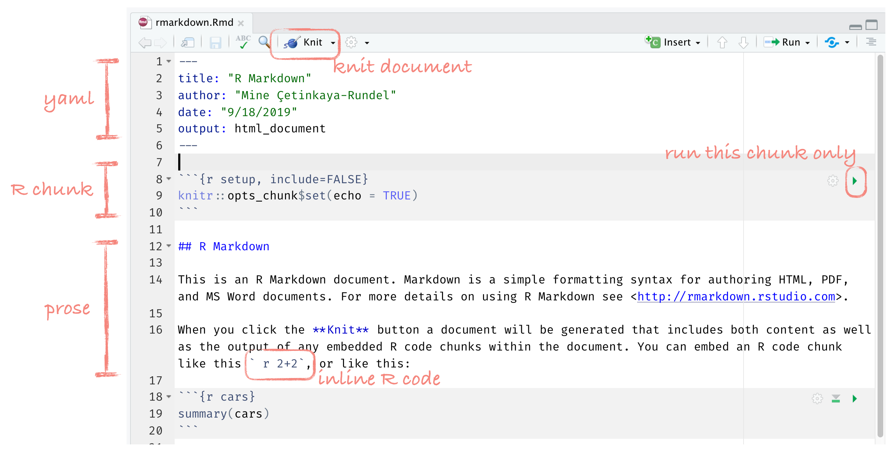
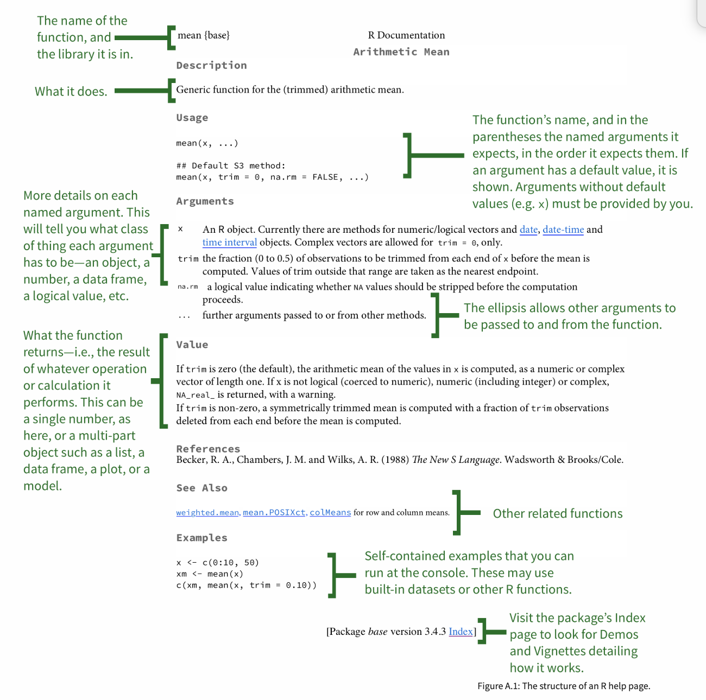
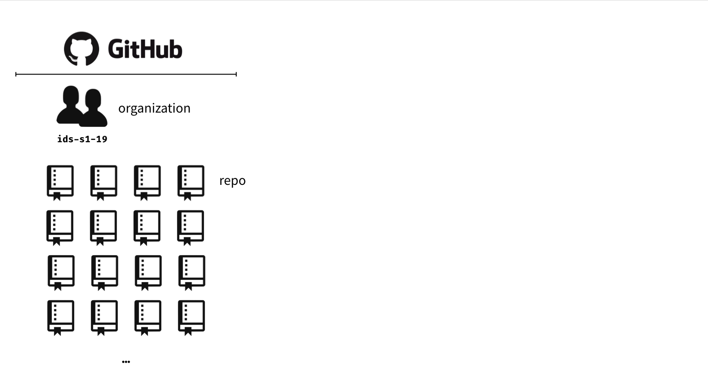
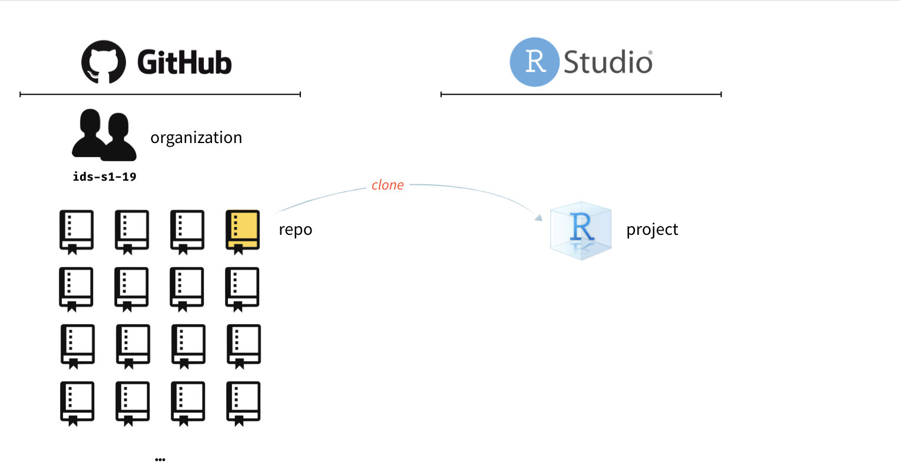
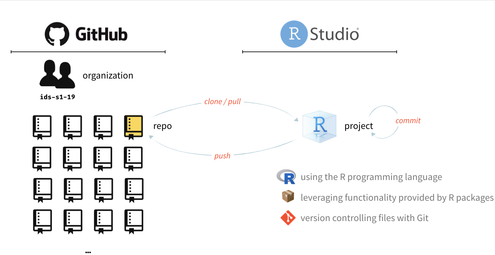

```{r child="../slides-common.Rmd"}
```

```{r include=FALSE}
slideSetup()
```

class: middle

.white-pre[
Everyone should be 
  quick to listen,
  slow to speak and
  slow to become angry,
because human anger does not produce the righteousness that God desires.
]

.right[
James 1:19-20
]

*What disagreements have you had recently?*

---


## So far...

- Hands on practice with R, RStudio, Git, GitHub
- First look at visualizing and summarizing data in R
- Why summary statistics alone are not sufficient for data exploration


---

## Logistics

* Discussion 1 due tomorrow (responses due next week)
* Moodle activity completion checklist
* Try a different technology for lab on Friday
* Log your daily temperature?

---

class: center, middle

.question[
.large[
Any questions?
]
]

---

class: center, middle

# Reproducible data analysis

---

## Reproducibility checklist

.question[
What does it mean for a data analysis to be "reproducible"?
]

--

Near-term goals:

- Can you re-make all tables and figures easily?
- Does the code actually do what you think it does?
- Is it clear **why** decisions were made?  (e.g., how were parameter settings chosen?)

Long-term goals:

- Can the code be used for other data?
- Can you extend the code to do other things?

---

## Toolkit

- Scriptability $\rightarrow$ R
- Literate programming (code, narrative, output in one place) $\rightarrow$ R Markdown
- Version control $\rightarrow$ Git / GitHub

---

class: center, middle

# Toolkit overview

---

class: center, middle

# The whole game

`r emo::ji("yarn")` **knit**

`r emo::ji("white_check_mark")` **commit**

`r emo::ji("arrow_up")` **push**


---

class: center, middle

# R

---

## R

R can be used as a calculator.
```{r}
8738787213 / 1653
```


Most common data type: "data frames". Each row = one *observation*. Each *column* = one *variable*.

```{r eval=FALSE}
mtcars
```

.small[
```{r echo=FALSE}
mtcars %>% knitr::kable()
```
]
---

## R

- We use the `$` operator to access a variable within a data frame.

```{r}
mtcars$mpg
```

- Functions are (often) verbs, followed by what they will be applied to in parentheses.

```{r eval=FALSE}
do_this(to_this)
do_that(to_this, to_that, with_those)
```

---

## R

* "Package" = shareable code (aka *library* in other languages)
* Over 16k packages on CRAN (**C**omprehensive **R** **A**rchive **N**etwork)
  * Good chance someone already solved a problem that you’re working on, and you can benefit from their work by downloading their package.
* Using R packages:
  - Install them from CRAN with `install.packages("x")`
  - Use them in R with `library(x)`
  - Get help on them by clicking on their name in the Packages list in RStudio

---

class: center, middle

# RStudio

---

class: center

```{r echo=FALSE, out.width="80%"}
knitr::include_graphics("img/rstudio-anatomy.png")
```

---

class: center, middle

# R Markdown

---

```{r echo=FALSE, out.width="100%"}

```

---

## R Markdown tips

- Most importantly: environment of your R Markdown document is separate from that of the Console
- Help:
  - [R Markdown cheat sheet](https://github.com/rstudio/cheatsheets/raw/master/rmarkdown-2.0.pdf) 
  - Markdown Quick Reference (Help -> Markdown Quick Reference)

---

## How will we use R Markdown?

- Every assignment / report / project / etc. is an R Markdown document
- You'll always have a template R Markdown document to start with
- The amount of scaffolding in the template will decrease over the semester

---

class: center, middle

# Getting help in R

---

class: center

```{r echo=FALSE, out.width="50%"}

```

.tiny[
Source: http://socviz.co/appendix.html#a-little-more-about-r
]

---

```{r echo=FALSE, out.width="100%"}

```

---

```{r echo=FALSE, out.width="100%"}
knitr::include_graphics("img/whole-game-02.png")
```

---

```{r echo=FALSE, out.width="100%"}

```

---

```{r echo=FALSE, out.width="100%"}

```

---

## Asking good questions

- Always include your code and the error
- Create a minimum working example (we'll keep working on this throughout the semester)
- Use code formatting
