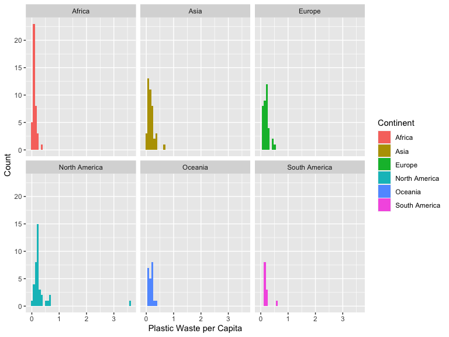
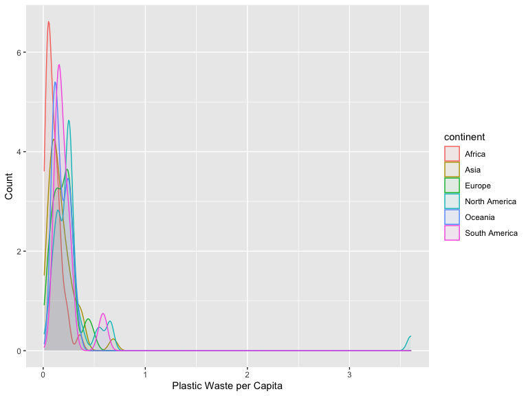
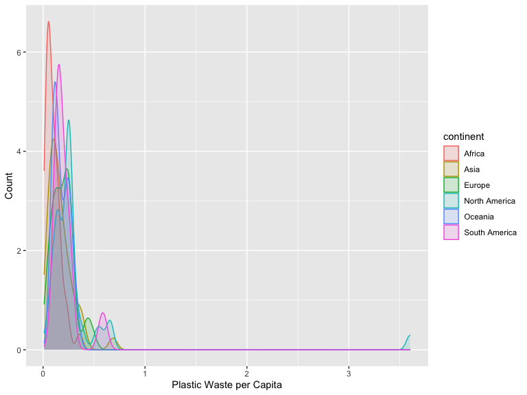
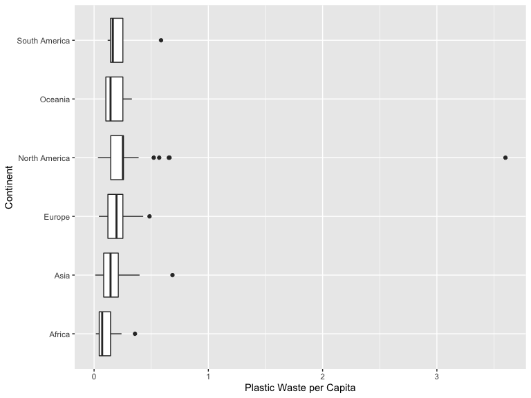
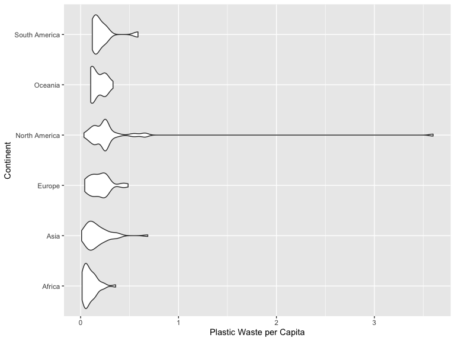
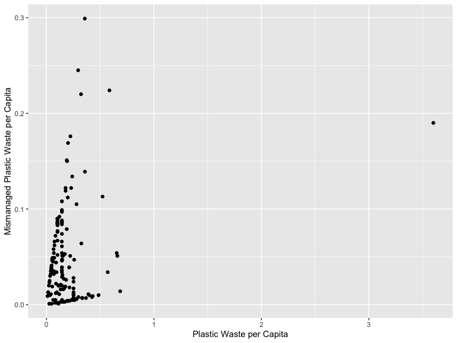
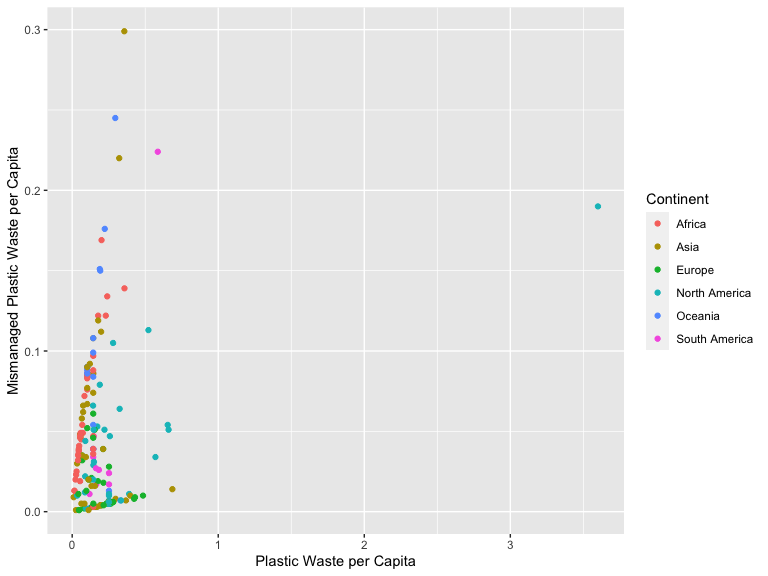
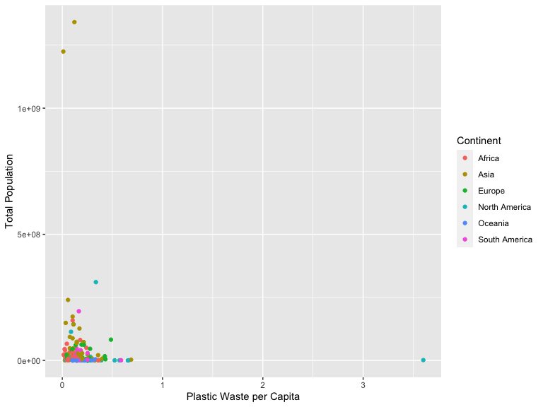
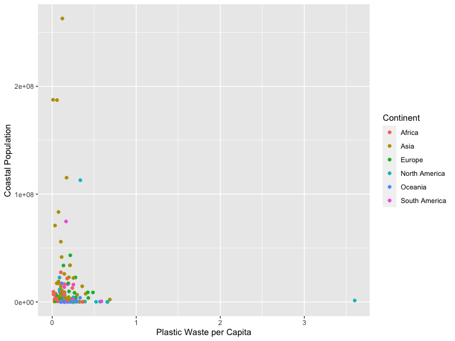
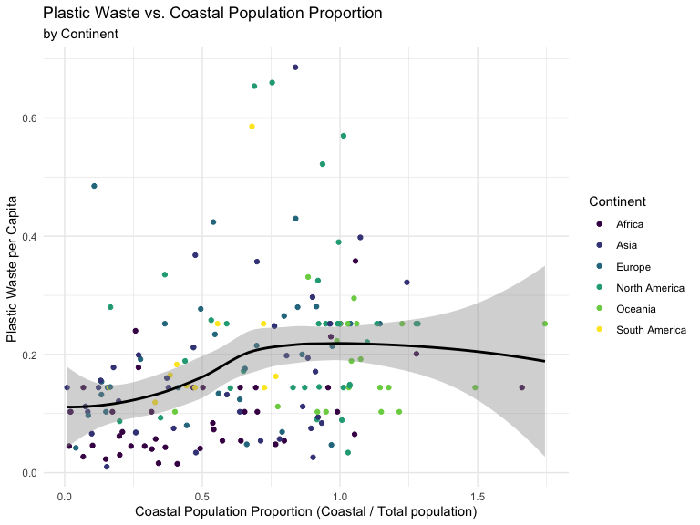

Lab 02: Global Plastic Waste
================

The Data
--------

Exercise 1
----------

    plastic_waste %>% 
      ggplot(aes(x = plastic_waste_per_cap, fill = continent)) +
      geom_histogram(bins = 50) +
      facet_wrap(~continent) +
      labs(x = "Plastic Waste per Capita", y = "Count", fill = "Continent")

    plastic_waste %>% 
      ggplot(aes(x = plastic_waste_per_cap, color = continent, fill = continent)) +
      geom_density(alpha = 0.07) +
      labs(x = "Plastic Waste per Capita", y = "Count")

-   According to these plots, most of the countries do **not** surpass 1
    kilogram of plastic waste per day, except for Trinidad and Tobago.

Exercise 2
----------

    plastic_waste %>% 
      ggplot(aes(x = plastic_waste_per_cap, color = continent, fill = continent)) +
      geom_density(alpha = 0.15) +
      labs(x = "Plastic Waste per Capita", y = "Count")

Exercise 3
----------

-   

Exercise 4
----------

    plastic_waste %>% 
      ggplot(aes(x = plastic_waste_per_cap, y = continent)) +
      geom_boxplot() +
      labs(x = "Plastic Waste per Capita", y = "Continent")

    plastic_waste %>% 
      ggplot(aes(x = plastic_waste_per_cap, y = continent)) +
      geom_violin() +
      labs(x = "Plastic Waste per Capita", y = "Continent")

-   A violin plot displays a continuous distribution. It is displayed
    similarily as a boxplot but it is displayed as a mirrored density
    plot. A violin plot shows where there is a high density of points.
    In other words, a violint plot allows us to see the shape of the
    distribution. While we can draw quantiles in a violin plot, a box
    plot always displays the interquartile range, the median, and the
    outliers.

Exercise 5
----------

    plastic_waste %>% 
      ggplot(aes(x = plastic_waste_per_cap, y = mismanaged_plastic_waste_per_cap)) +
      geom_point() +
      labs(x = "Plastic Waste per Capita", y = "Mismanaged Plastic Waste per Capita")

-   There seems to a slight positive relationship between
    `plastic waste per capita` and
    `mismanaged plastic waste per capita`.

Exercise 6
----------

    plastic_waste %>% 
      ggplot(aes(x = plastic_waste_per_cap, y = mismanaged_plastic_waste_per_cap, color = continent)) +
      geom_point() +
      labs(x = "Plastic Waste per Capita", y = "Mismanaged Plastic Waste per Capita", color = "Continent")

-   There doesn’t seem to be any clear distinctions between continents
    with respect to how `plastic waste per capita` and
    `mismanaged plastic waster per capita` are associated. Most of the
    outliers seem to be countries from Africa, Asia, and Oceania, but
    most of the countries are clustered.

Exercise 7
----------

    plastic_waste %>% 
      ggplot(aes(x = plastic_waste_per_cap, y = total_pop, color = continent)) +
      geom_point() +
      labs(x = "Plastic Waste per Capita", y = "Total Population", color = "Continent")

    plastic_waste %>% 
      ggplot(aes(x = plastic_waste_per_cap, y = coastal_pop, color = continent)) +
      geom_point() +
      labs(x = "Plastic Waste per Capita", y = "Coastal Population", color = "Continent")

-   There doesn’t seem to be a strong linear association between
    `plastic waste per capita` and `total population` and/or
    `coastal population`. One conclusion that could be made is the fact
    that *Asia* seem to have countries with larger `total population`
    and `coastal population`, which makes sense (China, India, Japan,
    etc.), but do not produce the larget amount of plastic waste per
    capita. Instead, countries with smaller populations seem to produce
    a slightly higher snumber of plastic waste per capita. While there
    might be several reasons to why that is the case, one hypothesis
    might be if a country produces the same amount of plastic waste but
    has a smaller population, then it will have a slightly higher number
    than a country that produces the same amount of plastic waste but
    with a bigger population.

-   *Note*: It would be interesting to study how and why countries with
    small populations produce a significant amount of plastic waste.

Exercise 8
----------

    plastic_waste %>% 
      mutate(coastal_pop_prop = coastal_pop / total_pop) %>%
      filter(plastic_waste_per_cap < 3) %>%
      ggplot(aes(x = coastal_pop_prop, y = plastic_waste_per_cap, color = continent)) + 
        geom_point() +
        geom_smooth(color = "black") +
        scale_color_viridis_d() +
        labs(x = "Coastal Population Proportion (Coastal / Total population)", 
             y = "Plastic Waste per Capita ", 
             color = "Continent",
             title = "Plastic Waste vs. Coastal Population Proportion",
             subtitle = "by Continent") +
        theme_minimal()

    ## `geom_smooth()` using method = 'loess' and formula 'y ~ x'

