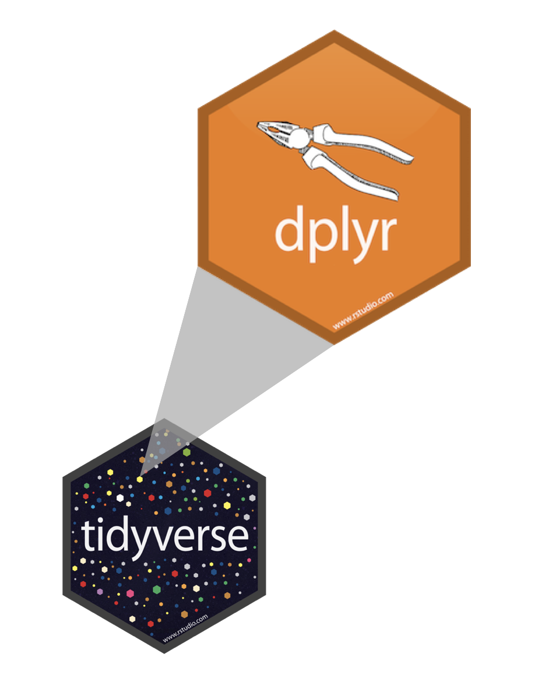

```{r child = "../slide-setup.Rmd"}
```

## Q&A

> Will we be working with different data?

We'll use a mix of old and new examples each week.

> When should we spend effort making graphs look good?

Homework, exams: always. Otherwise not necessary but always good practice.

> How do we remember which types of plots to make and how?

Class slides, RStudio cheatsheets, textbook, ...

---

## Office hours

* Mondays at 2:30pm Maroon lab
* Appointments for other times encouraged!

---

## So far

* *R/RStudio/Rmarkdown/Git*: a toolkit for reproducible collaborative analysis and reporting
* `ggplot2`: a *Grammar of Graphics*
  * a language for describing and building visualizations
  * concepts apply to many other toolkits

This week:

* `dplyr`: a *Grammar of Data Transformation*
  * basic concepts apply in SQL and other environments (e.g., Python Pandas)

---

class: middle

# Grammar of data wrangling

---

## A grammar of data wrangling...

... based on the concepts of functions as verbs that manipulate data frames

.pull-left[
```{r dplyr-part-of-tidyverse, echo=FALSE, out.width="70%", caption = "dplyr is part of the tidyverse"}

```
]
.pull-right[
.midi[
- `select`: pick columns by name
- `arrange`: reorder rows
- `slice_head`: pick first rows (`_tail`: last rows)
- `slice_sample`: pick rows randomly
- `filter`: pick rows matching criteria
- `distinct`: filter for unique rows
- `mutate`: add new variables
- `summarize`: reduce variables to values
- `pull`: grab a column as a vector
- ... (many more)
]
]

---

## Rules of **dplyr** functions

- First argument is *always* a data frame
- Subsequent arguments say what to do with that data frame
- Always return a data frame
- Don't modify in place

Don't worry, R shares memory, so copies don't waste space.

---

## Data: Hotel bookings

- Data from two hotels: one resort and one city hotel
- Observations: Each row represents a hotel booking
- Goal for original data collection: Development of prediction models to classify a hotel booking's likelihood to be cancelled ([Antonia et al., 2019](https://www.sciencedirect.com/science/article/pii/S2352340918315191#bib5))

```{r message=FALSE}
library(tidyverse)
hotels <- read_csv("data/hotels.csv")
```

.footnote[
Source: [TidyTuesday](https://github.com/rfordatascience/tidytuesday/blob/master/data/2020/2020-02-11/readme.md)
]

---

## First look: Variables

```{r output.lines=18}
names(hotels)
```

---

## Second look: Overview

```{r output.lines=18}
glimpse(hotels)
```

---

## Select a single column

View only `lead_time` (number of days between booking and arrival date):

```{r}
select(hotels, lead_time)
```

---

## Select a single column

.pull-left[
```{r eval=FALSE}
select( #<<
  hotels, 
  lead_time
  )
```
]
.pull-right[
- Start with the function (a verb): `select()`
]

---

## Select a single column

.pull-left[
```{r eval=FALSE}
select( 
  hotels, #<<
  lead_time
  )
```
]
.pull-right[
- Start with the function (a verb): `select()`
- First argument: data frame we're working with, `hotels`
]

---

## Select a single column

.pull-left[
```{r eval=FALSE}
select( 
  hotels, 
  lead_time #<<
  )
```
]
.pull-right[
- Start with the function (a verb): `select()`
- First argument: data frame we're working with, `hotels`
- Second argument: variable we want to select, `lead_time`
]

---

## Select a single column

.pull-left[
```{r}
select( 
  hotels, 
  lead_time
  )
```
]
.pull-right[
- Start with the function (a verb): `select()`
- First argument: data frame we're working with, `hotels`
- Second argument: variable we want to select, `lead_time`
- Result: data frame with `r nrow(hotels)` rows and 1 column
]

---

.tip[
dplyr functions always expect a data frame and always yield a data frame.
]

```{r}
select(hotels, lead_time)
```

---

## Select multiple columns


View only the `hotel` type and `lead_time`:

--

.pull-left[
```{r}
select(hotels, hotel, lead_time)
```
]
--
.pull-right[
.question[
What if we wanted to select these columns, and then arrange the data in descending order of lead time?
]
]

---

## Data wrangling, step-by-step

.pull-left[
Select:
```{r}
hotels %>%
  select(hotel, lead_time)
```
]

--
.pull-right[
Select, then arrange:
```{r}
hotels %>%
  select(hotel, lead_time) %>%
  arrange(desc(lead_time))
```
]

---

class: middle

# Pipes

---

## What is a pipe?

In programming, a pipe is a technique for passing information from one process to another.

--

.pull-left[
- Start with the data frame `hotels`, and pass it to the `select()` function,
]
.pull-right[
.small[
```{r}
hotels %>% #<<
  select(hotel, lead_time) %>%
  arrange(desc(lead_time))
```
]
]

---

## What is a pipe?

In programming, a pipe is a technique for passing information from one process to another.

.pull-left[
- Start with the data frame `hotels`, and pass it to the `select()` function,
- then we select the variables `hotel` and `lead_time`,
]
.pull-right[
.small[
```{r}
hotels %>%
  select(hotel, lead_time) %>% #<<
  arrange(desc(lead_time))
```
]
]

---

## What is a pipe?

In programming, a pipe is a technique for passing information from one process to another.

.pull-left[
- Start with the data frame `hotels`, and pass it to the `select()` function,
- then we select the variables `hotel` and `lead_time`,
- and then we arrange the data frame by `lead_time` in descending order.
]
.pull-right[
.small[
```{r}
hotels %>%
  select(hotel, lead_time) %>% 
  arrange(desc(lead_time)) #<<
```
]
]

---

## How does a pipe work?

- You can think about the following sequence of actions - find keys, 
unlock car, start car, drive to work, park.

--
- Expressed as a set of nested functions in R pseudocode this would look like:
```{r eval=FALSE}
park(drive(start_car(find("keys")), to = "work"))
```

--
- Writing it out using pipes give it a more natural (and easier to read) 
structure:
```{r eval=FALSE}
find("keys") %>%
  start_car() %>%
  drive(to = "work") %>%
  park()
```

---

## A note on piping and layering

- `%>%` used mainly in **dplyr** pipelines, *we pipe the output of the previous line of code as the first input of the next line of code*

--
- `+` used in **ggplot2** plots is used for "layering", *we create the plot in layers, separated by `+`*

---

## dplyr

.midi[
`r emo::ji("x")`

```{r error=TRUE}
hotels +
  select(hotel, lead_time)
```

`r emo::ji("white_check_mark")`

```{r eval=FALSE}
hotels %>%
  select(hotel, lead_time)
```

```{r echo=FALSE, output.lines=6}
hotels %>%
  select(hotel, lead_time)
```
]

---

## ggplot2

.midi[
`r emo::ji("x")`

```{r error=TRUE}
ggplot(hotels, aes(x = hotel, fill = deposit_type)) %>%
  geom_bar()
```

`r emo::ji("white_check_mark")`

```{r bar-example, out.width="25%"}
ggplot(hotels, aes(x = hotel, fill = deposit_type)) +
  geom_bar()
```
]

---

## Code Style

Many of the styling principles are consistent across `%>%` and `+`:

- always a space before
- always a line break after (for pipelines with more than 2 lines)

`r emo::ji("x")`

```{r eval=FALSE}
ggplot(hotels,aes(x=hotel,y=deposit_type))+geom_bar()
```

`r emo::ji("white_check_mark")`

```{r eval=FALSE}
ggplot(hotels, aes(x = hotel, y = deposit_type)) + 
  geom_bar()
```

---

## Code Style

>"Good coding style is like correct punctuation: you can manage without it, butitsuremakesthingseasiertoread."
>
>Hadley Wickham

- Recommended: Tidyverse style guide <https://style.tidyverse.org/>

---

## Summary

* File names and code chunks: `data-wrangling`, not `Data Wrangling`.
* Variable names: `hourly_rides`, not `hourlyRides` or `hourly.rides` or `rides_by_hour_with_weather`
  * Informative but short. Don't reuse.

---

## Spacing

- Put a space before and after all infix operators (=, +, -, <-, etc.), and when 
naming arguments in function calls
- Always put a space after a comma, and never before (just like in regular English)

```{r eval = FALSE}
# Good
average <- mean(feet * 12 + inches, na.rm = TRUE)

# Bad
average<-mean(feet*12+inches,na.rm=TRUE)
```
