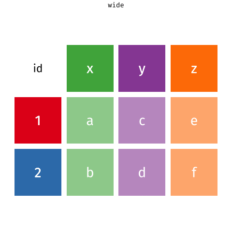
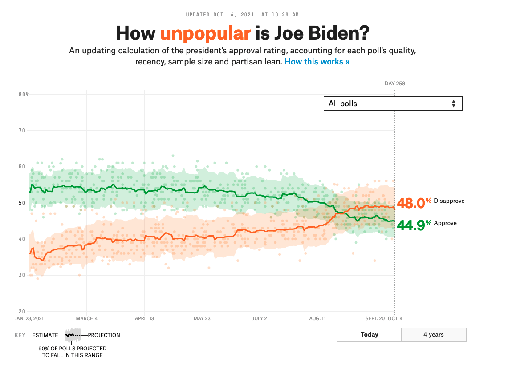
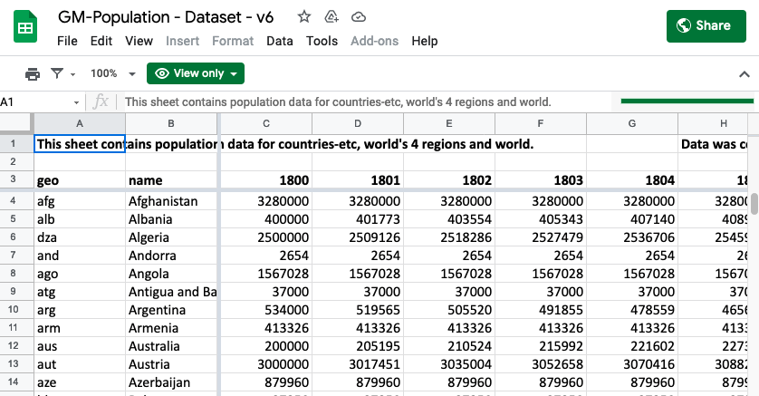

```{r child = "../slide-setup.Rmd"}
```

```{r packages, include=FALSE}
library(tidyverse)
knitr::opts_chunk$set(comment = "")
options(dplyr.print_max = 10)
```


## Q&A

> Can we use actual maps instead of scatterplots?

Yes, we need a *base layer*. We'll focus more on spatial data in a few weeks.

---

## Review of Exercise 5

Why not just grab `states$population`?

---

class: center, middle

# Pivoting

---

## Data: Sales

```{r include=FALSE}
prices <- tribble(
           ~item, ~price,
       "avocado",    0.5,
        "banana",   0.15,
         "bread",      1,
          "milk",    0.8,
  "toilet paper",      3
  )

customers <- tribble(
  ~customer_id, ~item_1,        ~item_2,  ~item_3,
            1L, "bread",         "milk", "banana",
            2L,  "milk", "toilet paper",       NA
  )
```

.pull-left[
### .green[We have...]
```{r echo=FALSE}
customers
```
]

--
.pull-right[
### .pink[We want...]
```{r echo=FALSE}
customers %>%
  pivot_longer(cols = -customer_id, names_to = "item_num", values_to = "item")
```
]

---

## A grammar of data tidying

.pull-left[
```{r dplyr-part-of-tidyverse, echo=FALSE, out.width="60%", caption = "tidyr is part of the tidyverse"}
include_graphics("img/tidyr-part-of-tidyverse.png")
```
]
.pull-right[
The goal of tidyr is to help you tidy your data via

- pivoting for going between wide and long data
- splitting and combining character columns
- nesting and unnesting columns
- clarifying how `NA`s should be treated
]

---

class: middle

# Pivoting data

---

## Not this...

```{r echo=FALSE,out.width="70%"}
include_graphics("img/pivot.gif")
```

---

## but this!

.center[
```{r echo=FALSE, out.width="45%", out.extra ='style="background-color: #FDF6E3"'}

```
]

---

## Wider vs. longer

.pull-left[
### .green[wider]
more columns
```{r echo=FALSE}
customers
```
]

--
.pull-right[
### .pink[longer]
more rows
```{r echo=FALSE}
customers %>%
  pivot_longer(cols = item_1:item_3, names_to = "item_num", values_to = "item")
```
]

---

## `pivot_longer()`

.pull-left[
- `data` (as usual)
]
.pull-right[
```{r eval=FALSE}
pivot_longer(
  data, #<<
  cols, 
  names_to = "name", 
  values_to = "value"
  )
```
]

---

## `pivot_longer()`

.pull-left[
- `data` (as usual)
- `cols`: columns to pivot into longer format 
]
.pull-right[
```{r eval=FALSE}
pivot_longer(
  data, 
  cols, #<<
  names_to = "name", 
  values_to = "value"
  )
```
]

---

## `pivot_longer()`

.pull-left[
- `data` (as usual)
- `cols`: columns to pivot into longer format 
- `names_to`: name of the column where column names of pivoted variables go (character string)
]
.pull-right[
```{r eval=FALSE}
pivot_longer(
  data, 
  cols, 
  names_to = "name", #<<
  values_to = "value"
  )
```
]

---

## `pivot_longer()`

.pull-left[
- `data` (as usual)
- `cols`: columns to pivot into longer format 
- `names_to`: name of the column where column names of pivoted variables go (character string)
- `values_to`: name of the column where data in pivoted variables go (character string)
]
.pull-right[
```{r eval=FALSE}
pivot_longer(
  data, 
  cols, 
  names_to = "name", 
  values_to = "value" #<<
  )
```
]

---

## Customers $\rightarrow$ purchases

```{r}
purchases <- customers %>%
  pivot_longer( #<<
    cols = item_1:item_3,  # variables item_1 to item_3 #<<
    names_to = "item_num", # column names -> new column called item_num #<<
    values_to = "item"     # values in columns -> new column called item #<<
    ) #<<

purchases
```

---

## Why pivot?

Most likely, because the next step of your analysis needs it

--

.pull-left[
```{r}
prices
```
]
.pull-right[
```{r}
purchases %>%
  left_join(prices) #<<
```
]

---

## Purchases $\rightarrow$ customers

.pull-left-narrow[
- `data` (long)
- `names_from`: tells us what column to put each value in
- `values_from`: tells us what to put in that column
]
.pull-right-wide[
```{r}
purchases %>%
  pivot_wider( #<<
    names_from = item_num, #<<
    values_from = item #<<
  ) #<<
```
]

---


---

class: middle

# Case study: Biden Approval Rating

---

```{r echo=FALSE, out.width="70%"}

```

.footnote[
Source: [FiveThirtyEight](https://projects.fivethirtyeight.com/biden-approval-rating/)
]

---

## Data

```{r include=FALSE}
approval_raw <- read_csv("data/approval_topline.csv")#read_csv("data/approval_polllist.csv")
approval_raw
```


```{r include=FALSE}
approval <- approval_raw %>% 
  select(subgroup, date = modeldate, approval = approve_estimate, disapproval = disapprove_estimate) %>% 
  mutate(date = lubridate::mdy(date)) %>% 
  filter(subgroup != "All polls")
# approval <- approval_raw %>% 
#   filter(subgroup != "All polls") %>% 
#   group_by(subgroup, )
#   select(subgroup, date = enddate, approval = adjusted_approve, disapproval = adjusted_disapprove)
```

```{r}
approval
```

---

## Goal

.pull-left-wide[
```{r echo=FALSE, out.width="100%"}
approval %>%
  pivot_longer(
    cols = c(approval, disapproval),
    names_to = "rating_type",
    values_to = "rating_value"
  ) %>%
  ggplot(aes(x = date, y = rating_value, 
             color = rating_type)) +
  geom_line() +
  facet_wrap(vars(subgroup)) +
  scale_color_manual(values = c("darkgreen", "orange")) + 
  labs( 
    x = "Date", y = "Rating", 
    color = NULL, 
    title = "How (un)popular is Joe Biden?", 
    subtitle = "Estimates based on polls of all adults and polls of likely/registered voters", 
    caption = "Source: FiveThirtyEight modeling estimates" 
  ) + 
  theme_minimal() +
  theme(legend.position = "bottom")
```
]
--
.pull-right-narrow[
**Aesthetic mappings:**  
`r emo::ji("check")`  x = `date`  
`r emo::ji("x")`      y = `rating_value`  
`r emo::ji("x")`      color = `rating_type`

**Facet:**  
`r emo::ji("check")`  `subgroup` (Adults and Voters)
]

---

## Pivot

```{r output.lines=11}
approval_longer <- approval %>%
  pivot_longer(
    cols = c(approval, disapproval),
    names_to = "rating_type",
    values_to = "rating_value"
  )

approval_longer
```

---

## Plot

```{r fig.asp = 0.5}
ggplot(approval_longer, 
       aes(x = date, y = rating_value, color = rating_type)) +
  geom_line() +
  facet_wrap(vars(subgroup))
```

---

.panelset[

.panel[.panel-name[Code]
```{r "approval-plot", fig.show="hide"}
ggplot(approval_longer, 
       aes(x = date, y = rating_value, 
           color = rating_type)) +
  geom_line() +
  facet_wrap(vars(subgroup)) +
  scale_color_manual(values = c("darkgreen", "orange")) + #<<
  labs( #<<
    x = "Date", y = "Rating", #<<
    color = NULL, #<<
    title = "How (un)popular is Joe Biden?", #<<
    subtitle = "Estimates based on polls of all adults and polls of likely/registered voters", #<<
    caption = "Source: FiveThirtyEight modeling estimates" #<<
  ) #<<
```
]

.panel[.panel-name[Plot]
```{r ref.label="approval-plot", echo = FALSE, out.width="75%"}
```
]

]

---

.panelset[

.panel[.panel-name[Code]
```{r "approval-plot-2", fig.show="hide"}
ggplot(approval_longer, 
       aes(x = date, y = rating_value, 
           color = rating_type)) +
  geom_line() +
  facet_wrap(vars(subgroup)) +
  scale_color_manual(values = c("darkgreen", "orange")) + 
  labs( 
    x = "Date", y = "Rating", 
    color = NULL, 
    title = "How (un)popular is Joe Biden??", 
    subtitle = "Estimates based on polls of all adults and polls of likely/registered voters", 
    caption = "Source: FiveThirtyEight modeling estimates" 
  ) + 
  theme_minimal() + #<<
  theme(legend.position = "bottom") #<<
```
]

.panel[.panel-name[Plot]
```{r ref.label="approval-plot-2", echo = FALSE, out.width="75%", fig.width=6}
```
]

]


---


class: middle

# Case study: Gapminder

---

```{r out.width="100%", echo=FALSE}

```

Source: https://www.gapminder.org/data/documentation/gd003/

---

## We want...

```{r}
gm_pop_wide <- read_csv("data/GM-Population - Dataset - v6 - data-pop-gmv6-in-columns.csv", skip = 2, show_col_types = FALSE)
gm_pop_wide %>% distinct(geo, name)
```

```{r}
gm_pop_long <- gm_pop_wide %>% 
  pivot_longer(
    cols = -c(geo, name),
    names_to = "year",
    values_to = "population"
  ) %>% 
  mutate(
    year = parse_number(year)
  )

countries_to_show <- c("China", "India", "United States", "Indonesia", "Pakistan")

#gm_pop_long %>% filter(year == 2021) %>% mutate(pop_rank = rank(population)) %>% arrange(-pop_rank)

#gm_pop_long %>% left_join(gm_pop_long %>% filter(year == 2021) %>% transmute(geo, name, pop_rank = rank(population)))
p <- gm_pop_long %>% 
  filter(between(year, 1900, 2010), name %in% countries_to_show) %>% 
  ggplot(aes(x = year, y = population / 1e6, color = name)) +
    geom_line() +
    scale_x_continuous(expand = expansion(mult = c(0, .2)))
directlabels::direct.label(p, "last.qp")
```


---

class: middle

# Case Study: is college worth it?

---

```{r include=FALSE}
# This was Jared Mulder's replication project 20FA.
```

```{r}
# https://www.insidehighered.com/news/2019/06/10/new-data-show-economic-value-earning-bachelors-degree-remains-high
# https://www.newyorkfed.org/medialibrary/media/research/college-labor-market/labor-market-for-recent-college-grads.xlsx?la=en
labor_fed <- read_csv("data/college-labor-data.csv", show_col_types = FALSE)
labor_fed
```

```{r}
labor_fed %>% 
  pivot_longer(
    cols = -Date,
    names_to = "education",
    values_to = "wage"
  ) %>% 
  separate(education, into = c("degree", "measure"), sep = ": ") %>% 
  rename(date = Date) %>% 
  mutate(date = lubridate::parse_date_time(date, "%m/%d/%y!*")) %>% 
  filter(measure == "median") %>% 
  ggplot(aes(x = date, y = wage, color = degree)) + geom_line()
```

