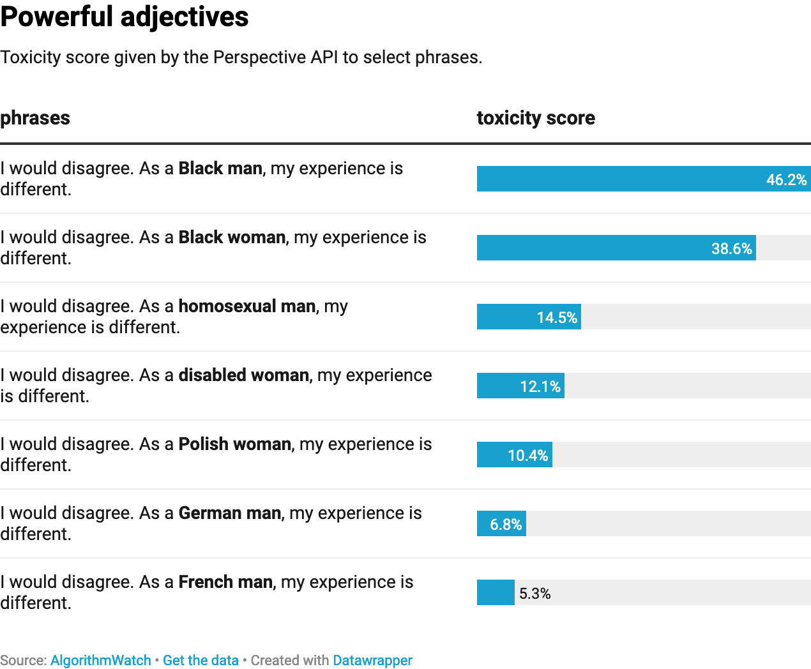
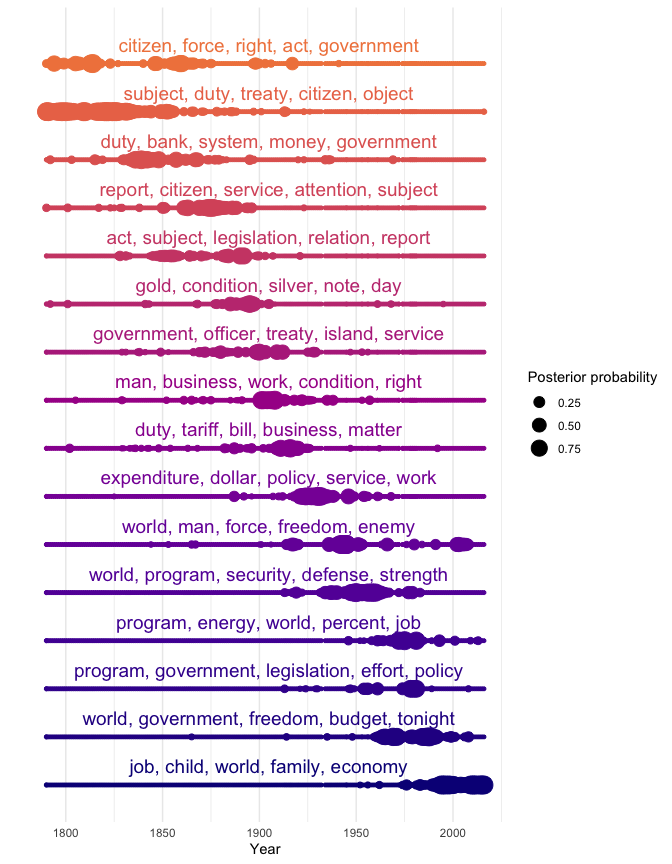

```{r setup, include=FALSE, code=xfun::read_utf8('../slide-setup.R')}
```

```{r setup2, include=FALSE, message=FALSE}
knitr::opts_chunk$set(comment = "")
Sys.unsetenv("RETICULATE_PYTHON")
library(reticulate)
Sys.setenv("TOKENIZERS_PARALLELISM" = "false")
```

class: center, middle

## Text Analysis

---

### Why?

* Lots of data is *only* in text form
  * reviews (products, movies, travel destinations, etc.)
  * social media posts
  * articles (news, Wikipedia, etc.)
  * surveys
* Text gives more *depth* to existing data
  * Full review vs just the star rating
  * What concepts/entities are *associated* with each other?
* Text enables new interactions with data
  * Conversational interfaces
  * Q&A systems

---

### What can we do with text data?

* Sentiment analysis
* Categorization (spam!)
* Information extraction
* Relationship extraction
* Topic analysis
* ... lots more!

---

### Example: Revealing Fake Comments

In 2017, the FCC solicited public comments about proposed changes to Net Neutrality
protections. They got *flooded with fake comments*.

```{r echo=FALSE, out.width="75%"}
include_graphics("https://hackernoon.com/hn-images/1*shWYIe0km5rYxPebfGPTTg.png")
```


.floating-source[
Source: Jeff Kao, [More than a Million Pro-Repeal Net Neutrality Comments were Likely Faked](https://hackernoon.com/more-than-a-million-pro-repeal-net-neutrality-comments-were-likely-faked-e9f0e3ed36a6)
See also [BuzzFeed News article](https://www.buzzfeednews.com/article/jsvine/net-neutrality-fcc-fake-comments-impersonation)
]

---

### Some examples

```{r load-packages, eval=FALSE}
if (!py_module_available("torch"))
  py_install("pytorch", channel = "pytorch")
if (!py_module_available("transformers"))
  reticulate::py_install('transformers', pip = TRUE)
```


```{python import-transformers}
from transformers import pipeline
from pprint import pprint
```

---

### Sentiment Analysis

We'll load up the default sentiment analysis pipeline, which uses a model called
[distilbert-base-uncased-finetuned-sst-2-english](https://huggingface.co/distilbert-base-uncased-finetuned-sst-2-english).
It is:

* Google's [BERT](https://arxiv.org/abs/1810.04805) language model, trained on English Wikipedia and books
* "[distilled](https://arxiv.org/abs/1910.01108)" into a smaller model that performs similarly
* "fine-tuned" to the task of predicting sentiment on the [Stanford Sentiment Treebank](https://nlp.stanford.edu/sentiment/index.html) (SST-2) dataset.

```{python}
sentiment_pipeline = pipeline("sentiment-analysis")
```


```{python}
def text_to_sentiment(sentence):
  result = sentiment_pipeline(sentence)[0]
  if result['label'] == "POSITIVE": return result['score']
  if result['label'] == "NEGATIVE": return -result['score']
  raise ValueError("Unknown result label: " + result['label'])
```

---

#### Sentiment Examples

```{python}
text_to_sentiment("I hate you")
text_to_sentiment("I love you")
```

```{python}
text_to_sentiment("This is bad.")
text_to_sentiment("This is not that bad.")
```

---

### Sentiment Bias

Examples from <https://blog.conceptnet.io/posts/2017/how-to-make-a-racist-ai-without-really-trying/>

```{python}
text_to_sentiment("Let's go get Italian food")
text_to_sentiment("Let's go get Chinese food")
text_to_sentiment("Let's go get Mexican food")
```

---

```{python}
text_to_sentiment("My name is Emily")
text_to_sentiment("My name is Heather")
text_to_sentiment("My name is Latisha")
text_to_sentiment("My name is Nour")
```

---

### It's not just in toy examples

```{r echo=FALSE}

```


.floating-source[
Source: [AlgorithmWatch](https://algorithmwatch.org/en/story/automated-moderation-perspective-bias/)
]
---

### Quantifying Bias

.small-code[
```{python}
NAMES_BY_ETHNICITY = {
    # The first two lists are from the Caliskan et al. appendix describing the
    # Word Embedding Association Test.
    'White': [
        'Adam', 'Chip', 'Harry', 'Josh', 'Roger', 'Alan', 'Frank', 'Ian', 'Justin',
        'Ryan', 'Andrew', 'Fred', 'Jack', 'Matthew', 'Stephen', 'Brad', 'Greg', 'Jed',
        'Paul', 'Todd', 'Brandon', 'Hank', 'Jonathan', 'Peter', 'Wilbur', 'Amanda',
        'Courtney', 'Heather', 'Melanie', 'Sara', 'Amber', 'Crystal', 'Katie',
        'Meredith', 'Shannon', 'Betsy', 'Donna', 'Kristin', 'Nancy', 'Stephanie',
        'Bobbie-Sue', 'Ellen', 'Lauren', 'Peggy', 'Sue-Ellen', 'Colleen', 'Emily',
        'Megan', 'Rachel', 'Wendy'
    ],

    'Black': [
        'Alonzo', 'Jamel', 'Lerone', 'Percell', 'Theo', 'Alphonse', 'Jerome',
        'Leroy', 'Rasaan', 'Torrance', 'Darnell', 'Lamar', 'Lionel', 'Rashaun',
        'Tyree', 'Deion', 'Lamont', 'Malik', 'Terrence', 'Tyrone', 'Everol',
        'Lavon', 'Marcellus', 'Terryl', 'Wardell', 'Aiesha', 'Lashelle', 'Nichelle',
        'Shereen', 'Temeka', 'Ebony', 'Latisha', 'Shaniqua', 'Tameisha', 'Teretha',
        'Jasmine', 'Latonya', 'Shanise', 'Tanisha', 'Tia', 'Lakisha', 'Latoya',
        'Sharise', 'Tashika', 'Yolanda', 'Lashandra', 'Malika', 'Shavonn',
        'Tawanda', 'Yvette'
    ],
    
    # This list comes from statistics about common Hispanic-origin names in the US.
    'Hispanic': [
        'Juan', 'José', 'Miguel', 'Luís', 'Jorge', 'Santiago', 'Matías', 'Sebastián',
        'Mateo', 'Nicolás', 'Alejandro', 'Samuel', 'Diego', 'Daniel', 'Tomás',
        'Juana', 'Ana', 'Luisa', 'María', 'Elena', 'Sofía', 'Isabella', 'Valentina',
        'Camila', 'Valeria', 'Ximena', 'Luciana', 'Mariana', 'Victoria', 'Martina'
    ],
    
    # The following list conflates religion and ethnicity, I'm aware. So do given names.
    #
    # This list was cobbled together from searching baby-name sites for common Muslim names,
    # as spelled in English. I did not ultimately distinguish whether the origin of the name
    # is Arabic or Urdu or another language.
    #
    # I'd be happy to replace it with something more authoritative, given a source.
    'Arab/Muslim': [
        'Mohammed', 'Omar', 'Ahmed', 'Ali', 'Youssef', 'Abdullah', 'Yasin', 'Hamza',
        'Ayaan', 'Syed', 'Rishaan', 'Samar', 'Ahmad', 'Zikri', 'Rayyan', 'Mariam',
        'Jana', 'Malak', 'Salma', 'Nour', 'Lian', 'Fatima', 'Ayesha', 'Zahra', 'Sana',
        'Zara', 'Alya', 'Shaista', 'Zoya', 'Yasmin'
    ]
}
```
]

---

```{r}
name_sentiments <- 
  py$NAMES_BY_ETHNICITY %>% enframe("ethnicity", "name") %>% unnest(name) %>% 
  rowwise() %>% 
  mutate(sentiment = py$text_to_sentiment(glue("My name is {name}")))
name_sentiments %>% arrange(sentiment)
```

---

```{r name-sentiments-plot}
ggplot(name_sentiments, aes(x = sentiment, y = ethnicity)) + geom_boxplot()
```


---

### Question Answering

```{python}
qa_pipeline = pipeline("question-answering")
```


```{python}
context = r"""
Extractive Question Answering is the task of extracting an answer from a text given a question. An example of a
question answering dataset is the SQuAD dataset, which is entirely based on that task. If you would like to fine-tune
a model on a SQuAD task, you may leverage the examples/question-answering/run_squad.py script.
"""

result = qa_pipeline(question="What is extractive question answering?", context=context)
print(f"Answer: '{result['answer']}', score: {round(result['score'], 4)}, start: {result['start']}, end: {result['end']}")
```


```{python}
result = qa_pipeline(question="What is a good example of a question answering dataset?", context=context)
print(f"Answer: '{result['answer']}', score: {round(result['score'], 4)}, start: {result['start']}, end: {result['end']}")
```

---

### Named Entity Recognition

```{python}
ner_pipeline = pipeline("ner", grouped_entities = True)
sequence = ("Hugging Face Inc. is a company based in New York City. Its headquarters are in DUMBO, therefore very"
           "close to the Manhattan Bridge which is visible from the window.")
```

```{python}
pprint(ner_pipeline(sequence))
```

---

class: center, middle

## Other Text Tasks

---

### Comparing texts: [`scattertext`](https://github.com/JasonKessler/scattertext)

```{r echo=FALSE}
include_graphics("https://raw.githubusercontent.com/JasonKessler/jasonkessler.github.io/master/demo_compact.png")
```

---

### Topic Modeling

```{r echo=FALSE, out.width="40%"}

```

.floating-source[
From a [vignette](https://statsmaths.github.io/cleanNLP/state-of-union.html) in the `cleanNLP` package
]

---

class: center, middle

## Other Issues

---

### Fake News

.small[
> In addition to the potential for AI-generated false stories, there’s a simultaneously scary and exciting future where AI-generated false stories are the norm. The rise of the software engineer has given us the power to create new kinds of spaces: virtual reality and augmented reality are now possible, and the “Internet of things” is increasingly entering our homes. This past year, we’ve seen a new type of art: that which is created by algorithms and not humans. In this future, AI-generated content will continue to become more sophisticated, and it will be increasingly difficult to differentiate it from the content that is created by humans. One of the implications of the rise in AI-generated content is that the public will have to contend with the reality that it will be increasingly difficult to differentiate between generated content and human-generated content.
]

* Written by GPT-3 for [The Atlantic](https://www.theatlantic.com/ideas/archive/2020/09/future-propaganda-will-be-computer-generated/616400/)
* See also: [The Radicalization Risks of GPT-3 and Advanced Neural Language Models](https://arxiv.org/abs/2009.06807)

---

### Climate Impact

* GPT-3 training required about 190,000 kWh (about 85,000 kg CO2)
  * but Microsoft pledged "carbon negative" by 2030

```{r echo=FALSE, out.width="75%"}
include_graphics("https://www.microsoft.com/en-us/research/uploads/prod/2020/02/TurningNGL_Model__1400x788.png")
```


.floating-source[
Sources: [The Register](https://www.theregister.com/2020/11/04/gpt3_carbon_footprint_estimate/),
[Carbontracker](https://arxiv.org/abs/2007.03051)
]
