```{r setup, include=FALSE, code=xfun::read_utf8('../slide-setup.R')}
```

```{r setup2, include=FALSE}
if (interactive()) source('../slide-setup.R')
library(tidyverse)
library(tidymodels)
library(patchwork)
```

<style>
.two-column {
  columns: 2;
}
</style>

## Logistics

- Modeling quizzes
- Modeling homework
- Final Projects

---

## Statistical Inference vs Predictive Modeling

> Do we need to test for normality etc. for linear regression?

If you want to make **inferences**.

- **Questions about underlying relationships**
  - Is height related to weight?
  - How must faster can you run with caffeine?
  - Does our new website lead to higher sales?
- **Questions about prediction**
  - Guess weight, given height and other details
  - Predict running speed.
  - Predict today's sales.

---

## More Q&A

> When do we use each model?

`parsnip` makes it easy to try many models! But:

- Does it need to be **accurate**? Try many models, probably RF.
- Does it need to be **understandable**? Decision Tree, or sometimes linear regression
  - Very simple shallow trees can be great for decision-makers.
- Will it need to **extrapolate**, e.g., over time? Linear regression.
- etc.

> Don't home prices change year-to-year?

Yeah, we're oversimplifying the Ames examples. Final project?

---

## More Q&A

> Why would MAPE be different than MAE?

- Predicting $5k for a $1k sale: $4k absolute error, 400% percent error.
- Predicting $105k for a $101k sale: $4k absolute error, 5% percent error.


> Can we change final projects after proposal?

Yes.

> Can we use multiple variables in linreg?

Yes! But beware: interpreting coefficients can get tricky.


---

## Unsupervised Learning

* So far we have been doing *supervised* learning, where have a *target* we're trying to predict.
  * "How much will these homes sell for?"
  * "How long will this person spend watching this video?"
* **Unsupervised** learning works when we don't have an exact target to predict, or we want to explore relationships in the data.
  * "What general types of homes are on the market right now?"
  * "What are some different segments of our customer base?"
  * "[Are there distinct types of Covid-19 symptoms?](https://covid.joinzoe.com/us-post/covid-clusters)"
* **Clustering** is one very common type of unsupervised learning.

---

## Clustering

Goal: put observations into groups

* Those in the *same* group should be *similar to each other*
* Those in *different* groups should be *different*.

Crucial questions:

* How many groups?
* How do we define "similar" / "different"?

---

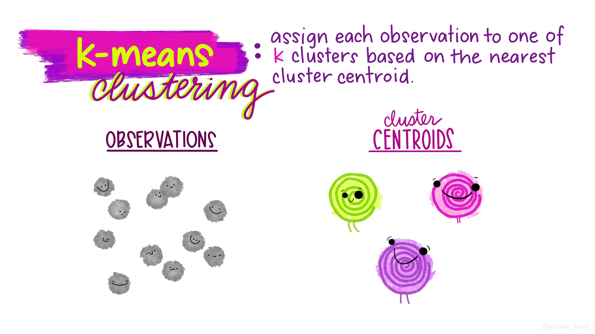

.floating-source[Artwork by [@allison_horst](https://github.com/allisonhorst/stats-illustrations)]
---

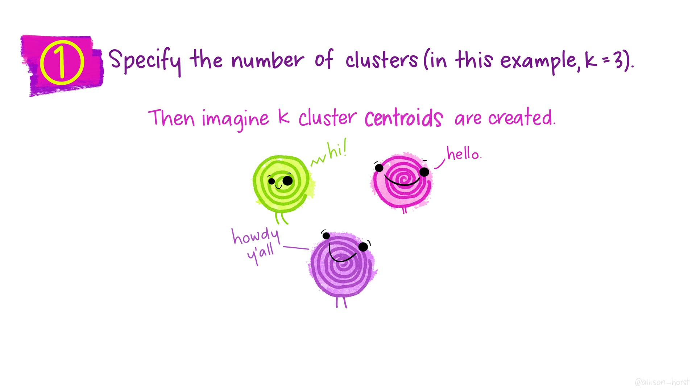

---
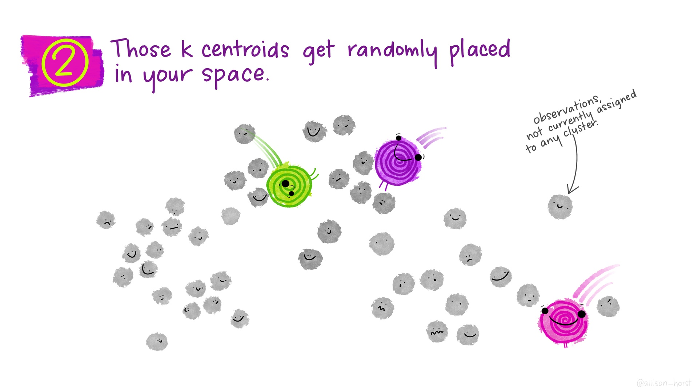

---
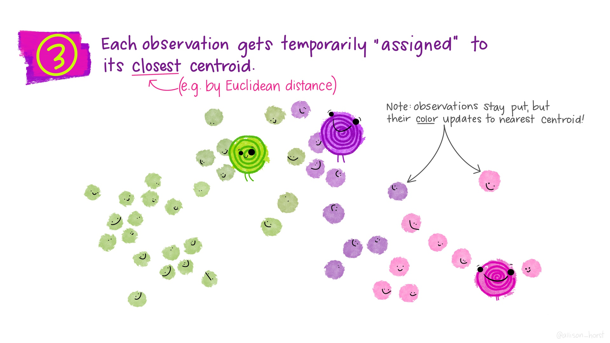

---
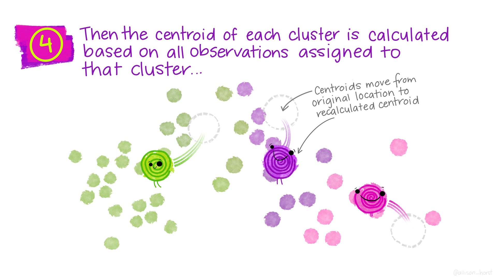

---
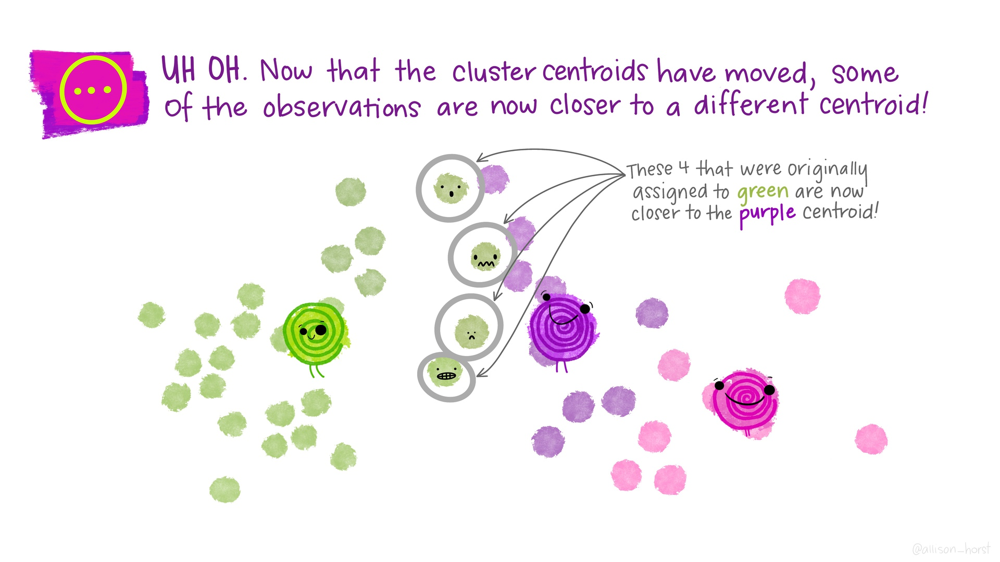

---
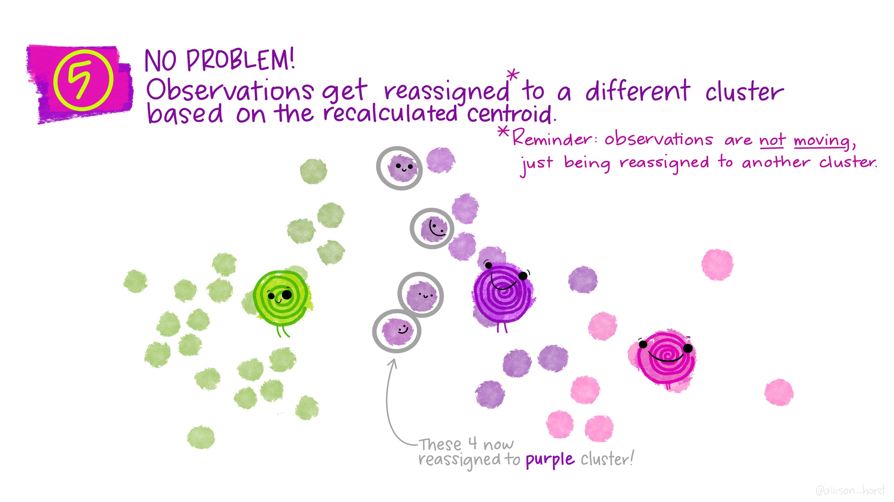

---
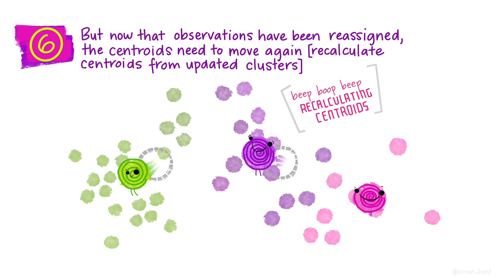

---
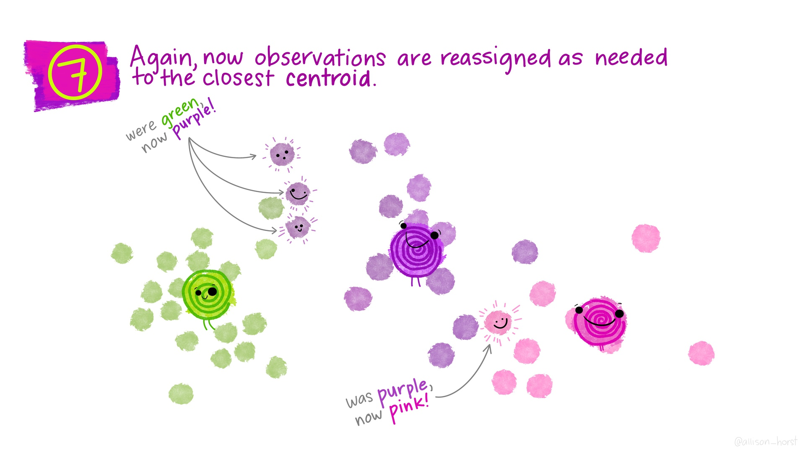

---
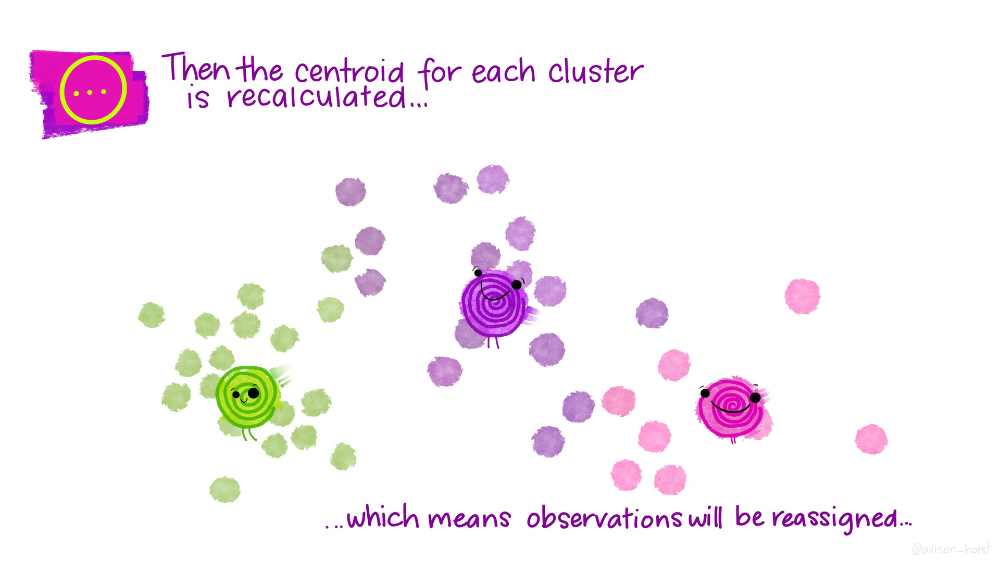
---

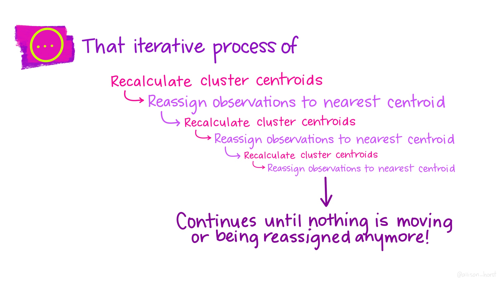

---
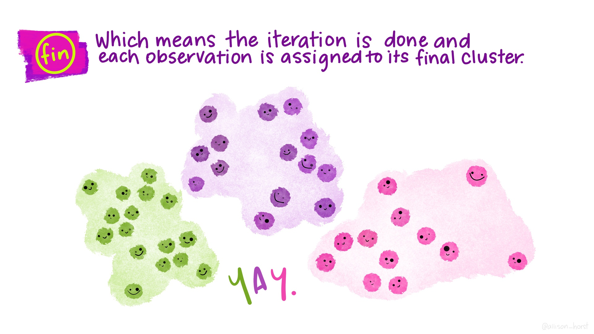

---

## *Many* types of clustering algorithms

```{r echo=FALSE, out.width="100%"}
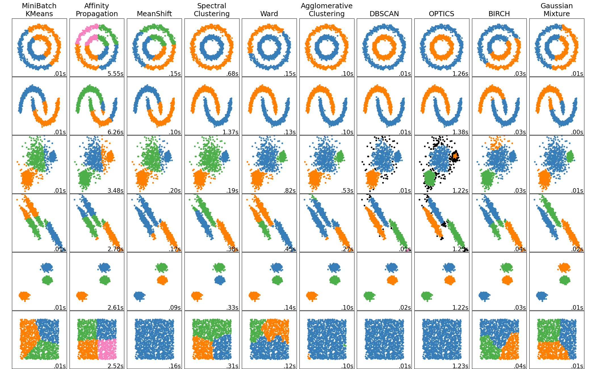
```

.floating-source[Source: [sklearn documentation](https://scikit-learn.org/stable/modules/clustering.html)]


---

```{r load-data, echo=FALSE}
#data(ames, package = "modeldata")
ames <- AmesHousing::make_ames()
ames_all <- ames %>%
  filter(Gr_Liv_Area < 4000, Sale_Condition == "Normal") %>%
  mutate(across(where(is.integer), as.double)) %>%
  mutate(Sale_Price = Sale_Price / 1000)
rm(ames)
```

```{r make-clusters}
set.seed(20201120)
data_for_clustering <- ames_all %>% 
  select(Latitude, Longitude) %>% 
  #select(Year_Built, Gr_Liv_Area) %>% 
  mutate(
    #Gr_Liv_Area = rescale(Gr_Liv_Area, to = c(0, 1)),
    #Year_Built = rescale(Year_Built, to = c(0, 1))
  )
clustering_results <- kmeans(
  data_for_clustering, nstart = 4, centers = 3
)
  

ames_with_clusters <- ames_all %>% 
  mutate(cluster = as.factor(clustering_results$cluster))
```


```{r glance-clustering-results}
glance(clustering_results)
tidy(clustering_results)
```

---

.small-code[
```{r cluster-plots, fig.asp=0.4}
latlong_plot <- 
  ggplot(ames_with_clusters, aes(y = Latitude, x = Longitude, color = cluster)) +
    geom_point(alpha = .5)

year_area_plot <- 
  ggplot(ames_with_clusters, aes(x = Gr_Liv_Area, y = Year_Built, color = cluster)) +
  #coord_equal() +
    geom_point(alpha = .5)

library(patchwork)
latlong_plot + year_area_plot + plot_layout(guides='collect')
```
]

---

## Activities

.comfortable[.two-column[
1. What differences do you notice between the plot on the left and the plot on the right?
1. Try increasing the number of `centers`. What changes about both plots?
2. Use only `Year_Built` for clustering (removing latitude and longitude). What can you say about the age of homes in different parts of town?
2. Try clustering using `select(Latitude, Longitude, Gr_Liv_Area)`. What changes about both plots?
  Why are they different?
2. Try scaling `Gr_Liv_Area` to have a maximum of 1 using `Gr_Liv_Area = rescale(Gr_Liv_Area, to = c(0, 1))` etc. What changes about both plots? Why?
2. Try adding scaling for `Latitude` (but not `Longitude`). What changes and why?
2. Now add scaling for for `Longitude`. What changes and why?
2. Try changing the maximum to `10` for `Gr_Liv_Area`. Then try `0.1`. What changes and why?
2. Try adding `Year_Built`.
]]

---

Do the patterns captured by these clusters also happen to relate to sale price?

```{r sale-price-by-cluster, fig.asp=0.4}
ames_with_clusters %>% 
  ggplot(aes(x = Sale_Price, y = cluster)) + geom_boxplot()
```

---

.small-code[
```{r appendix, echo=FALSE, results='asis'}
labels_of_non_echoed_code <- setdiff(
  knitr::all_labels(echo == FALSE),
  c("setup", "appendix")
)

cat("## Appendix\n\n")
walk(labels_of_non_echoed_code, function(label) {
  cat(paste0("\n\n```r\n", paste0(knitr::knit_code$get(label), collapse="\n"), "\n```\n"))
})
```
]
