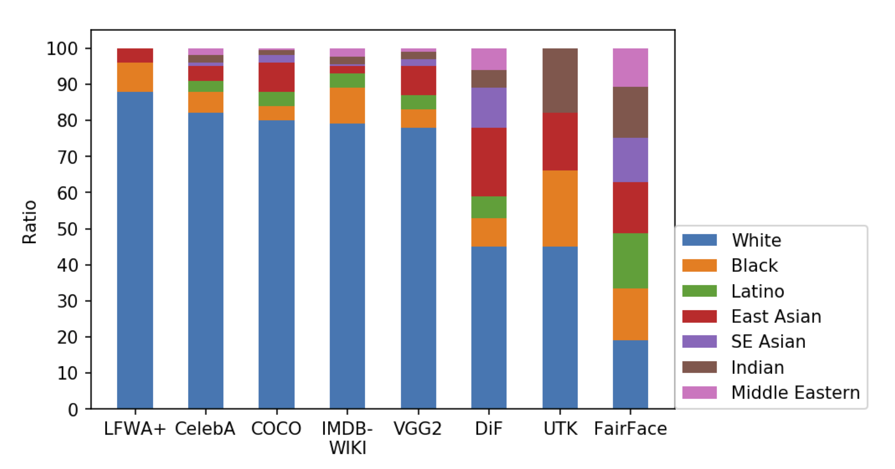

```{r setup, include=FALSE, code=xfun::read_utf8('../slide-setup.R')}
```

```{r setup2, include=FALSE}
if (interactive()) source('../slide-setup.R')
library(tidyverse)
```

## Today

- Please fill out *Course evaluations*
  - It's helpful *data* for me, my department, and the university.
  - Each comment matters. Each rating matters.
  - Be honest, be balanced.
  - Come get me in the hall when everyone is done.
- Virtuous Data Science: wrap-up

---

## Logistics

- Sign up for final project presentation slot (see Moodle)
- All work should be in before Finals (or make specific arrangements with me)
- Moodle grades aren't yet accurate, but hopefully soon!

---

## Q&A

> Is "report" just the knit PDF?

Yes. But make sure it's *readable* as a *standalone document* by someone who
*can't read R code*.

> Is data visualization a separate job?

Sometimes, e.g., NYTimes Graphics Dept (`@nytgraphics`). But data scientists often wear many hats.

---

## Q&A

> *Why* were facial recognition systems less accurate for minorities?

```{r echo=FALSE}

```

.floating-source[.small[FairFace: Face Attribute Dataset for Balanced Race, Gender, and Age, arXiv:1908.04913]]

---

> Are there ways that we can make this better for the future?

Measurement. Accountability. Diverse representation on team leadership. ...

---

class: middle, center

...some of your quotes...

---

## Recommendation Systems

>  people begin to try to fit into a box

<br>

> Part of me wants to find this creepy, but at the same time its somewhat convenient

<br>

> ... mindlessly scroll through the platform's content without thinking very much ... However, the platforms ... are filtering what I am seeing


---

## Facial Recognition

>  I think as a society we have become obsessed with the advantages of automation and maybe have not taken the proper time to consider the disadvantages automation causes.

<br>

> When we fail to acknowledge diversity we create systems that disproportionately affect others.

---

## Wrap-Up of Virtuous Data Science


### Objectives

- Describe how Reformed concepts of justice and shalom apply to data collection, analysis, sharing, and use.
- Give examples of specific concerns around privacy, bias, accountability, and transparency
- Describe steps and dispositions that individual data scientists can take to act justly in their profession

---

## A bullet-point summary of biblical *justice*

* Community above individual (voluntarily)
* Equity: equal treatment, dignity
* Collective responsibility
* Individual responsibility
* Advocacy for poor and marginalized

.question[
What does biblical justice require, in the area of data science?
]

<!-- ` countdown(minutes = 3, update_every = 15)` -->

.floating-source[.small[Tim Keller, [A Biblical Critique of Secular Justice and Critical Theory](https://quarterly.gospelinlife.com/a-biblical-critique-of-secular-justice-and-critical-theory/)]]

---

<!-- ### Some things you pointed out in Discussion -->

<!-- * Care for people *together with* care for environment -->
<!-- * Care for individual people affected, not just general economic impacts -->
<!-- * Cherishing and celebrating what God has made (people, natural resources) instead of exploiting -->
<!-- * Need safeguards to protect from the effects of sin -->

<!-- some scripture you mentioned: -->

<!-- * Isaiah 56:1, Psalm 82:3 -->

<!-- --- -->

### Community

> The righteous are willing to disadvantage themselves to advantage the community; the wicked are willing to disadvantage the community to advantage themselves.

--

So:

- privacy: what *must* we share? what must we *not* share?
- integrity in data collection, analysis, reporting, communication

Thus:

- Data analysis process: *reproducible*, *transparent*, *documented*
- Reporting: transparency about *limitations*, *choices*, consideration of *possible harms*

---

### Equity: Everyone must be treated equally and with dignity.

--

* *direct* impact
  * fair risk assessment (see Discussion and COMPAS)
  * fair surveillance (don't hyper-surveil the poor etc.)
  * fair resource allocation
* *indirect* impact:
  * don't show ads for criminal background checks more often for Black names
  * don't tolerate higher speech recognition error rates for minorities
  * show a representative diversity of age/gender/race/... in image searches

---

### Should we even be predicting peoples' lives?

* Risk assessment for criminality, loan approval, etc. requires predicting
  peoples' future actions and situations
* These predictions might be terribly inaccurate. *Should we be trying at all*?

Salganik et al, [**Measuring the predictability of life outcomes with a scientific mass collaboration**](https://www.pnas.org/content/117/15/8398.short). PNAS, April 2020

> Despite using a rich dataset and applying machine-learning methods optimized for prediction, the best predictions were not very accurate and were only slightly better than those from a simple benchmark model.

---

### Corporate responsibility: I am sometimes responsible for and involved in other people’s sins.

--

* Even if *I* intend no prejudice, my *algorithm* could be prejudiced because of training data.
* Even if my work is honest, I could be supporting a company that exploits other
  workers directly or rely on conflict minerals and [child labor](https://www.bbc.com/news/world-africa-50812616)
* Environmental responsibility is both individual and collective

???

http://opiniojuris.org/2020/01/13/the-mighty-apple-google-tesla-dell-and-microsoft-in-the-dock-a-look-at-the-child-labour-lawsuit/

---

### Individual responsibility: I am finally responsible for all my sins, but not for all my outcomes.

--

* I must do what's right, whether or not my company's policies require it.
* When something isn't right, I need to say something even if it risks my job.

---

### Advocacy: We must have special concern for the poor and the marginalized.

--

- By *exposing injustice* through visualization and modeling
- By **listening to** and **amplifying**, not **speaking for**.
- e.g., beware of doing "parachute research" or de-contextualized "Data for Good"

Data science, and data scientists, *are not saviors*.

---

### Incarnation

.scripture[
```
In your relationships with one another, have the
  same mindset as Christ Jesus:
Who, being in very nature God,
    did not consider equality with God something
      to be used to his own advantage;
rather, he made himself nothing
    by taking the very nature of a servant,
    being made in human likeness.
And being found in appearance as a man,
    he humbled himself
    by becoming obedient to death—
        even death on a cross!
```
.ref[Philippians 2:5-8, NIV]
]

---

class: center, middle

## Learning More

---

## Courses

- DATA 303: Applied Modeling and Visualization
- CS 344: Machine Learning (AI)
- STAT 245: Applied Data Analysis
- STAT 341: Computational Bayesian Statistics

---

### Some further reading on data ethics

* [The Oxford Handbook of Ethics of AI](https://global.oup.com/academic/product/the-oxford-handbook-of-ethics-of-ai-9780190067397?cc=ca&lang=en&#)
* Coded Bias documentary
* Fast.AI [Data Ethics course](https://ethics.fast.ai/)
* [Ethics and Data Science](https://www.amazon.com/Ethics-Data-Science-Mike-Loukides-ebook/dp/B07GTC8ZN7) by Mike Loukides, Hilary Mason, DJ Patil
* [Weapons of Math Destruction](https://www.amazon.com/Ethics-Data-Science-Mike-Loukides-ebook/dp/B07GTC8ZN7): *How Big Data Increases Inequality and Threatens Democracy*, by Cathy O'Neil
* [How Charts Lie](https://wwnorton.com/books/9781324001560): *Getting Smarter about Visual Information*, by Alberto Cairo
* [How Deceptive are Deceptive Visualizations?](https://dl.acm.org/doi/10.1145/2702123.2702608) Pandey et al., CHI 2015

---

## Other resources on Data Ethics

* AI Now Institute
* Data and Society
* [AlgorithmWatch](https://algorithmwatch.org/en/)
* [Harvard BKC](https://twitter.com/BKCHarvard)
* ACM Conference on Fairness, Accountability, and Transparency ([FAccT](https://facctconference.org/))

---

## Who/What I'm Reading / Following: Tech

* [RStudio AI blog](https://blogs.rstudio.com/ai/)
* [tidyverse blog](https://www.tidyverse.org/blog/)
* [RWeekly](https://rweekly.org/)
* [distill.pub](https://distill.pub/)
* [Harvard Data Science Review](https://hdsr.mitpress.mit.edu/)
* [TWiML Podcast](https://twimlai.com/shows/)
* [Cassie Kozyrkov](https://decision.substack.com/) ([@quaesita](https://twitter.com/quaesita))


---

## "What can I do?"

- Practice the "data dispositions"
  - Humility (cite sources, acknowledge limitations, validate results)
  - Integrity (check assumptions, reproduce analyses, evaluate others' claims)
  - Hospitality (clear visuals, clear reports, clear code)
  - Compassion and justice

<!-- * Choose jobs carefully ([How to Interview a Tech Company](https://medium.com/@AINowInstitute/how-to-interview-a-tech-company-d4cc74b436e9)) -->
<!--   * You *can* make a difference inside even a "bad" company--but recruit a support network like a missionary. -->
- Listen a lot. To diverse opinions. (e.g., "The Flip Side")
- Keep in touch.
