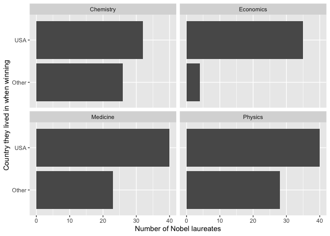
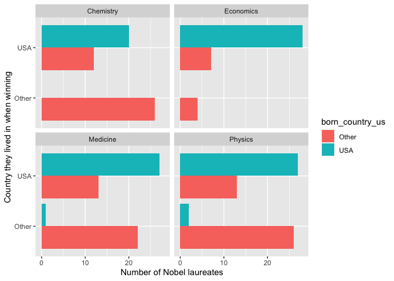

Lab 03 - Nobel laureates
================
YOUR NAME
TODAY’S DATE

### Load packages and data

    library(tidyverse)

    nobel <- read_csv("data/nobel.csv")

### Exercise 1

There are 935 Nobel laureates in the dataset. For each laureate the
dataset provides 26 variables.

### Exercise 2

    nobel_living <- nobel %>%
      filter(!is.na(country),
             gender != "org",
             is.na(died_date))

We have data for 228 living Nobel laureates.

    nobel_living_science <- nobel_living %>%
      mutate(
        country_us = if_else(country == "USA", "USA", "Other"),
        born_country_us = if_else(born_country == "USA", "USA", "Other")
      ) %>% 
      filter(category %in% c("Physics", "Medicine", "Chemistry", "Economics"))

### Exercise 3

    ggplot(nobel_living_science, aes(y = country_us)) +
      geom_bar() +
      facet_wrap(~ category) +
      labs(x = "Number of Nobel laureates", y = "Country they lived in when winning")

<!-- -->

Across all four STEM categories, there were more laureates who were
living in the US than in any other country at the time the prize was
awarded.

### Exercise 4

*don’t add code here; instead, go back and edit the pipeline in Exercise
2*

### Exercise 5

    ggplot(nobel_living_science, aes(y = country_us, fill = born_country_us)) +
      geom_bar(position = position_dodge(preserve = "single")) +
      facet_wrap(~ category) +
      labs(x = "Number of Nobel laureates", y = "Country they lived in when winning")

<!-- -->

### Exercise 6

    nobel_living_science %>% 
      filter(country == "USA" & born_country_us != "USA") %>% 
      count(born_country) %>% 
      arrange(desc(n))

    ## # A tibble: 21 x 2
    ##    born_country       n
    ##    <chr>          <int>
    ##  1 Germany            7
    ##  2 United Kingdom     7
    ##  3 China              5
    ##  4 Canada             4
    ##  5 Japan              3
    ##  6 Australia          2
    ##  7 Israel             2
    ##  8 Norway             2
    ##  9 Austria            1
    ## 10 Finland            1
    ## # … with 11 more rows
