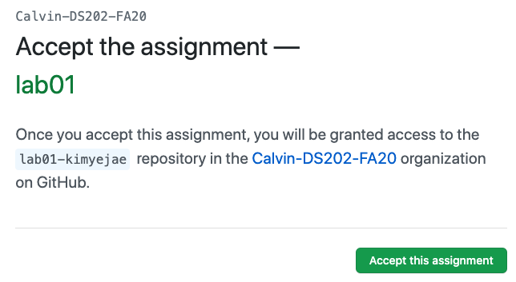
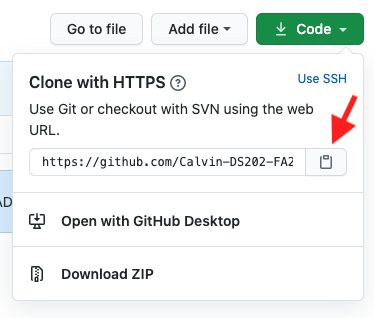
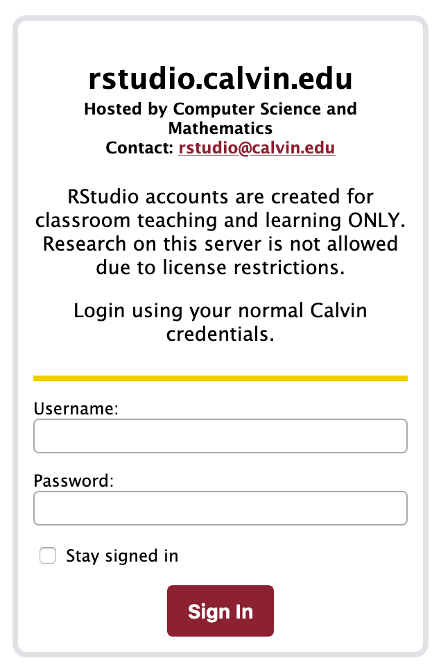
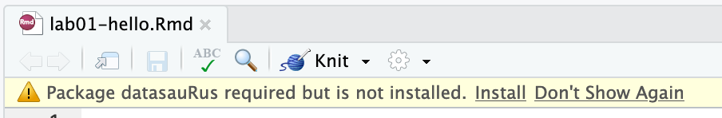
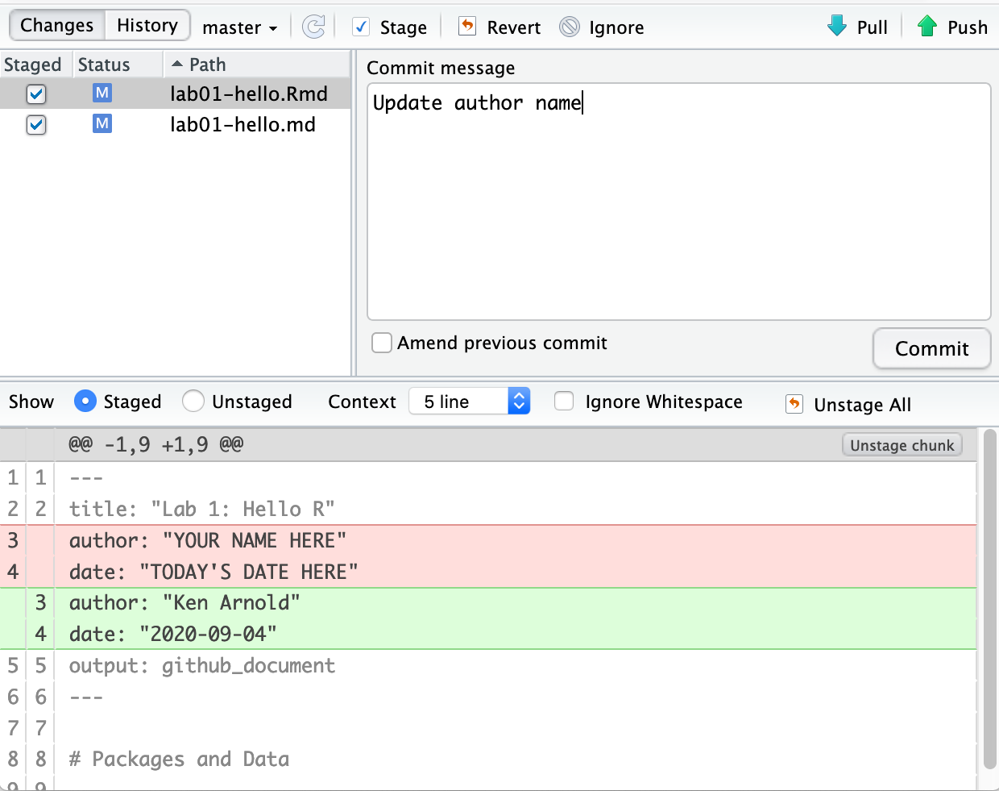
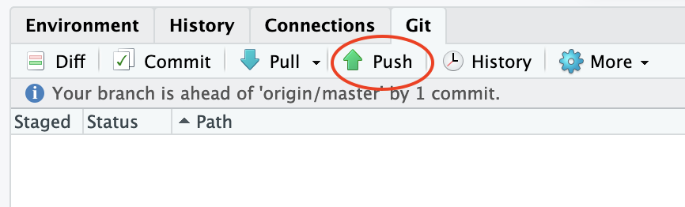

# Learning goals

- Get acquainted with R and RStudio, which we will be using throughout the course to analyze data.
- Get practice using Git and GitHub.
- Appreciate the value of visualization in exploring the relationship between variables.
- Start using R for building plots and calculating summary statistics.

# Terminology

We've already thrown around a few new terms, so let's define them before we proceed.

```{marginfigure}
You can think about it as R is the engine of the car, and RStudio is the dashboard.
```

- **R**: Name of one of the programming languages we will be using throughout the course.
- **RStudio**: A convenient interface for writing and running R code.

```{marginfigure}
Git is like the "Track Changes" feature from Microsoft Word on steroids, and GitHub is the home for your Git-based projects on the internet (like Dropbox).
```

- **Git**: A version control system.
- **GitHub**: A platform for collaboration using Git.
- **Repository**: A Git repository ("repo") contains all of your project's files and stores each file's revision history. It's common to refer to a repository as a repo.
  - In this course, each assignment you work on will be contained in a Git repo.
  - For individual assignments, only you will have access to the repo. For team assignments, all team members will have access to a single repo where they work collaboratively.
  - All repos associated with this course are housed in a GitHub organization: [`Calvin-DS202-FA20`](https://github.com/Calvin-DS202-FA20). The organization is set up such that students can only see repos they have access to, but the course staff can see all of them.

# Starting slow

As the labs progress, you are encouraged to explore beyond what the labs dictate; a willingness to experiment will make you a much better data scientist Before we get to that stage, however, you need to build some basic fluency in R. Today we begin with the fundamental building blocks of R and RStudio: the interface, reading in data, and basic commands.

To make versioning simpler, this is a solo lab. Additionally, we want to make sure everyone gets a significant amount of time at the steering wheel. Next week you'll learn about collaborating on GitHub and produce a single lab report for your team.

# Getting started

Before you can get started with the analysis, you will first need to make a GitHub account
and link that account with our class.

## Create a GitHub account

Go to [github.com](https://github.com/) and create an account (unless you already have one).

Below are some tips for selecting a username:^[[Happy git with R](http://happygitwithr.com/github-acct.html#username-advice) by Jenny Bryan]

- Incorporate your actual name.
- Reuse username from other contexts, e.g. Twitter.
- Pick a username you will ll be comfortable revealing to your future boss.
- Shorter is better than longer.
- Be as unique as possible in as few characters as possible.
- Make it timeless. Don’t highlight your current university, employer, etc.

## Join the course organization

- Go to https://classroom.github.com/a/tyhssTGy to accept your lab assignment. Since this is the first assignment, clicking on this link will also allow you to join the course GitHub organization. Log in with your GitHub username and password and click on **Authorize GitHub**.

- In the next screen you will see a course roster with names of students enrolled in this course. Select your name from the list.

```{r github-classroom, fig.margin = TRUE, echo = FALSE}

```

- Then, in the next screen, click on **Accept this assignment**. This will create the  GitHub repo for the assignment. This repo contains a template you can build on to complete your assignment. Click on the repository link created for you to get started.

# Workflow overview

```{marginfigure}
This action is called *cloning*.
```

For each assignment in this course you will start with a GitHub repo that I created for you and that contains the starter documents you will build upon when working on your assignment. The first step is always to bring these files into RStudio so that you can edit them, run them, view your results, and interpret them.

Then you will work in RStudio on the data analysis, making *commit*s along the way (snapshots of your changes) and finally *push* all your work back to GitHub.

The next few steps will walk you through the process of getting information of the repo to be cloned, launching RStudio, and cloning your repo, and getting started with the analysis.

## 1. Get URL of repo to be cloned


```{r clone-repo-link, fig.margin = TRUE, echo = FALSE, fig.width=3}

```

On GitHub, click on the green **Code** button, select **Use HTTPS** (this might already be selected by default, and if it is, you'll see the text **Clone with HTTPS** as in the image below). Click on the clipboard icon to copy the repo URL.

## 2. Launch RStudio

```{r rstudio-login, fig.margin = TRUE, echo = FALSE}

```

Go to the [course webpage](https://tiny.cc/data202) or the class Moodle, and click on "RStudio". Log in with your Calvin credentials.

## 3. Clone the repo

And finally we clone the GitHub repo into an RStudio project.

```{r clone-repo-rstudio, fig.fullwidth=TRUE, echo = FALSE}
knitr::include_graphics("img/clone-repo-rstudio.png")
```

```{r fig.margin = TRUE, echo = FALSE}
knitr::include_graphics("img/rstudio-new-project.png")
```


- In RStudio, click on File > New Project
- In the next window, select Git
- In the final window:
  - Repository URL: Paste the repo url you grabbed from GitHub here
  - Click the tab button on your keyboard, and the project name will be filled in for you
  - Click Create Project
- Enter your GitHub username and password when prompted, and you're good to go!

## 4. Get working!

```{r fig.margin = TRUE, echo=FALSE}

```


Open the R Markdown (`Rmd`) file called `lab-01-hello.Rmd`. It will likely ask you if you would like to install a package that is required, click Install.

# Hello RStudio!

RStudio is comprised of four panes.

```{r rstudio-anatomy, fig.fullwidth=TRUE, echo = FALSE}
knitr::include_graphics("https://www-users.york.ac.uk/~er13/RStudio%20Anatomy.svg")
```

```{marginfigure}
For more details about the RStudio interface, see [this cheatsheet](https://raw.githubusercontent.com/rstudio/cheatsheets/master/rstudio-ide.pdf).
```


- On the bottom left is the Console, this is where you can write code that will be evaluated. Try typing `2 + 2` here and hit enter, what do you get?

- On the bottom right is the Files pane, as well as other panes that will come handy as we start our analysis. It also includes the Help and Viewer tabs, which you'll use a lot.

- If you click on a file, it will open in the editor, on the top left pane.

- Finally, the top right pane shows your Environment. If you define a variable it would show up there. Try typing `x <- 2` in the Console and hit enter, what do you get in the Environment pane? Importantly, this pane is also where the Git interface lives. We will be using that regularly throughout this lab.

# Packages

R is an open-source language, and developers contribute functionality to R via packages. In this lab we will work with two packages: `tidyverse`, which is a collection of packages for doing data analysis in a "tidy" way, and `usethis`, for setting our Git credentials.


Load these packages by running the following in the Console.

```{r message=FALSE}
library(tidyverse) 
library(usethis)
```

Note that the packages are also loaded with the same commands in your R Markdown document.

Packages can also distribute datasets, which is convenient for examples like this one. We'll use the "datasauRus" package, so run this command to load our dataset from it:

```{r}
datasaurus_dozen <- datasauRus::datasaurus_dozen
```

(If you get an error, run `install.packages("datasauRus")` in the Console and try again.)


# Hello Git!

```{marginfigure}
Your email address is the address tied to your GitHub account and your name should be first and last name.
```

Before we can get started we need to take care of some required housekeeping. Specifically, we need to do some configuration so that RStudio can communicate with GitHub. This requires two pieces of information: your email address and your name.

Run the following (but update it for your name and email!) in the Console to configure git:

```{r git-config, eval=FALSE}
use_git_config(user.name = "Your Name", 
               user.email = "your.email@address.com")
``` 

# Warm up

Before we introduce the data, let's warm up with some simple exercises.

## Metadata

Open the R Markdown (`Rmd`) file in your project, change the author name to your name, and `Knit` the document.

## `r emo::ji("white_check_mark")` Commit

Then go to the Git pane in your RStudio.

If you have made changes to your `Rmd` file, you should see it listed here. Click on it to select it in this list and then click on **Diff**. This shows you the *diff*erence between the last committed state of the document and its current state that includes your changes. If you're happy with these changes, write "Update author name" in the **Commit message** box and hit **Commit**.

```{r update-author-name-commit, fig.fullwidth=TRUE, echo = FALSE}

```

You don't have to commit after *every* change, this would get quite cumbersome. You should consider committing states that are *meaningful to you* for inspection, comparison, or restoration. In the first few assignments we will tell you exactly when to commit and in some cases, what commit message to use. As the semester progresses we will let you make these decisions.

## `r emo::ji("arrow_up")` Push

```{r echo=FALSE}

```

Now that you have made an update and committed this change, it's time to push these changes to the web! Or more specifically, to your repo on GitHub. Why? So that others can see your changes. And by others, we mean the course teaching team (your repos in this course are private to you and us, only). 

In order to push your changes to GitHub, click on **Push**. This will prompt a dialogue box where you first need to enter your user name, and then your password. This might feel cumbersome. Bear with me... We *will* teach you how to save your password so you don't have to enter it every time. But for this one assignment you'll have to manually enter each time you push in order to gain some experience with it.

## Thought exercise

For which of the above steps (changing project name, making updates to the document, committing, and pushing changes) do you need to have an internet connection? Discuss with your classmates.

# Data

```{marginfigure}
If it's confusing that the data frame is called `datasaurus_dozen` when it contains 13 datasets, you're not alone! Have you heard of a [baker's dozen](https://en.wikipedia.org/wiki/Dozen#Baker's_dozen)?
```

The data frame we will be working with today is called `datasaurus_dozen` and it's in the `datasauRus` package. Actually, this single data frame contains 13 datasets, designed to show us why data visualization is important and how summary statistics alone can be misleading. The different datasets are marked by the `dataset` variable.

To find out more about the dataset, type the following in your Console: `?datasaurus_dozen`. A question mark before the name of an object will always bring up its help file. This command must be run in the Console.

1. Based on the help file, how many rows and how many columns does the `datasaurus_dozen` file have? What are the variables included in the data frame? Add your responses to your lab report. When you're done, commit your changes with the commit message "Added answer for Ex 1", and push. `r emo::ji("white_check_mark")` `r emo::ji("arrow_up")`

Let's take a look at what these datasets are. To do so we can make a *frequency table* of the dataset variable:

```{r}
datasaurus_dozen %>%
  count(dataset)
```

```{marginfigure}
Matejka, Justin, and George Fitzmaurice. "Same stats, different graphs: Generating datasets with varied appearance and identical statistics through simulated annealing." Proceedings of the 2017 CHI Conference on Human Factors in Computing Systems. ACM, 2017.
```

The original Datasaurus (`dino`) was created by Alberto Cairo in [this great blog post](http://www.thefunctionalart.com/2016/08/download-datasaurus-never-trust-summary.html). The other Dozen were generated using simulated annealing and the process is described in the paper *Same Stats, Different Graphs: Generating Datasets with Varied Appearance and Identical Statistics* through Simulated Annealing by Justin Matejka and George Fitzmaurice. In the paper, the authors simulate a variety of datasets that the same summary statistics to the Datasaurus but have very different distributions.

# Data visualization and summary

2. Plot `y` vs. `x` for the `dino` dataset. Then, calculate the correlation coefficient between `x` and `y` for this dataset.

Below is the code you will need to complete this exercise. Basically, the answer is already given, but you need to include relevant bits in your Rmd document and successfully knit it and view the results.

Start with the `datasaurus_dozen` and pipe it into the `filter` function to filter for observations where `dataset == "dino"`. Store the resulting filtered data frame as a new data frame called `dino_data`.

```{r}
dino_data <- datasaurus_dozen %>%
  filter(dataset == "dino")
```

There is a lot going on here, so let's slow down and unpack it a bit. 

First, the pipe operator: `%>%`, takes what comes before it and sends it as the first argument to what comes after it. We can pronounce it "then". So here, we're saying to take the `datasaurus_dozen` data frame and then `filter` it for observations where `dataset == "dino"`.

Second, the assignment operator: `<-`, assigns the name `dino_data` to the filtered data frame. We can pronounce it "gets" or "gets assigned"

We can read this statement out loud like this: "What `dino_data` gets is: take `datasaurus_dozen` then `filter` where `dataset` is the string `dino`."

Next, we need to visualize these data. We will use the `ggplot` function for this. Its first argument is the data you're visualizing. Next we define the `aes`thetic mappings. In other words, the columns of the data that get mapped to certain aesthetic features of the plot, e.g. the `x` axis will represent the variable called `x` and the `y` axis will represent the variable called `y`. Then, we add another layer to this plot where we define which `geom`etric shapes we want to use to represent each observation in the data. In this case we want these to be points,m hence `geom_point`.

```{r fig.fullwidth=TRUE}
ggplot(data = dino_data, mapping = aes(x = x, y = y)) +
  geom_point()
```

If this seems like a lot, it is. And you will learn about the philosophy of building data visualizations in layer in detail next week. For now, follow along with the code that is provided.

For the second part of this exercises, we need to calculate a summary statistic: the correlation coefficient. Correlation coefficient, often referred to as $r$ in statistics, measures the linear association between two variables. You will see that some of the pairs of variables we plot do not have a linear relationship between them. This is exactly why we want to visualize first: visualize to assess the form of the relationship, and calculate $r$ only if relevant. In this case, calculating a correlation coefficient really doesn't make sense since the relationship between `x` and `y` is definitely not linear -- it's dinosaurial!

But, for illustrative purposes, let's calculate correlation coefficient between `x` and `y`.

```{marginfigure}
Start with `dino_data` and calculate a summary statistic that we will call `r` as the `cor`relation between `x` and `y`.
```

```{r}
dino_data %>%
  summarize(r = cor(x, y))
```

`r emo::ji("white_check_mark")` `r emo::ji("arrow_up")` *This is a good place to pause, commit changes with the commit message "Added answer for Ex 2", and push.*

3. Plot `y` vs. `x` for the `star` dataset. You can (and should) copy and paste the code we introduced above, just replace the dataset name with the desired dataset. Then, calculate the correlation coefficient between `x` and `y` for this dataset. How does this value compare to the `r` of `dino`?

`r emo::ji("white_check_mark")` `r emo::ji("arrow_up")` *This is another good place to pause, commit changes with the commit message "Added answer for Ex 3", and push.*

4. Plot `y` vs. `x` for the `circle` dataset. You can (and should) reuse code we introduced above, just replace the dataset name with the desired dataset. Then, calculate the correlation coefficient between `x` and `y` for this dataset. How does this value compare to the `r` of `dino`?

`r emo::ji("white_check_mark")` `r emo::ji("arrow_up")` *You should pause again, commit changes with the commit message "Added answer for Ex 4", and push.*

```{marginfigure}
Facet by the dataset variable, placing the plots in a 3 column grid, and don't add a legend.
```

5. Finally, let's plot all datasets at once. In order to do this we will make use of faceting.

```{r all-viz, eval=FALSE, fig.fullwidth=TRUE}
ggplot(datasaurus_dozen, aes(x = x, y = y, color = dataset)) +
  geom_point() +
  facet_wrap(~ dataset, ncol = 3) +
  theme(legend.position = "none")
```

And we can use the `group_by` function to generate all correlation coefficients.

```{r first-10-r, eval=FALSE}
datasaurus_dozen %>%
  group_by(dataset) %>%
  summarize(r = cor(x, y))
```


`r emo::ji("white_check_mark")` `r emo::ji("arrow_up")`  *Yay, you're done! Commit all remaining changes, use the commit message "Done with Lab 1! `r emo::ji("muscle")`", and push. Before you wrap up the assignment, make sure all documents are updated on your GitHub repo.*

`r emo::ji("heavy_check_mark")` Checklist:

* `r emo::ji("yarn")` I **knit** the most recent version of the document.
* `r emo::ji("white_check_mark")` I **commit**ted all files: my "Git" tab doesn't list any files in it.
* `r emo::ji("arrow_up")` I **push**ed to GitHub
* `r emo::ji("eyes")` I **look**ed at the `.md` file on my repo on GitHub to make sure everything looks right

Repeat after me: "knit-commit-push".

<br>

---

# Getting to know you

If you're done with your lab, use the remaining time to take the Intro survey on Moodle and get ahead on your readings. If time is up for the lab session, complete the survey at home by Monday.
