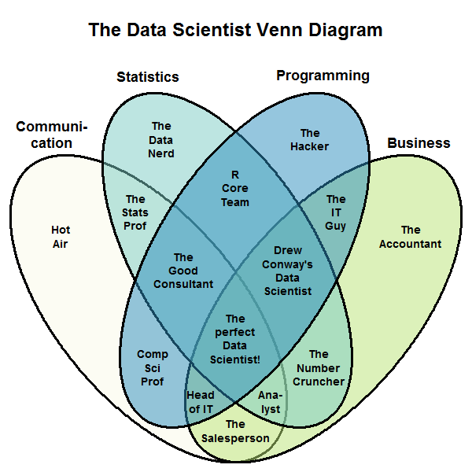
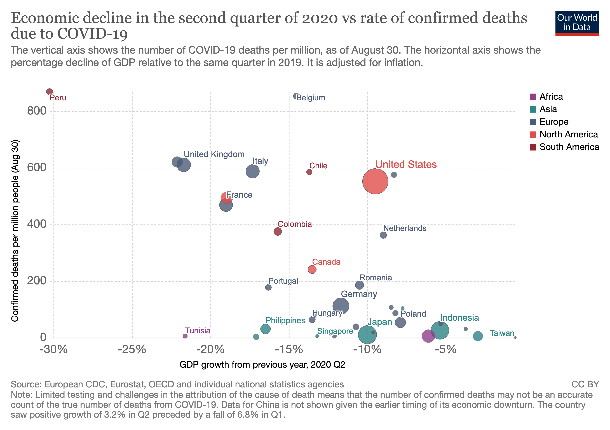
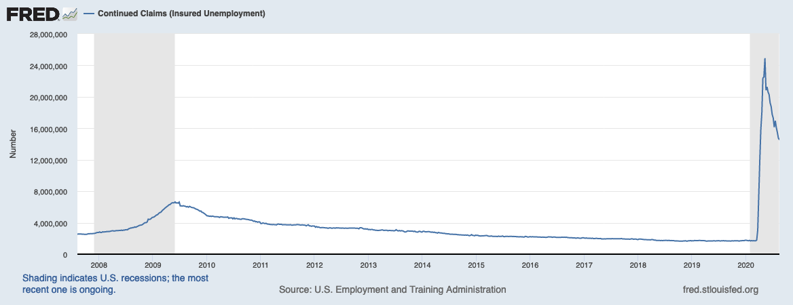
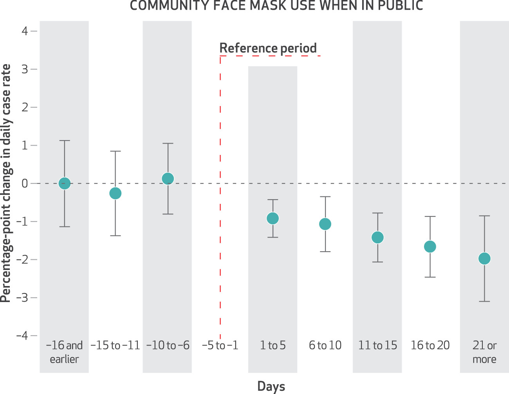
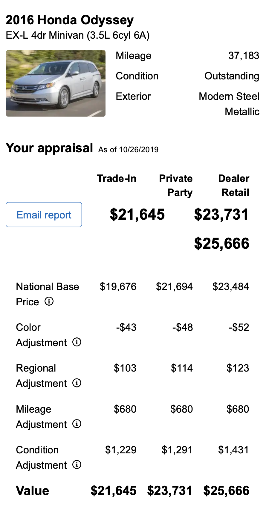

```{r xaringan-themer, include=FALSE, warning=FALSE}
library(xaringanthemer)
style_mono_accent(
#  base_color = "#1c5253",
  base_color = "#8C2131",
  #header_font_google = google_font("Josefin Sans"),
  #text_font_google   = google_font("Montserrat", "300", "300i"),
  #text_font_google =   google_font("Domine"),
  code_font_google   = google_font("Fira Mono"),
  header_h1_font_size = "2.75rem",
  header_h2_font_size = "2.5rem",
  text_font_size = "1.5rem",
)
style_extra_css(list(
    ".small" = list("font-size" = "70%"),
    ".large" = list("font-size" = "120%")
))
```

class: middle

# Welcome to DATA 202: Data Science 2

1. Please show your *CampusClear* status and green wristband as you enter.

2. We need a volunteer *Remote Student Representative*
  * Watch the Teams chat
  * Alert instructor to questions or problems

3. Fill out [attendance sheet](https://docs.google.com/spreadsheets/d/1qqtg0Q6Dwg3hSBi1L98JOgtePw6ybozEvzHbjFMHD8E/edit?usp=sharing)

<div style="position: absolute; bottom: 0; right: 0; width: 10rem; z-index: 1; background: white;"></div>

---

class: middle

# An opening prayer for a unique semester

From the apostle Paul's letter to the Philippians:

> This is my prayer: <br>that your love may abound more and more<br> in knowledge and depth of insight,<br>so that you may be able to discern what is best and may be pure and blameless for the day of Christ, filled with the fruit of righteousness that comes through Jesus Christ—to the glory and praise of God.

---

class: middle

# What is Data Science?

--

* **Data**: information, collected systematically
* **Science**: systematic study of that data

---

class: middle

.pull-left[
```{r echo=FALSE, fig.align='center', out.width="85%"}
knitr::include_graphics("img/DataScienceDisciplines.png")
```

.small[https://commons.wikimedia.org/wiki/File:DataScienceDisciplines.png]
]

.pull-right[
```{r echo=FALSE, fig.align='center', out.width="85%"}

```

.small[https://commons.wikimedia.org/wiki/File:Data_scientist_Venn_diagram.png]
]
---

class: middle, center

# How does data science help you see?

--

Visualization

Inference

Prediction

---

class: middle, center

# Visualization

---

```{r fig.align='center', echo=FALSE, alt="Health vs Economy?", out.width="85%"}

```

.small[
Source: https://ourworldindata.org/covid-health-economy
]

---

class: center, middle

```{r fig.align='center', echo=FALSE, alt="Unemployment", out.width="100%"}

```

.small[
Source: https://fred.stlouisfed.org/graph/?g=v4rP
]

---

class: middle, center

# Inference

---

```{r fig.align='center', echo=FALSE, alt="Impact of Mask Policies", out.width="60%"}

```

.small[
Wei Lyu and George L. Wehby. *Community Use Of Face Masks And COVID-19: Evidence From A Natural Experiment Of State Mandates In The US*. https://doi.org/10.1377/hlthaff.2020.00818
]
---

class: middle, center

# Prediction

---

<!--
```{r fig.align="center", echo=FALSE, alt="Frequently Bought With", out.width="50%"}
knitr::include_graphics("img/instacart-boughtwith.png")
```

.small[
Source: https://tech.instacart.com/3-million-instacart-orders-open-sourced-d40d29ead6f2
]
-->

```{r fig.align='center', echo=FALSE, alt="Edmunds car price estimate", out.width="35%"}

```

---

## Classification


.small[https://medical.mit.edu/covid-19-updates/2020/06/how-accurate-diagnostic-tests-covid-19]

---

# The DS Life Cycle

```{r fig.align='center', echo=FALSE, alt="Data Science Life Cycle", out.width="70%"}
knitr::include_graphics("img/moderndive-flowchart.png")
```

.small[
Source: https://moderndive.com/preface.html
]

---

## Data Science 2 focuses on...

* wrangling
* predictive modeling and validation
* visualization and communication

but touches on all of the DS lifecycle.

Uses:

* R (tidyverse, tidymodels, ggplot/plotly) the *first* time we see something
* Python (Pandas, sklearn) the *second* time we see something
* occasionally: SQL, other tools according to student interest

---


## Our Goals

* *Skill*: how to do these things
* *Knowledge*: understanding the underlying concepts
* *Character*: wisdom in practicing these skills

---

## Character??

DS is a lens. How can we see rightly through it? Some areas:

* Humility
* Integrity / Honesty
* Hospitality
* Compassion and justice

---

## Humility

Challenge: data feels powerful, people listen to what you use it to say.

So we will practice:

* Citing all sources (for both data and process)
* Acknowledging limitations
* Transparent process
* Validation of results

---

## Integrity

It’s tempting to say something that isn’t entirely true, or to manipulate the collection/analysis/reporting process to yield the answer you want

So we will practice:

* Evaluating claims that others use data to make
* Clearly articulating our analysis decisions and rationale
* Using exploratory analytics to validate data against assumptions

---

## Hospitality

We can choose to use our tools to elucidate and clarify, rather than obscure.

So we will practice:

* Clear visual communication
* Clarity of code and process
* Writing explanations that are accessible and appropriate to audience.

---

## Compassion and Justice

Data Science can both cause harm and reveal it.

So we will:

* Study examples of how data might cause harm
* Study examples of how harm might be mitigated or revealed


---

## Where is this course?

<br><br><br><br>

.large[
.center[
[tiny.cc/data202](http://tiny.cc/data202)
]
]

---

## Who am I?

.pull-left[
```{r fig.align="center", echo=FALSE, alt="Ken", out.width="70%"}

```
]
.pull-right[
.midi[
- Ken Arnold
- **Office:** NH 298
- **Office hours:** TBD (fill out the poll!)
- **Email:** ka37@calvin.edu (but post course questions on Teams!)
  ]
]

---

class: middle, center

## Let's do some data science!

Go [here](https://rsconnect.calvin.edu:3939/content/96/)


---

## Why R?

**R gives names to concepts**.

Python:

`data[data.column_name > value]`

R:

`data %>% filter(column_name > value)`

etc.

---

## Why git?

* Reproducibility
* Hospitality
* Everybody uses it

---

# Acknowledgments

Much of the first weeks of this course is adapted from [introds.org](https://introds.org/)
by the excellent [Dr. Mine Çetinkaya-Rundel](https://www2.stat.duke.edu/~mc301/) at University of Edinburgh.
