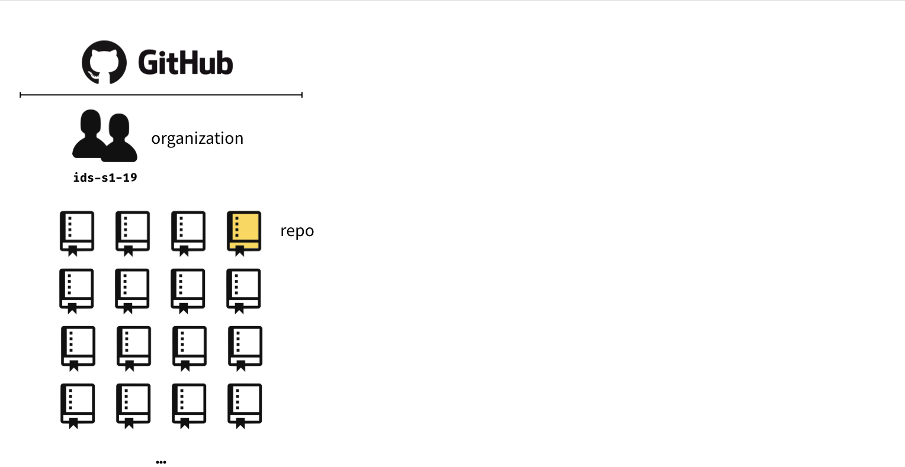
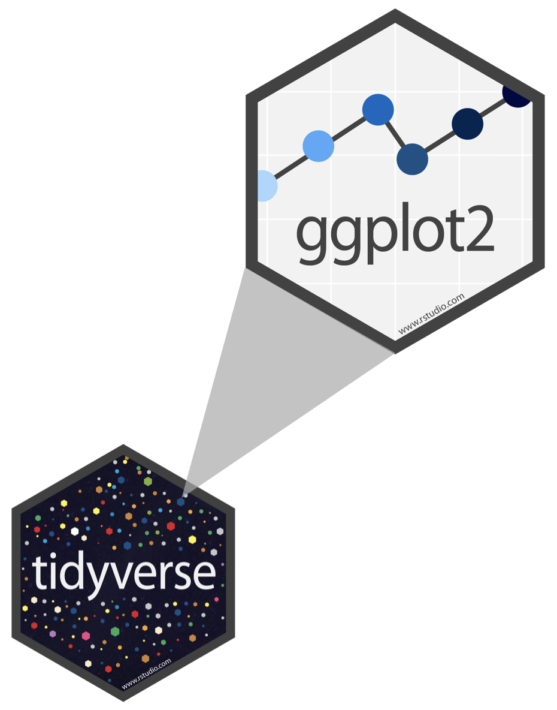
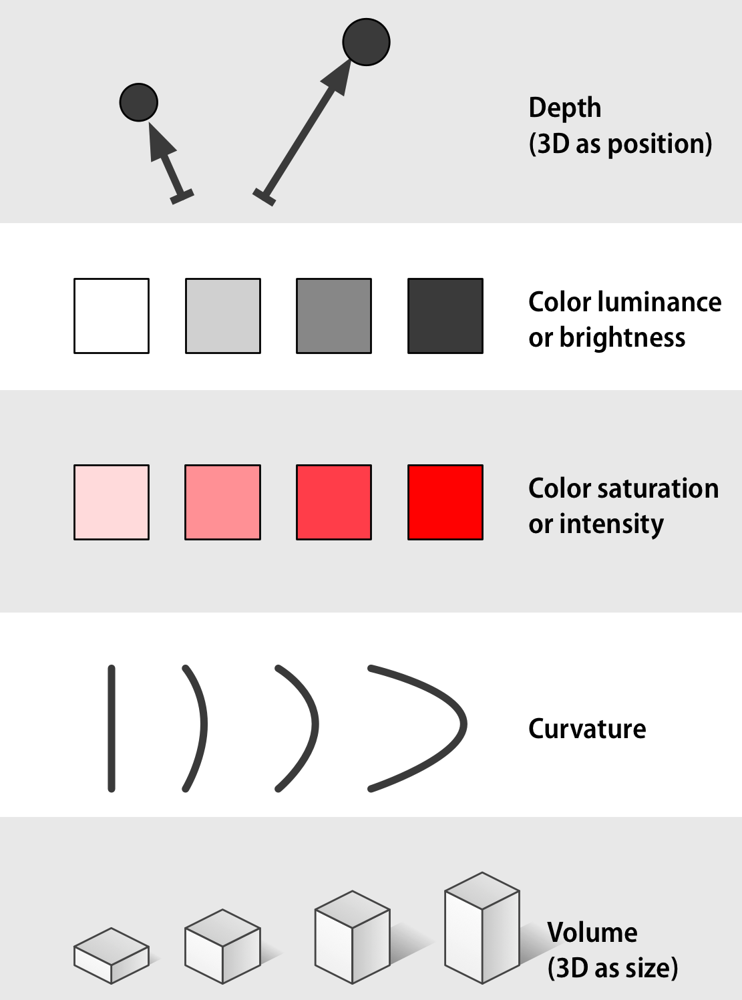

```{r include=FALSE, message=FALSE}
source("../slides-common.R")
slideSetup()
```

## Problem of Diverse Audiences

* Some of you have seen R, visualization, etc. before.

> "This is still just review" -- says several people

* Some of you had CS 108 years ago...

> "I'm totally lost" -- many people think, few say

-> **Yejae office hour today 4:30-5:30p**

-> My office hours **Fridays 3-4pm, Mondays 8-9am**.

---

## Q & A

> *When to use Console vs Rmarkdown?*

* **RMarkdown** is your source of truth. Use Console just to explore.
* Something broke? **Restart R and Run All**

> *Why two assignment operators?*

* `<-` assigns variables in *current environment*: `data <- read_csv()`
* `=` labels arguments to *functions*: `ggplot(data = dino_data)`
* You can use `=` instead of `<-`, but we won't.

---

## Q & A

> What is the difference between `.Rmd` and `.md`?

* Usually: `Rmd` -> **knit** -> `.html` or `.pdf`
* But `.html` doesn't show up nice in github
* So we told Rmarkdown to make an `md`, which does show up nice.

---


class: center, middle

`r emo::ji("yarn")` **knit**

`r emo::ji("white_check_mark")` **commit**

`r emo::ji("arrow_up")` **push**


---

```{r echo=FALSE, out.width="100%"}
knitr::include_graphics("img/whole-game-01.png")
```

---

```{r echo=FALSE, out.width="100%"}

```

---

```{r echo=FALSE, out.width="100%"}
knitr::include_graphics("img/whole-game-03.png")
```

---

```{r echo=FALSE, out.width="100%"}
knitr::include_graphics("img/whole-game-04.png")
```

---

## Asking good questions

- Always include your code and the error
- Create a minimum working example (we'll keep working on this throughout the semester)
- Use code formatting

---

class: center, middle

<iframe width="560" height="315" src="https://www.youtube.com/embed/Z8t4k0Q8e8Y" frameborder="0" allow="accelerometer; autoplay; encrypted-media; gyroscope; picture-in-picture" allowfullscreen></iframe>


---

```{r}
library(gapminder)
library(ggplot2)
```

```{r}
gapminder %>% head(5) %>% knitr::kable()
```

---

### We'll make this chart

```{r health-and-wealth, echo=FALSE, out.width="50%", fig.align='center'}
gapminder %>% 
  filter(year == 2007) %>% 
  ggplot(data = ., mapping = aes(x = gdpPercap, y = lifeExp, color = continent, size = pop)) + 
    geom_point() + 
    coord_cartesian(ylim = c(20, 90)) + 
    scale_x_continuous(breaks = c(400, 4000, 40000), trans = "log10") +
    labs(x = "GDP per Capita", y = "Life Expectancy (years)", color = "Continent", size = "Population") +
    scale_size_area(labels = function(breaks) format(breaks, big.mark = ",", scientific = FALSE)) +
    theme_bw() + 
    annotation_logticks(sides = "b")
```


---

## ggplot2 $\in$ tidyverse

.pull-left[
```{r echo=FALSE, out.width="80%"}

```
]
.pull-right[
- **ggplot2** is tidyverse's data visualization package
- The `gg` in "ggplot2" stands for Grammar of Graphics
- It is inspired by the book **Grammar of Graphics** by Leland Wilkinson
]
---

## Grammar of Graphics

Concisely describe the components of a graphic

```{r echo=FALSE, out.width="70%", fig.align='center'}
knitr::include_graphics("img/grammar-of-graphics.png")
```

.tiny[ 
Source: [BloggoType](http://bloggotype.blogspot.com/2016/08/holiday-notes2-grammar-of-graphics.html)
]

---

.pull-left[
```{r echo=FALSE, out.width="90%"}
knitr::include_graphics("img/channels-continuous-part1.png")
```
]

.pull-right[
```{r echo=FALSE, out.width="90%"}

```
]

.tiny[
Source: https://socviz.co/lookatdata.html#channels-for-representing-data
]

---
