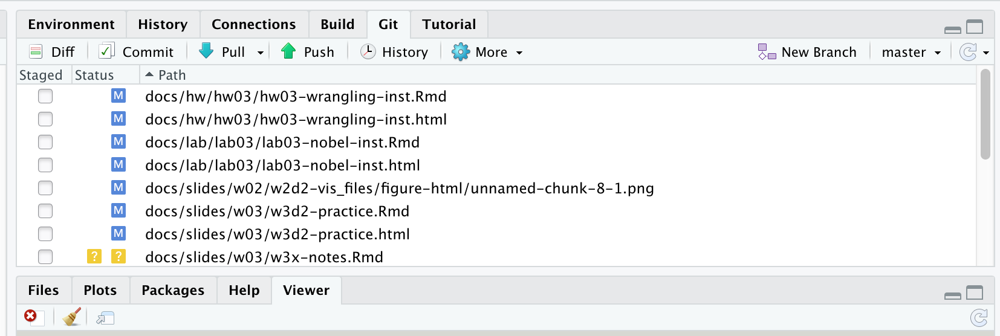
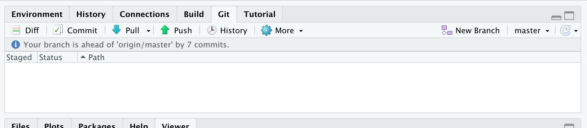
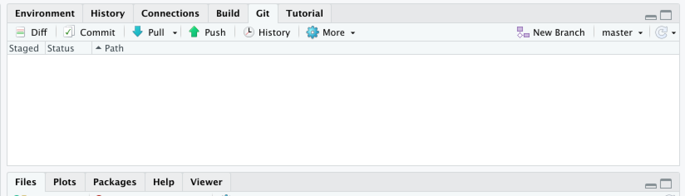

```{r include=FALSE, message=FALSE}
source("../slides-common.R")
slideSetup()
```

## Q&A

> Grading? Feedback?

We're catching up. HW1 and Quiz 1--2 are done.

> New structure? Grading?

We'll implement slowly. By default everything is same. No changes to due dates 
or grading distribution

> (When) do I need to physically attend class?

Physical attendance always optional (see policy). We'll try in-person and see
how that goes.

---

## Q&A

> When Python?

In a couple weeks.

---

## Git Tab

No:

```{r echo=FALSE, out.width="100%"}

```

---

## Git Tab

No:


```{r echo=FALSE, out.width="100%"}

```


---

## Git Tab

Yes:

```{r echo=FALSE, out.width="100%"}

```

---

## Work through Lab 3

Some highlights:

* Inline R code (see Additional Notes on Moodle)
* Forgetting to Knit or to stage
* pipeline gotchas (like forgetting a `%>%`)
* ggplot gotchas (like forgetting a `+`)
* multiline function gotchas (like forgetting a `,`)
* aesthetic mappings for bar plots (Lab exercises 3 and 5)
