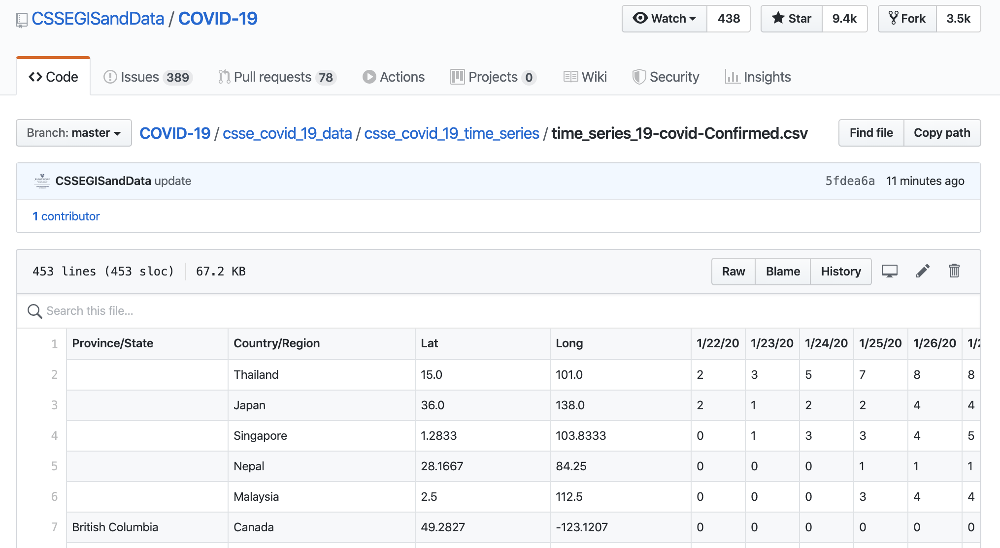
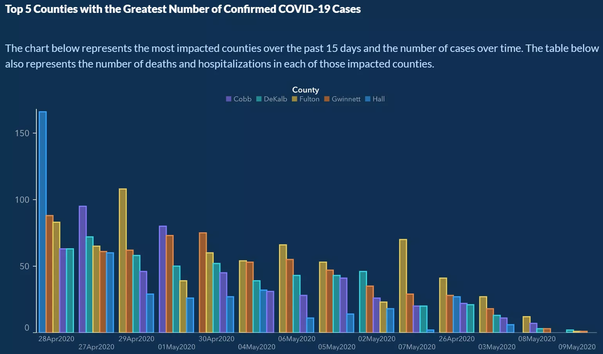

```{r setup, include=FALSE, message=FALSE}
source("../slides-common.R")
slideSetup()
knitr::opts_chunk$set(echo = TRUE)
library(tidyverse)
library(lubridate)
# Disable a warning message.
options(dplyr.summarise.inform = FALSE)
```

## Homework 3

* GitHub repos created for you!
* Comment out 2012 data if it's giving you trouble

---

## Facial Recognition (Discussion 2)

---

.center[
## Sit near your team<br>(see attandance sheet)
]

## Why cohorts?

* Relationships in a socially distant time
* Teamwork as a "soft skill"
* Learn collaborative workflow using GitHub
* Help each other within a cohort
* Course staff can meet with cohorts together
* Possible final project teams

For each assignment, each *cohort* randomly split into 2 *teams*.

---

class: middle

.center[
## Slow it down...
]

* HW 3 due date extension
* HW 4 small

---

## Friday

* Reminder: Quiz (including feedback)
* Discussion: reply instructions posted
* HW4 and Prep 4 posted this afternoon.
* Which two cohorts want to meet with me next week?

---

## Facial Recognition Surveillance

* What good points did others raise?

---


## Ethical Frameworks

* Utilitarian ("do the benefits outweigh the harms? to whom?")
* Virtue ("does this align with my core values?")
* Analogical ("is there a simpler situation I can compare this to?")
* Deontological ("is this decision lawful?")

Which did you use? Which did your peers use?

---

## Tidying and Joining Data

Outline:

* the dataset
* tidying
* joining
* plotting

Data wrangling often takes a *lot* of time and effort, so buckle in.

---

## JHU COVID-19 data

As you might imagine, keeping a comprehensive list of all COVID-19 cases
worldwide involves pulling data from numerous sources (and frequent updating).
Fortunately, some folks at Johns Hopkins have been doing that work and putting
the resulting data into a github repository that anyone can access.

---

### Navigating the GitHub Repo

You can visit their github project at <https://github.com/CSSEGISandData/COVID-19>.
There you will find 

* details about what sources were used for the data,
* what sorts of data are available, and 
* some places the data have been used

You will also see this note:

> The Website relies upon publicly available data from multiple sources, that do not always agree. 

---

### Finding some data

You could clone the repository, but you also just pull the data directly 
from their repository. They've split the data into "daily reports" (one CSV per
day, all measures) and "time series" (one CSV per measure, all days).
Here is an example page showing 
[one of the data sets](https://raw.githubusercontent.com/CSSEGISandData/COVID-19/master/csse_covid_19_data/csse_covid_19_time_series/time_series_covid19_confirmed_global.csv)
available to you.




---

### We want raw data

.small[
GitHub renders CSVs in a fancy way, but you can get the plain old CSV if you click the Raw button.
We're mostly interested in the URL for this file, since that will let us pull the data into R.

```{r construct-url}
confirmed_global_url <- paste0(
  "https://raw.githubusercontent.com/CSSEGISandData/COVID-19/master/",
  "csse_covid_19_data/csse_covid_19_time_series/time_series_covid19_",
  "confirmed", # also: "deaths", "recovered"
  "_global.csv"
)
```

Read it in.

```{r read_confirmed}
confirmed_global <- confirmed_global_url %>%
  pins::pin() %>%
  read_csv(col_types = cols(
    .default = col_double(),
    `Province/State` = col_character(),
    `Country/Region` = col_character()
  )) %>%
  rename(
    country_or_region = `Country/Region`,
    province_or_state = `Province/State`
  )
```
]

---

.tiny[
```{r explore-data, echo=FALSE}
reactable::reactable(confirmed_global, searchable = TRUE, defaultPageSize = 5)
```
]

Notice that each day's count of confirmed cases is in a separate column.

Suppose we want to plot the number of cases over time. What about the structure
of this table might give us trouble?

--

How many observations does each row represent?

---

## Think and discuss

Suppose we want to plot the number of cases over time.

What *should* the table look like?

---

### Tidying Step 1: `pivot_longer`

* We have: Lots of observations per row
* We want: one observation per row.
* So: we're gonna need a *longer* (and narrower) dataset.

*enter* `pivot_longer`!

---

```{r pivot-longer-1}
confirmed_global %>%
  pivot_longer(
    -(1:4) # the first 4 columns are not part of the pivot
  )
```

---

```{r pivot-longer-2}
confirmed_global %>%
  pivot_longer(
    -(1:4),
    names_to = "date" #<<
  )
```

---

```{r pivot-longer-3}
confirmed_global_long <-
  confirmed_global %>%
  pivot_longer(
    -(1:4),
    names_to = "date",
    values_to = "confirmed" #<<
  )
confirmed_global_long
```

---

```{r broken-date, cache=TRUE, out.width="80%"}
ggplot(confirmed_global_long, aes(x = date, y = confirmed)) +
  geom_point()
```

???

---

## This happens!

```{r georgia-misleading, out.width="50%", echo=FALSE}

```

.small[
Source: https://www.vox.com/covid-19-coronavirus-us-response-trump/2020/5/18/21262265/georgia-covid-19-cases-declining-reopening
]

---

## Aside: lots of Covid visualizations are problematic

* https://sirota.substack.com/p/georgias-misleading-covid-map
* https://medium.com/nightingale/ten-considerations-before-you-create-another-chart-about-covid-19-27d3bd691be8

---

```{r successful-parse-date}
"2020-02-01" %>%
  parse_date() %>%
  lubridate::month()
```

```r
"2/1/20" %>% parse_date() #<< Fail: date parser needs help!
```


```{r successful-parse-special-date}
"2/1/20" %>%
  parse_date_time("%m/%d/%y!*") %>%
  lubridate::month()
```

---

```{r successful-pivot-date}
confirmed_global_long <-
  confirmed_global %>%
  pivot_longer(
    -(1:4), # the first 4 columns are not part of the pivot
    names_to = "date", # names of the remaining columns will be put into a date column
    values_to = "confirmed"
  ) %>% # values will be put into a column called confirmed
  mutate(date = lubridate::parse_date_time(date, "%m/%d/%y!*")) # convert to date objects

confirmed_global_long
```

---

## Plotting the data

---

```{r total-cases-by-date, out.width="80%", fig.align='center'}
confirmed_global_long %>%
  group_by(date) %>%  #<<
  summarize(confirmed = sum(confirmed)) %>% #<<
  ggplot(aes(x = date, y = confirmed)) +
    geom_line() +
    labs(title="Worldwide cases over time")
```

---

```{r cases-by-country-broken, out.width="80%"}
confirmed_global_long %>%
  filter(country_or_region %in%
    c("US", "Canada", "China", "Japan", "Korea, South", "Italy", "Germany", "Spain", "United Kingdom")) %>%
  ggplot(aes(x = date, y = confirmed)) +
    geom_line() +
    facet_wrap(~country_or_region, scales = "free_y")
```


---

Why are the plots for Canada, China, and the UK so weird? Let's look at the data...

```{r explain-weird-plots}
confirmed_global %>%
  count(country_or_region) %>%
  filter(n > 1)
```

---

```{r cases-by-country, out.width="80%"}
confirmed_global_long %>%
  filter(country_or_region %in%
    c("US", "Canada", "China", "Japan", "Korea, South", "Italy", "Germany", "Spain", "United Kingdom")) %>%
  group_by(country_or_region, date) %>% # <<
  summarize(confirmed = sum(confirmed)) %>% # <<
  ggplot(aes(x = date, y = confirmed)) +
  geom_line() +
  facet_wrap(~country_or_region, scales = "free_y")
```

---

### Per Capita?

A data source: the [World Bank](https://data.worldbank.org/indicator/SP.POP.TOTL).

```{r get-population}
reload_data <- FALSE
if (reload_data) {
  wbstats::wb_data("SP.POP.TOTL",
    mrnev = 1 # most recent non-empty value
  ) %>% write_csv("data/worldbank_sp_pop_totl.csv")
}

population <-
  read_csv(
    "data/worldbank_sp_pop_totl.csv",
    col_types = cols_only(
      iso2c = col_character(),
      iso3c = col_character(),
      country = col_character(),
      date = col_double(),
      SP.POP.TOTL = col_double(),
      footnote = col_character()
    )
  ) %>%
  select(iso2c, iso3c, country, population = SP.POP.TOTL)
```

---

.tiny[
```{r show-population}
population %>% reactable::reactable()
```
]

---

## Join cases table with population table

```{r join-with-pop-broken}
cases_with_population <- confirmed_global_long %>%
  rename(country = country_or_region) %>%
  left_join(
    population,
    by = "country"
  )
```

---

```{r join-plot-broken, out.width="80%"}
cases_with_population %>%
  filter(country %in%
    c("US", "Canada", "China", "Japan", "Korea, South", "Italy", "Germany", "Spain", "United Kingdom")) %>%
  group_by(country, date, population) %>% # <<
  summarize(confirmed = sum(confirmed)) %>% # <<
  ggplot(aes(x = date, y = confirmed / population)) +
  geom_line() +
  facet_wrap(~country, scales = "free_y")
```

---

### Debugging a join

.small[
```{r join-debug}
full_join_results <- confirmed_global_long %>%
  rename(country = country_or_region) %>%
  full_join( # <<
    population,
    by = "country"
  )
```

.pull-left[
Countries with population but no case count:
```{r join-debug-left}
full_join_results %>%
  filter(is.na(confirmed)) %>%
  distinct(country)
```
]

.pull-right[
Countries with case count but no population:
```{r join-debug-right}
full_join_results %>%
  filter(is.na(population)) %>%
  distinct(country)
```
]
]

---

## Recoding

```{r recode-example}
recoded_cases <-
  confirmed_global_long %>% 
  mutate(country = case_when( #<<
    country_or_region == "US" ~ "United States",
    country_or_region == "Russia" ~ "Russian Federation",
    country_or_region == "Korea, South" ~ "Korea, Rep.",
    TRUE ~ country_or_region
  ))
cases_with_population <- inner_join(
  recoded_cases %>% select(country, date, confirmed),
  population %>% select(country, population),
  by = "country"
)
```


---

```{r fixed-plot, out.width="80%"}
cases_with_population %>%
  filter(country %in%
    c("United States", "Canada", "China", "Japan", "Korea, Rep.", "Italy", "Germany", "Spain", "United Kingdom")) %>%
  group_by(country, population, date) %>% # <<
  summarize(confirmed = sum(confirmed)) %>% # <<
  ggplot(aes(x = date, y = confirmed / population)) +
  geom_line() +
  facet_wrap(~country, scales = "fixed")
```


```{r example-US-state-data, include = FALSE, eval = FALSE}
US <- readr::read_csv("../../data/USstates.csv")

Confirmed_long %>%
  filter(country_or_region %in% c("US")) %>%
  filter(date > lubridate::ymd("2020-03-08")) %>%
  filter(confirmed > 0) %>%
  rename(state = `Province/State`) %>%
  left_join(US) %>%
  group_by(state, date, population2019) %>%
  summarise(confirmed = sum(confirmed)) %>%
  mutate(percap = 100000 * confirmed / population2019) %>%
  ungroup() %>%
  mutate(state = reorder(state, percap, max)) %>%
  # filter(population2019 > 8000000) %>%
  gf_line(percap ~ date,
    color = ~ (state == "Michigan"),
    group = ~state, show.legend = FALSE,
    size = 1, alpha = 0.8
  ) %>%
  gf_refine(scale_y_log10()) %>%
  gf_labs(
    title = "Per capita confirmed cases by state",
    subtitle = "MI highlighted",
    caption = "Source: JHU data repository"
  )
```
