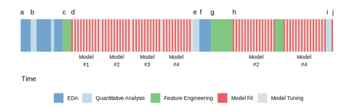

```{r setup, include=FALSE, message=FALSE}
source("../slides-common.R")
slideSetup()
knitr::opts_chunk$set(echo = TRUE)
library(glue)
```

## Homework 6 notes

Remember to **connect with the claim**: what point was the author making?

* Get as *close to the source* as you can
  * e.g., "Our World in Data" is great, but often data is pre-wrangled. See "Source" tab.
* *tidy data tip*: Try expressing your data as a bunch of simple sentences, one per observation.
  * On January 22, the number of Covid cases in Afghanistan was 0.
  * On January 23, the number of Covid cases in Afghanistan was 0.
  * ...
* For bar charts, use `geom_col` (not `geom_bar`) unless you know exactly what you're doing.
* If you're having trouble getting data, talk with me!

---

## Recap: regression error measures

* MAE: mean absolute error
* MSE: mean *squared* error

### Units

* If sale price is in $'s, what *units* is MAE in?
* MSE?
* What unit would the square root of MSE (RMSE) be in?

---

## Q&A

> Should I look at (root) mean squared error, mean absolute error, or what?

Think: Would I use the mean or the median to summarize the errors?

* If the model is mostly good but makes a few large errors, is that bad (use MSE!), or
  does it mean we should probably ignore those points as outliers (use MAE!).
* For a single number: **Median** minimizes MAE. **Mean** minimizes MSE. (Think: what would minimize max *absolute* error?)
* Most *models* try to minimize MSE. (but that doesn't mean *you* have to.)

.small[A nice discussion, including concrete examples, [here](https://medium.com/human-in-a-machine-world/mae-and-rmse-which-metric-is-better-e60ac3bde13d).]

---

## Q&A

> We found coefficients by guess-and-check... is there a better way?

**Practically**: machine learning / stats software include efficient algorithms
for exactly this. But it can still take weeks on supercomputers for big
models and data.

**Mathematically**: Most common algorithm is *gradient descent*:

1. From your data, randomly pick a batch of a few observations.
2. Put those X's through your model, tracing the computations on the way.
3. Compute error (e.g., MSE) on that batch.
4. Compute *what small change to each coefficient would have reduced error*?
5. Make all of those small changes, repeat.


---

## Objectives

* What are the basic steps in training and validating any predictive model?
* Why is each step important?
* How can we use the `tidymodels` ecosystem to train and validate a linear model?

---

```{r echo=FALSE}

```

.small[Source: [Feature Engineering and Selection ch1](https://bookdown.org/max/FES/important-concepts.html)]

---

## Predictive Modeling Workflow

Preliminaries:

1. **Define the problem**: predict *what*, based on *what*? What *metrics* will indicate success? (Measure success in multiple ways!)
2. **Explore your data** (EDA): understand its structure, make lots of plots

--

Modeling:

1. **Pick a model**: Which type(s) of models are appropriate for task and data?
2. **Transform the data** as needed by the model ("feature engineering", preprocessing", "recipe")
3. **Split the data** to allow for validation.
4. **Fit and evaluate the model**
5. **Tune**: adjust model hyperparameters
6. **Analyze model errors** and refine all earlier steps

---


```{r}
library(tidymodels)
```

Packages:

* `parsnip`: **Specify** and **train** the model you want
* `recipes`: **Prepare** the data
* `rsample`: **Split** data into training and validation
* `yardstick`: Compute **metrics** for performance
* `tune`: Helps you set the dials.

Analogous Python package: `scikit-learn`.

---

## Where to find documentation

### Theory

* [Feature Engineering and Selection](https://bookdown.org/max/FES/)
* [An Introduction to Statistical Learning](http://faculty.marshall.usc.edu/gareth-james/ISL/)

### Practice

* TidyModels website: [Getting Started](https://www.tidymodels.org/start/),
  [vignettes](https://www.tidymodels.org/learn/)
* [Tidy Modeling with R](https://www.tmwr.org/) book (work in progress)

.small[
Some others:

* <https://rviews.rstudio.com/2019/06/19/a-gentle-intro-to-tidymodels/>
* <https://juliasilge.com/blog/intro-tidymodels/>
]

---

## Example data: Ames home sales


.pull-left[
Like before, but we subset the data as [De Cock](http://jse.amstat.org/v19n3/decock.pdf) suggests.
Again, see [Data dictionary](http://jse.amstat.org/v19n3/decock/DataDocumentation.txt)

```{r}
data(ames, package = "modeldata")
ames <- ames %>% 
  filter(Gr_Liv_Area < 4000, Sale_Condition == "Normal")
nrow(ames)
```
]

.pull-right[
Exploratory analysis:

```{r eda-living-area}
ggplot(ames, aes(x = Gr_Liv_Area, y = Sale_Price, color = Fireplaces > 0)) +
  geom_point()
```
]

---

```{r eda-several-predictors}
ames %>% select(Sale_Price, Gr_Liv_Area, Lot_Area, Full_Bath, Half_Bath, Fireplaces) %>% 
  pivot_longer(-c(Sale_Price, Fireplaces), names_to = "predictor", values_to = "predictor_value") %>% 
  ggplot(aes(x = predictor_value, y = Sale_Price, color = Fireplaces > 0)) + geom_point() +
  facet_wrap(vars(predictor), scales = "free") + theme_bw()
```

---

## Example, without validation

Specify the model:

```{r}
my_model_spec <-  parsnip::linear_reg() %>% #<<
  set_engine("lm")
```

--

Train it ("fit") on data:

```{r}
my_trained_model <- my_model_spec %>% 
  fit(Sale_Price ~ Lot_Area, data = ames)
```

--

Predict on new data:

```{r include=FALSE}
augment.model_fit <- function(x, ...) {
  if ("new_data" %in% names(list(...))) {stop("Use newdata, not new_data")}
  augment(x$fit, ...)
}
```


```{r}
tibble(Lot_Area = c(32000, 12000), Sale_Price = c(239000, 185000)) %>%
  predict(my_trained_model, new_data = .)  
```

---

## Example, with validation

1. Hold out some data to use for validation:

```{r}
set.seed(10)
ames_split <- initial_split(ames, prop = 3/4)
ames_train <- training(ames_split)
ames_test <- testing(ames_split)
glue("Using {nrow(ames_train)} sales to train, {nrow(ames_test)} to test")
```

---

1. Hold out some data to use for validation:
2. Specify the model to use.
3. Train the model **on the training set**:

```{r}
my_trained_model <- my_model_spec %>% 
  fit(Sale_Price ~ Lot_Area + Gr_Liv_Area + Full_Bath, data = ames_train) #<<
```

---

1. Hold out some data to use for validation:
2. Specify the model to use.
3. Train the model **on the training set**
4. Make predictions on training set:

.pull-left[
```{r}
train_predictions <- 
  my_trained_model %>% 
    predict(ames_train)
train_predictions
```
]

.pull-right[
```{r}
train_predictions %>% 
  bind_cols(ames_train) %>% # Put back the original data
  yardstick::metrics(truth = Sale_Price, estimate = .pred)
```
]

---

1. Hold out some data to use for validation:
2. Specify the model to use.
3. Train the model **on the training set**
4. Make predictions on training set:
5. **Evaluate on test** set:

```{r}
my_trained_model %>% 
  predict(ames_test) %>% 
  bind_cols(ames_test) %>% 
  metrics(truth = Sale_Price, estimate = .pred)
```


---

## Types of models

* Linear models
  * ordinary least-squares (OLS)
  * Lasso, Ridge, etc.: penalize large coefficients
  * Generalized Linear Models: outputs get transformed
    * Logistic Regression (also Support Vector Machine): transform output to *score* for each class
* Decision Lists and Trees
  * extension: Random Forests
* Neural Networks: layered combinations of the above
* many, many more

---

## Which variables mean what?

The *formula interface*:

* `y ~ x`
  * predict *y* using *x*. `Sale_Price ~ Lot_Area`
* `y ~ x1 + x2 + x3`
  * predict *y* using *x1* and *x2* and *x3*
  * `Sale_Price ~ Lot_Area + Gr_Liv_Area + Full_Bath`

Don't get confused: they "forgot" the coefficients! A fitted linear model will actually look like:
<br>
<br>
Sale_Price = .red[c1] \* Lot_Area + .red[c2] \* Gr_Liv_Area + .red[c3] \* Full_Bath + intercept

<br>


But this works for specifying even models that aren't linear.

<!--This is `+` like `ggplot` or like "determination + perseverance + grit = success",
not like "2x + y = 4".-->

