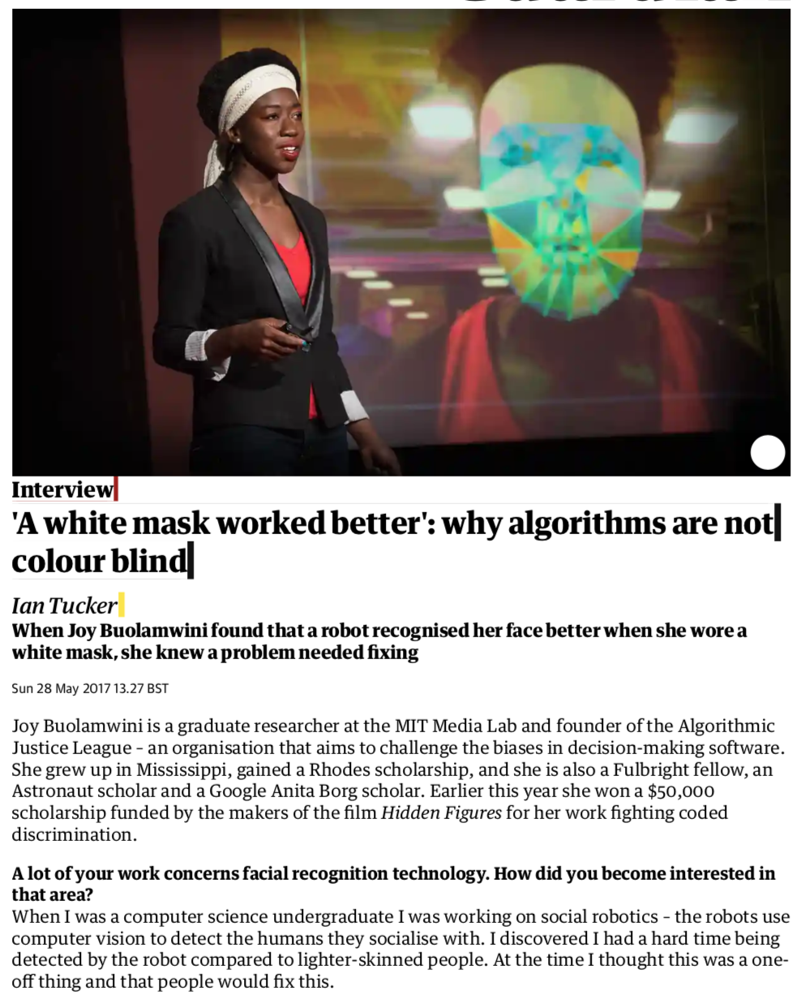
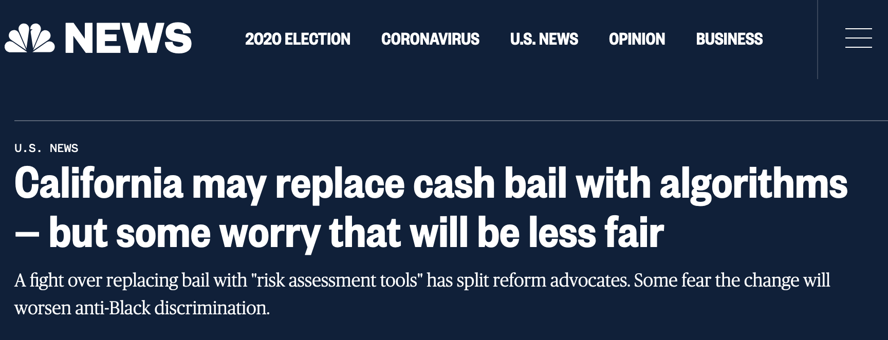
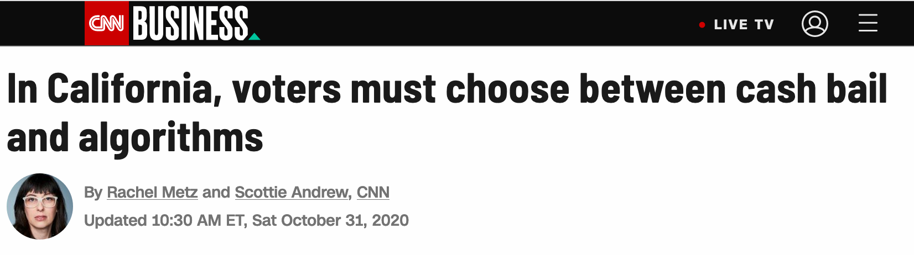
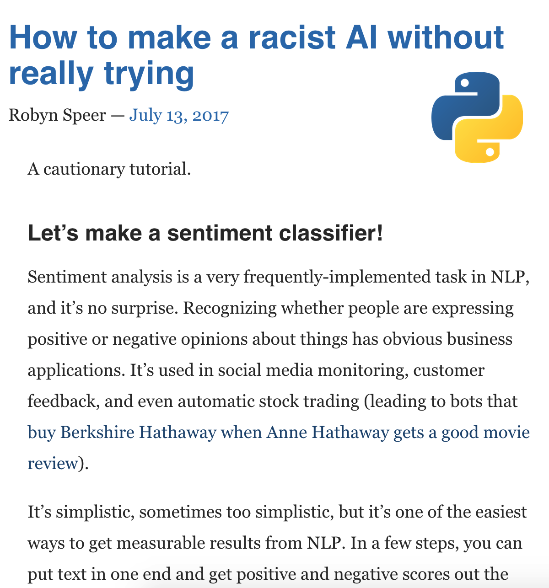
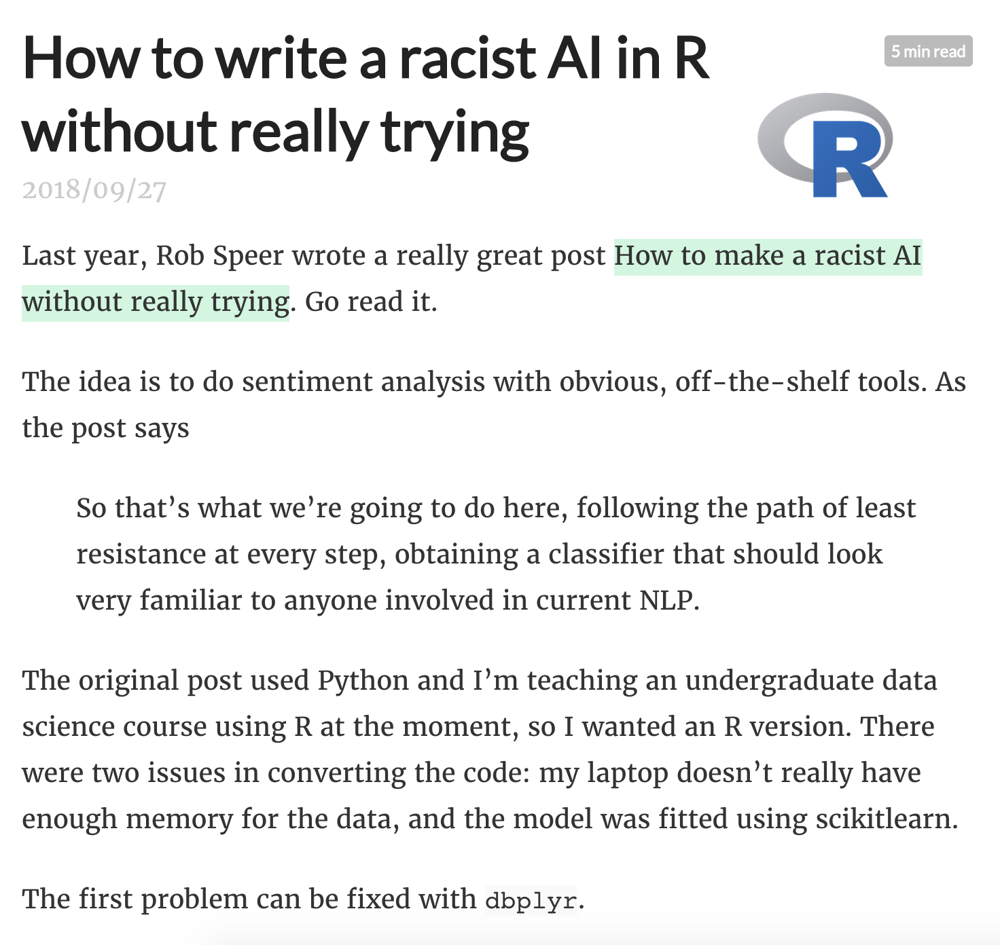

```{r setup, include=FALSE, message=FALSE}
source("../slides-common.R")
slideSetup()
knitr::opts_chunk$set(echo = TRUE)

library(countdown)
cat(r"(
remark.macros.scale = function(w) {
  var url = this;
  return '';
};
)", file = "macros.js", append = FALSE, sep = "\n")

# cat(r"(
# 
# )", file = "util.js", append = FALSE, sep = "\n")
```

## Logistics

* Project rubric, details, and logistics posted!
* *Unofficial* milestone: make some plot using your data before Thanksgiving

---

## Q&A / Review

> Why did we use such a huge `set.seed` last time?

*Today's date*!

---

## Q&A / Review

> Why did a bigger `step_range` make the feature more prominent?

```{r scaling-example, echo=FALSE, fig.asp=0.4}
#library(patchwork)
set.seed(20201123)

centers <- tibble(
  cluster = factor(1:4), 
  num_points = c(100, 150, 50, 50),  # number points in each cluster
  x1 = c(-5, -5, 5, 5),
  x2 = c(-5, 5, -5, 5)
)

labelled_points <- 
  centers %>%
  mutate(
    x1 = map2(num_points, x1, rnorm),
    x2 = map2(num_points, x2, rnorm)
  ) %>% 
  select(-num_points) %>% 
  unnest(cols = c(x1, x2))

p1 <- ggplot(labelled_points, aes(x1, x2)) +
  geom_point(alpha = 0.3) + theme_bw() + labs(shape = "") + xlim(-10, 10)

p2 <- ggplot(labelled_points, aes(.05 * x1, x2)) +
  geom_point(alpha = 0.3) + theme_bw() + labs(shape = "") + xlim(-10, 10)

cowplot::plot_grid(p1, p2, nrow = 2)
```

.floating-source[
<https://www.tidymodels.org/learn/statistics/k-means/>
]
---


## Rest of the semester

* Advanced models (random forests, neural nets, ...)
* SQL
* Text
* Techniques for Communication


---

## Today: A Series of Mini Discussions

Preview of questions:

* What characterizes an ethical data scientist or analyst?
* What are some ways that we have practiced *humility* in this course?
* What are some ways that we have practiced *integrity*?
* What are some ways that we have practiced *compassion and justice*?

<br>

* What are some things we could do that would *compromise* our integrity?
* What are some ways that data-driven systems can *help* or *hinder* truth?
* What are some ways that data systems can help *perpetuate*, or *fight*, injustice?

---

.question[
What characterizes an ethical data scientist or analyst?
]

*Post your thoughts in your Cohort channel*. I will pick a random cohort.

`r countdown(minutes = 2, update_every = 15)`

---

## Recall from Day 1...


.floating-source[
Some examples drawn from [DSBox](https://rstudio-education.github.io/datascience-box/course-materials/slides/u3_d01-ethics/u3_d01-ethics.html)
]

---

## Our Goals

* *Skill*: how to do these things
* *Knowledge*: understanding the underlying concepts
* *Character*: wisdom in practicing these skills

---

## Character??

DS is a lens. How can we see rightly through it? Some areas:

* Humility
* Integrity / Honesty
* Hospitality
* Compassion and justice

---

## Humility

Challenge: data feels powerful, people listen to what you use it to say.

.question[
What are some ways that we have practiced humility?
]

`r countdown(minutes = 2, update_every = 15)`

???

* R Markdown
* 2 weeks on validation of predictive models
* citing sources in midterm projects

So we will practice:

* Citing all sources (for both data and process)
* Acknowledging limitations
* Transparent process
* Validation of results

---

class: center, middle

.scripture[
Finally, brothers and sisters, whatever is true, whatever is noble, whatever is right, whatever is pure, whatever is lovely, whatever is admirable—if anything is excellent or praiseworthy—think about such things.

.ref[*Philippians 4:8*]
]

---

## Integrity

It’s tempting to say something that isn’t entirely true, or to manipulate the collection/analysis/reporting process to yield the answer you want

.question[
What are some ways that we have practiced integrity?
]

.question[
What are some things we could do that would *compromise* our integrity?
]

`r countdown(minutes = 3, update_every = 15)`

---

```{r echo=FALSE, out.width="80%"}
knitr::include_graphics("img/axis-start-at-0.png")
```

.footnote[
Ingraham, C. (2019) ["You’ve been reading charts wrong. Here’s how a pro does it."](https://www.washingtonpost.com/business/2019/10/14/youve-been-reading-charts-wrong-heres-how-pro-does-it/), The Washington Post, 14 Oct.
]


---

## Coloring Maps

.center[

]

.floating-source[
[NYTimes Election Maps](https://www.nytimes.com/interactive/2016/11/01/upshot/many-ways-to-map-election-results.html)
]

---

## Coloring Maps

.center[

]
--

.footnote[
See alse: Gamio, L. (2016) ["Election maps are telling you big lies about small things"](https://www.washingtonpost.com/graphics/politics/2016-election/how-election-maps-lie/), The Washington Post, 1 Nov.
]

???

TODO Replace this with a modern example

MAUP problem


---

## Truth and Falsehood

.question[
What are some ways that data-driven systems can *help* or *hinder* truth?
]

`r countdown(minutes = 2, update_every = 15)`

---

## Recommender Systems and Information

* Why does YouTube recommend some videos rather than others?
* What is YouTube optimizing for? (what brings them money?)

--

* **Time on YouTube**

> Any smart AI that optimizes engagement with itself will have a tendency to discourage engagement to other channels.

* ... which *may* mean that recommendations promote videos that *amplify resentment against other media*.

Guillaume Chaslot, [How Algorithms Can Learn to Discredit the Media](https://medium.com/@guillaumechaslot/how-algorithms-can-learn-to-discredit-the-media-d1360157c4fa)


---

## Deepfakes

.center[
<video preload="auto" playsinline="true" autoplay="true" src="https://int.nyt.com/newsgraphics/2020/these-people-are-not-real/top/top-v4-1024.mp4" style="max-height: 75vh;"></video>
]

.floating-source[
[Designed to Deceive: Do These People Look Real to You?](https://www.nytimes.com/interactive/2020/11/21/science/artificial-intelligence-fake-people-faces.html)
By Kashmir Hill and Jeremy White (NYTimes)
]


---

## Hospitality

We can choose to use our tools to elucidate and clarify, rather than obscure.

So we will practice:

* Clear visual communication
* Clarity of code and process
* Writing explanations that are accessible and appropriate to audience.

???

How have we practiced each of these?


---

class: center, middle

.scripture[
```
Learn to do right; seek justice.
    Defend the oppressed.
Take up the cause of the fatherless;
    plead the case of the widow.
```
.ref[Isaiah 1:17 (NIV)]
]

---

## Compassion and Justice

Data Science can both cause harm and reveal it.

So we will:

* Study examples of how data might cause harm
* Study examples of how harm might be mitigated or revealed

.question[
What are some ways that data systems can help *perpetuate*, or *fight*, injustice?
]

`r countdown(minutes = 2, update_every = 15)`

--

Examples

* Fairness (vs algorithmic bias)
* Transparency and Accountability
* Data Stewardship
* Environmental impact

---

class: middle

### Algorithmic bias and gender

---

## Google Translate

```{r echo=FALSE, out.width=900}
knitr::include_graphics("img/google-translate-gender-bias.png")
```

---

## Amazon's experimental hiring algorithm

- Used AI to give job candidates scores ranging from one to five stars - much like shoppers rate products on Amazon, some of the people said
- Company realized its new system was not rating candidates for software developer jobs and other technical posts in a gender-neutral way
- Amazon’s system taught itself that male candidates were preferable

>Gender bias was not the only issue. Problems with the data that underpinned the models’ judgments meant that unqualified candidates were often recommended for all manner of jobs, the people said.

.footnote[
Dastin, J. (2018) [Amazon scraps secret AI recruiting tool that showed bias against women](https://reut.rs/2Od9fPr), Reuters, 10 Oct.
]

---

class: middle

### Algorithmic bias and race

---

.pull-left[
```{r echo=FALSE, out.width=500, fig.align="right"}

```
]
.pull-right[
['A white mask worked better': why algorithms are not colour blind](https://www.theguardian.com/technology/2017/may/28/joy-buolamwini-when-algorithms-are-racist-facial-recognition-bias)  
<br>
*by Ian Tucker*
]

---

## Further watching

<div style="max-width:854px"><div style="position:relative;height:0;padding-bottom:56.25%"><iframe src="https://embed.ted.com/talks/lang/en/joy_buolamwini_how_i_m_fighting_bias_in_algorithms" width="854" height="480" style="position:absolute;left:0;top:0;width:100%;height:100%" frameborder="0" scrolling="no" allowfullscreen></iframe></div></div>

---

## Criminal Justice



.floating-source[[NBC News, 2020-10-17](https://www.nbcnews.com/news/us-news/california-may-replace-cash-bail-algorithms-some-worry-will-be-n1243750)]

???

[CNN article](https://www.cnn.com/2020/10/31/tech/prop-25-cash-bail-algorithm-california/index.html): 


---

```{r out.width="60%", echo=FALSE}
knitr::include_graphics("img/propublica-criminal-sentencing.png")
```

There’s software used across the country to predict future criminals. And it’s biased against blacks.
.small[
[propublica.org/article/machine-bias-risk-assessments-in-criminal-sentencing](https://www.propublica.org/article/machine-bias-risk-assessments-in-criminal-sentencing), May 23, 2016
]

---

## A tale of two convicts

.pull-left[

]
--
.pull-right[

]

---

class: middle

>“Although these measures were crafted with the best of intentions, I am concerned that they inadvertently undermine our efforts to ensure individualized and equal justice,” he said, adding, “they may exacerbate unwarranted and unjust disparities that are already far too common in our criminal justice system and in our society.”
>  
>Then U.S. Attorney General Eric Holder (2014)

---

## ProPublica analysis

### Data: 

Risk scores assigned to more than 7,000 people arrested in Broward County, Florida, in 2013 and 2014 + whether they were charged with new crimes over the next two years

---

## ProPublica analysis

### Results:

- 20% of those predicted to commit violent crimes actually did
- Algorithm had higher accuracy (61%) when full range of crimes taken into account (e.g. misdemeanors)

- Algorithm was more likely to falsely flag black defendants as future criminals, at almost twice the rate as white defendants
- White defendants were mislabeled as low risk more often than black defendants

---

## Further reading

.pull-left[
```{r echo=FALSE, out.width=500, fig.align="right"}
knitr::include_graphics("img/propublica-machine-bias.png")
```
]
.pull-right[
[Machine Bias](https://www.propublica.org/article/machine-bias-risk-assessments-in-criminal-sentencing)  
There’s software used across the country to predict future criminals. And it’s biased against blacks.  
<br>
*by Julia Angwin, Jeff Larson, Surya Mattu and Lauren Kirchner, ProPublica*
]

---

## Further watching

.center[
<iframe width="800" height="450" src="https://www.youtube.com/embed/MfThopD7L1Y" frameborder="0" allow="accelerometer; autoplay; encrypted-media; gyroscope; picture-in-picture" allowfullscreen></iframe>  
Predictive Policing: Bias In, Bias Out
by Kristian Lum
]

---

## How to make a racist AI without trying

.pull-left[

.center[
[Link to post](https://blog.conceptnet.io/posts/2017/how-to-make-a-racist-ai-without-really-trying/)
]
]
.pull-right[

.center[
[Link to post](https://notstatschat.rbind.io/2018/09/27/how-to-write-a-racist-ai-in-r-without-really-trying/)
]
]

---

## Review

.question[
A company uses a machine learning algorithm to determine which job advertisement to display for users searching for technology jobs. Based on past results, the algorithm tends to display lower paying jobs for women than for men (after controlling for other characteristics than gender).

What ethical considerations might be considered when reviewing this algorithm?
]

.footnote[
Source: Modern Data Science with R, by Baumer, Kaplan, and Horton
]

---

class: middle

# Some Further Reading / Watching

---

## Overall

* Fast.AI [Data Ethics course](https://ethics.fast.ai/)
* [Ethics and Data Science](https://www.amazon.com/Ethics-Data-Science-Mike-Loukides-ebook/dp/B07GTC8ZN7)  
by Mike Loukides, Hilary Mason, DJ Patil  
(Free Kindle download)
* [Weapons of Math Destruction](https://www.amazon.com/Ethics-Data-Science-Mike-Loukides-ebook/dp/B07GTC8ZN7)  
How Big Data Increases Inequality and Threatens Democracy  
by Cathy O'Neil

---

## Integrity

* [How Charts Lie](https://wwnorton.com/books/9781324001560)  
Getting Smarter about Visual Information  
by Alberto Cairo

* [How Deceptive are Deceptive Visualizations?](https://dl.acm.org/doi/10.1145/2702123.2702608)  
Pandey et al., CHI 2015

---

## Further watching

.center[
<iframe width="800" height="450" src="https://www.youtube.com/embed/fgf2VjnhpCs?start=1162" frameborder="0" allow="accelerometer; autoplay; encrypted-media; gyroscope; picture-in-picture" allowfullscreen></iframe>  
AI for Good in the R and Python ecosystems  
by Julien Cornebise
]

---

## Parting thoughts

- At some point during your data science learning journey you will learn tools that can be used unethically
- You might also be tempted to use your knowledge in a way that is ethically questionable either because of business goals or for the pursuit of further knowledge (or because your boss told you to do so)

.question[
How do you train yourself to make the right decisions (or reduce the likelihood of accidentally making the wrong decisions) at those points?
]
