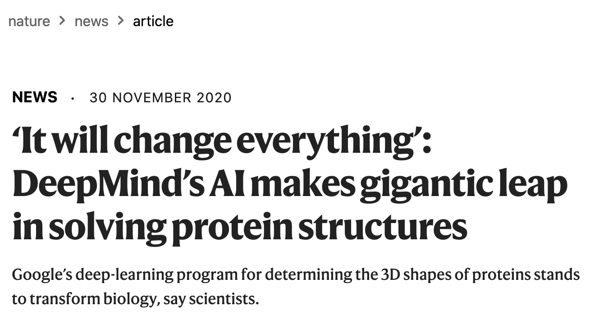
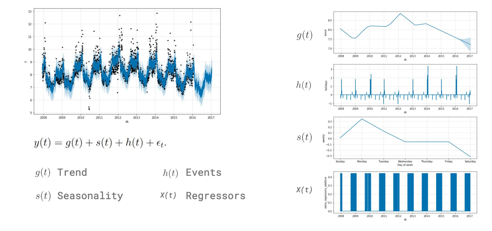

```{r setup, include=FALSE, message=FALSE}
source("../slides-common.R")
slideSetup()
knitr::opts_chunk$set(echo = TRUE)
```

## Q&A

> For final project, do we present by PowerPoint or by talking through our report?

Talking through report is fine! But if you want to do slides, check out Xaringan
(and `xaringanthemer`) that have powered all these slides.

> Do all good models require gigantic energy?

No! Simple methods are often good enough. And you can often leverage pre-trained models.

---

> If there're data ethicists in many big tech firms/ the tech world in general, why is there still so much bias with technology?

[Google Employees Say Scientist's Ouster Was 'Unprecedented Research Censorship'](https://www.npr.org/2020/12/03/942417780/google-employees-say-scientists-ouster-was-unprecedented-research-censorship)

.center[

]

Ethics-washing. Critical theory?

---

## A clarification: calibration

* The sentiment classifier we saw last time was prone to extremes (at least on short sentences).
* The classifier was not *calibrated*: predicted confidence doesn't match reality.
* This can be *harmful* even if classifier is unbiased. Some details: [Calibration: the Achilles heel of predictive analytics](https://bmcmedicine.biomedcentral.com/articles/10.1186/s12916-019-1466-7)

Many classifiers have calibration problems, but this one was worse than usual.

---

## Projects

> Can I use examples (Kaggle notebooks, blog posts, etc.) that are similar to my project?

* Yes!
* Google your project title or data set name.
* Don’t leave me wondering what part is your original work.
* Reference what you found and how your work differs (is better)

---

## Reminder: State of AI Ethics Discussion Forum

---

## Data Science in the News



.floating-source[
Source: [Nature](https://www.nature.com/articles/d41586-020-03348-4)
]

---


---

## Modeling

* Capture complex patterns while minimizing over-fitting:
  * Random Forests
  * Boosting: XGBoost / LightGBM
  * MARS
* Leverage common perceptual patterns: deep learning pre-training
* Forecast the future of a time series
  * Trend, seasonality, events, regressors, auto-regression
  * ([Neural](https://github.com/ourownstory/neural_prophet)) Prophet

---

## Random Forests

.pull-left[
* Recall: decision tree can capture detailed patterns, but can *overfit* by capturing patterns that don't generalize.
* Idea: learn *lots of trees*, each on a different random sample of the observations and features.
* Often "just works" without pre-processing or configuration
]
.pull-right[

]

.floating-source[
<a href="https://commons.wikimedia.org/wiki/File:Random_forest_diagram_complete.png">Venkata Jagannath</a>, <a href="https://creativecommons.org/licenses/by-sa/4.0">CC BY-SA 4.0</a>, via Wikimedia Commons
]

---

### Advanced Modeling in `tidymodels`

Shortcut: [`usemodels` package](https://usemodels.tidymodels.org/) (`devtools::install_github("tidymodels/usemodels")`)

.small[
```{r}
data(ames, package = 'modeldata')
usemodels::use_xgboost(Sale_Price ~ ., ames)
```
]

---

### See also

* `tune` package, for helping find good settings for hyperparameters
* [`finetune`](https://finetune.tidymodels.org/) package ([announcement blog post](https://www.tidyverse.org/blog/2020/12/finetune-0-0-1/)) for doing that efficiently
* the [tidyverse blog](https://www.tidyverse.org/blog/) for catching the latest

---

## Deep Learning Pre-training

---

class: center, middle


.floating-source[
Source: [MathWorks neural net article](https://www.mathworks.com/discovery/convolutional-neural-network-matlab.html)
]

---

<https://blogs.rstudio.com/ai/posts/2020-10-19-torch-image-classification/>

---

## Forecasting

Some resources:

* [ModelTime](https://business-science.github.io/modeltime/articles/getting-started-with-modeltime.html) R
  package for comparing various time-series models. ([Another example](https://www.business-science.io/code-tools/2020/11/25/commodities-demand-forecasting.html))
* [NeuralProphet](https://github.com/ourownstory/neural_prophet) 
with the same package.

---



.floating-source[
Source: [NeuralProphet presentation](https://github.com/ourownstory/neural_prophet/blob/master/notes/Presented_at_International_Symposium_on_Forecasting.pdf)
]
