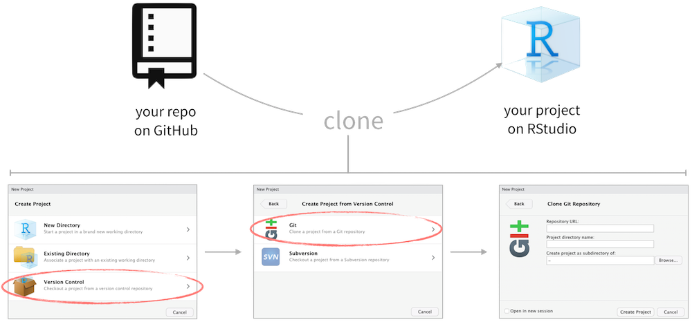

```{r setup, include=FALSE}
knitr::opts_chunk$set(echo = TRUE)
```


<!-- Notes for next time / 601 version: -->
<!-- * Screenshots! -->
<!-- * Maybe give a quick video outline of the process at the start -->
<!-- * Some of the questions could be worded more clearly -->
<!-- * Partner work helped many. -->
<!-- * Maybe use checklists? -->
<!-- Just use a PAT: https://usethis.r-lib.org/articles/git-credentials.html -->

## How Guided Exercises work

We will do these guided "lab" exercises in pairs, typically in the computer lab. The format will be reminiscent of the POGIL exercises that many students did in CS 106 or 108.

Today's exercise is all about getting started, so each student will need to do all the setup steps. But you should discuss and answer the reflection questions together. For today we won't assign specific roles to specific students, but we will do that in the future.

## Configuring SSH and GitHub

We'll be using GitHub for distributing and collecting assignments in this class. It's a complex tool (perhaps overly so!), but it's worth putting in the effort to learn it for at least 3 reasons:

1.  It's *very* commonly used in both industry and academia,
2.  It embodies our values of integrity and transparency, and
3.  It enables structured collaboration.

Getting it set up requires crossing a number of hurdles. Thankfully, almost all of these we only need to do once! So don't worry about understanding or memorizing the details in this section.

> I'd like to know (1) how long this process takes you and (2) what the biggest challenges were for you. So **write down the current time** as you start this section.

### Create a GitHub account

Go to [github.com](https://github.com/) and create an account (unless you already have one).

Below are some tips for selecting a username:[^1]

[^1]: [Happy git with R](http://happygitwithr.com/github-acct.html#username-advice) by Jenny Bryan

-   Reuse username from other contexts, e.g. Twitter.
-   Incorporate your actual name
-   Pick a username you will be comfortable revealing to your future boss.
-   Shorter is better than longer.
-   Be as unique as possible in as few characters as possible.
-   Make it timeless. Don't highlight your current university, employer, etc.

### Get your starter code

-   Go to <https://classroom.github.com/a/zUP1ptqo> to accept your exercise "assignment". Since this is the first assignment, clicking on this link will also allow you to join the course GitHub organization. Log in with your GitHub username and password and click on **Authorize GitHub**.

-   In the next screen you will see a course roster with names of students enrolled in this course. Select your name from the list. **Make sure you select the correct name!**

```{r github-classroom, fig.margin = TRUE, echo = FALSE}
knitr::include_graphics("img/Accept_Invitation.png")
```

-   Then, in the next screen, click on **Accept this assignment**. This will create the GitHub repo for the assignment. This repo contains a template you can build on to complete your assignment. Click on the repository link created for you to get started.

### Log into RStudio

Go to <https://rstudio.calvin.edu/> (or click the link on Moodle). Bookmark this page; it will be the main tool you use in this class.

Log in using your Calvin username (your email before the `@students` part) and password.

### Connect RStudio to GitHub

GitHub very recently stopped letting us use a username and password, so we'll have to jump through a few hoops. Fortunately you'll only need to do this once.

1.  Type `credentials::ssh_setup_github()` into the RStudio Console (on the left side of RStudio, possibly at the bottom) and press Enter.
2.  Follow the instructions it gives. You'll need to answer yes to both questions (generate a key, open a browser) by entering `1`.
3.  Copy and paste the key into GitHub. To do this: select the entire key (starting with `ssh-rsa` and going until the end, probably spanning several lines), press Ctrl-C (or Command-C on Macs), then go to the [GitHub Add SSH Key tab](https://github.com/settings/ssh/new) that should have opened and paste the key in the big text box there. You can title the key "Calvin RStudio Server".

If you're having trouble with these instructions, see [this guide](https://github.com/DukeStatSci/github_auth_guide), and ask a course staff member to get unstuck.

> Note: If you're working on your own computer, you may prefer to use the HTTPS URL and what GitHub calls a "PAT". While this is not officially supported, feel free to ask for help on Piazza or at office hours.

### Cloning the repo

Go back to the page for your starter code (if you closed the tab, click the link in "Get your starter code" above). This is called your **repo** (short for *repository*). You can edit it; only you and the course staff can see it.

#### Get the repo's *SSH* URL

Click the green **Code** button. Click **SSH** in the popup, and you'll see a URL that starts with `git@github.com:...`. Click the button next to that URL to copy the whole thing.

### Clone the repo on RStudio

And finally we clone the GitHub repo into an RStudio project.

```{r clone-repo-rstudio, fig.fullwidth=TRUE, echo = FALSE}

```

```{r fig.margin = TRUE, echo = FALSE}

```

-   In RStudio, click on File \> New Project

-   In the next window, select Git

-   In the final window:

    -   Repository URL: Paste the repo URL you grabbed from GitHub here
    -   Press the tab key on your keyboard, and the project name will be filled in for you
    -   Press Browse and then Choose (don't click "R") to select your home folder
    -   Click Create Project.
    -   You may get a prompt about the "authenticiy of host"... Type "yes" and press Enter.

### Tell git your name

In the Console, run this, replacing the user name and email as appropriate:

```
usethis::use_git_config(user.name = "Ken Arnold", user.email="ka37@students.calvin.edu")
```

> Ok, setup complete! Write down your stop time.

## Inquiry 1: the GitHub workflow

When you and your partner both got this far, do a little something to celebrate! (elbow bump, shout "Yay!", etc.) Then help your neighbors make progress too.

Now start paying attention to what's going on, because this is an observation exercise.

For this exercise, you'll need to have your GitHub repo open in one tab/window and RStudio open in another.

Discuss each question with your partner and write down your answers either on paper or in an electronic note.

1.  In *GitHub*, open the file named `ex01.Rmd`. Notice that the first few lines of the file specify a title and author. **What does this file specify as the author name?**

2.  In *RStudio*, open the file named `ex01.Rmd` (you'll see it in the Files tab on the bottom-right). **Does this file have the same contents as the one on GitHub?**

3.  In *RStudio*, click the **Knit** button on the toolbar above the file editor. **What shows up where when you press Knit?**

4.  Change the author name to your name. **What action is required for changes in the Source editor to be reflected in the generated report?**

5.  Look on *GitHub*. Does GitHub reflect the changes you have made? (*remember to reload the page*) (you should notice no changes, this is expected).

6.  In *RStudio*, look in the Git tab (top-right pane). What do you notice there?

7.  Press *Commit* (don't "stage" anything yet). Type in the message "Change author name". Press *Commit*. **What, if anything, has changed in the Git tab?** Has anything changed on GitHub?

8.  Check all of the "Staged" checkboxes. Now press Commit again. **What, if anything, has changed in the Git tab?**

9.  Check *GitHub* again. **Does your change show up on GitHub now?** (again, expecting "no")

10. **What message do you see in the Git tab?**

11. In the Git tab, click *Push*. Check GitHub. What do you see now?

12. **Where does GitHub show your commit message?** What shows up when you click on the commit message? This is called the "diff"; what do you think "diff" is short for?

13. Change the title of the report to "DATA 202 Exercise 1." **Get the new title to appear on GitHub.**

14. List the steps needed after making a change in RStudio to make the change appear on GitHub.

15. Suppose your friend asks for help getting their changes to show up on GitHub. **Describe two things you could check for in the Git tab that might indicate that something is wrong.**

## Inquiry 2: An RMarkdown document

Open `ex01.Rmd` again if needed.

```{marginfigure}
RStudio has recently added a feature called the Visual Editor. Some people like it, others don't, so we'll let you choose whether or not you want to use it. Click the Visual Editor Mode button  on the top right to switch back and forth between the visual editor and the text editor. You may use whichever you prefer. Here's some [documentation for the Visual Editor](https://rstudio.github.io/visual-markdown-editing/).
```

For the following exercises, continue to discuss each question and write down the answer with your partner.

<!-- Note: openxlsx::write.xlsx(openintro::seattlepets, "seattlepets.xlsx") -->

1.  Run the code chunk called `setup` by clicking the green arrow next to it. **What appears in the Environment tab (top-right pane)?**

2.  Click the name of the dataset in the Environment tab to open the *Viewer*. **What does each row represent?**

3.  **Briefly describe the information we have about each pet.**

4.  Run the `count-pets` chunk. **What appears in the Environment?** **What appears below the chunk?**

5.  Remove the second line inside the `count-pets` chunk (which reads just `num_pets`). **What appears below the chunk?** Now run the chunk again. **What appears below the chunk now?**

6.  Make the `count-pets` chunk show instead the average number of pets per person (look up the population of the metro area in [Wikipedia](https://en.wikipedia.org/wiki/Seattle)).

7.  **What is required for a code chunk to show output?**

8.  Put the last line back to `num_pets`. Fill in the blank in the text line below the chunk. **Knit**, **Commit**, and **Push**, and check that your changes appear on GitHub. You can use the commit message "Add a count of the number of dogs." (Aside: try replacing the XXX by `` `r knitr::inline_expr('num_pets')` `` and knitting again.)

9.  Change `Dog` to `Cat` but do not rerun the chunk. Instead, Knit again. **Compare the output within the Source editor with the output in the knitted document.**

10. In the toolbar above the Source window, find the Run button towards the right side. Click the down arrow and select Run All. **Now do the code, output, and report match?**

11. Suppose your friend is confused by the output they're getting. They've checked their code and everything looks right. **Describe some steps you could take to help them get their code, output, and report to match up.**

Finally, replace the "Replace this line..." with your best guess as to what each output is telling you. **Knit, commit, and push** one last time, and check that your work appears on GitHub.

```{r include=FALSE, eval=FALSE}
# How long did students say that the setup part took? 
# median about 12 minutes, wide variation.
times <- c(
  17, 12, 15, 10, 2, 10, 20, 20, 9, 5, 13, 14, 5, 4, 5, 11, 10, 23, 25, 10, 14, 25, 20, 20, 16, 7, 5, 18, 25
)
ggplot(mapping = aes(x = times)) + geom_histogram(binwidth = 5) + geom_boxplot()

```

