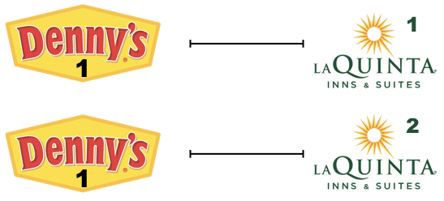

```{r setup, include=FALSE}
knitr::opts_chunk$set(eval = TRUE)
library(tidyverse)
```

This exercise continues what we started in [Guided Exercise 5](../../ex/ex05/ex05-viz-spatial-inst.html). We got to practice one (or two?) kinds of joins there; for this exercise we'll get even more comfortable with how joins work.


```{r fig.margin = TRUE, echo = FALSE}

```

# Learning goals

- Apply joins for computing pairwise operations
- Practice working with spatial data
- Write and use a custom function

# Getting Started

Use your Portfolio repo as usual. Refer to prior assignments if you need a refresher for how to Pull, and Knit-Commit-Push.

## Load Data

```{r load-data, message=FALSE}
dennys <- read_rds("data/dennys.rds")
laquinta <- read_rds("data/laquinta.rds")
states <- read_csv("data/states.csv", col_types = cols(
  name = col_character(),
  abbreviation = col_character(),
  area = col_double()
))
```


# Exercises

::: {.exercises}

1.  Filter the Denny's dataframe for Alaska (AK) and save the result as `dn_ak`. How many Denny's locations are there in Alaska?

```{r}
dn_ak <- dennys %>%
  filter(state == "AK")
nrow(dn_ak)
```

2.  Filter the La Quinta dataframe for Alaska (AK) and save the result as `lq_ak`. How many La Quinta locations are there in Alaska?

```{r}
lq_ak <- laquinta %>%
  filter(state == "AK")
nrow(lq_ak)
```

Next we'll calculate the distance between all Denny's and all La Quinta locations in Alaska.
Let's take this step by step:

**Step 1:** There are 3 Denny's and 2 La Quinta locations in Alaska.
(If you answered differently above, you might want to recheck your answers.)

{width="300px" height="300px"}

**Step 2:** Let's focus on the first Denny's location.
We'll need to calculate two distances for it: (1) distance between Denny's 1 and La Quinta 1 and (2) distance between Denny's 1 and La Quinta (2).

{width="300px" height="150px"}

**Step 3:** Now let's consider all Denny's locations.

{width="300px" height="450px"}

3.  How many pairings are there between all Denny's and all La Quinta locations in Alaska, i.e. how many distances do we need to calculate between the locations of these establishments in Alaska?

In order to calculate these distances we need to first *restructure our data to pair the Denny's and La Quinta locations*.
To do so, we will *join the two data frames*.

We have six main join options in R.
Each of these join functions take at least three arguments: `x`, `y`, and `by`.

-   `x` and `y` are data frames to join
-   `by` is the variable(s) to join by

Four of these join functions combine variables from the two data frames:

```{marginfigure}
These are called **mutating joins**.
```

-   `inner_join()`: return all rows from `x` where there are matching values in `y`, and all columns from `x` and `y`.

-   `left_join()`: return all rows from `x`, and all columns from `x` and `y`.
    Rows in x with no match in y will have NA values in the new columns.

-   `right_join()`: return all rows from `y`, and all columns from `x` and `y`.
    Rows in y with no match in x will have NA values in the new columns.

-   `full_join()`: return all rows and all columns from both `x` and `y`.
    Where there are not matching values, returns NA for the one missing.

And the other two join functions only keep cases from the left-hand data frame, and are called **filtering joins**.
We'll learn about these another time but you can find out more about the join functions in the help files for any one of them, e.g. `?full_join`.

In practice we mostly use mutating joins.
In this case we want to keep all rows and columns from both `dn_ak` and `lq_ak` data frames.
So we will use a `full_join`.

{height="300px" width="300px"}

Let's join the data on Denny's and La Quinta locations in Alaska, and take a look at what it looks like:

```{r}
dn_lq_ak <- full_join(dn_ak, lq_ak, by = "state", suffix = c("_dn", "_lq"))
dn_lq_ak
```

4.  How many observations are in the joined `dn_lq_ak` data frame? What are the names of the variables in this data frame?

Notice the suffixes `_dn` and `_lq` on the variable names. The two data frames both had the same variables, so how could we tell which data came from which data frame? To tell them apart, we told `full_join` to add those `suffix`es. (The default is `.x` and `.y`.)

Now that we have the data in the format we wanted, all that is left is to calculate the distances between the pairs.

🧶 ✅ ⬆️ Knit, *commit, and push your changes to GitHub with an appropriate commit message. Make sure to commit and push all changed files so that your Git pane is cleared up afterwards.*

5. Add a new variable, called `distance` to the `dn_lq_ak` data frame that contiains
    the distances between each Denny's and La Quinta locations. Make sure to
    save the result back to `dn_lq_ak` so that you can use it later.

Notes:

- What function from the tidyverse do we use the add a new variable to a data frame while keeping the existing variables?

- Since the Earth is spherical rather than flat, use the great-circle distance.
  You can calculate this using the Haversine distance formula.
  Since it's not a built-in function, we've provided an implementation for you:

```{r}
# Great-circle distance, Implementation from dsbox
haversine <- function(long1, lat1, long2, lat2) {
  # convert to radians
  long1 = long1 * pi / 180
  lat1  = lat1  * pi / 180
  long2 = long2 * pi / 180
  lat2  = lat2  * pi / 180
  
  # Earth mean radius in km (WGS84 ellipsoid)
  R = 6371.009
  
  # Compute the distance in km
  a = sin((lat2 - lat1)/2)^2 + cos(lat1) * cos(lat2) * sin((long2 - long1)/2)^2
  d = R * 2 * asin(sqrt(a))
  return(d)
}
```

This function takes four arguments:

-   Longitude and latitude of the first location
-   Longitude and latitude of the second location

**Note**: Longitude comes first!

6.  For each La Quinta location, calculate the distance to the nearest Denny's.
    To do so, group by La Quinta locations (consider the `address` as a unique identifier) and compute the `min()` of all of the corresponding `distance` values. Assign this to a new data frame.
    
    Hint: this data frame will have one row for each La Quinta's location in Alaska.

    Here is what I get (once I put latitude and longitude in the right order):
    
```{r echo=FALSE}
dn_lq_ak <- dn_lq_ak %>% 
  mutate(distance = haversine(long1 = longitude_dn, lat1 = latitude_dn, 
                              long2 = longitude_lq, lat2 = latitude_lq))

dn_lq_ak_mindist <- dn_lq_ak %>%
  group_by(address_lq, city_lq) %>%
  summarise(count = length(distance), dist_to_nearest = min(distance), .groups = "drop")
dn_lq_ak_mindist %>% select(-city_lq)
```

7.  Are there any La Quinta locations in Alaska that are "next to Denny's"? Refer to the result of the previous exercise.


🧶 ✅ ⬆️ Knit, *commit, and push your changes to GitHub with an appropriate commit message. Make sure to commit and push all changed files so that your Git pane is cleared up afterwards.*

8.  Write a function to perform the analysis for a given state. The function should take a state name (e.g., `"NC"`) and
return the distances from each La Quinta location in that state to the closest Denny's. 

Remember what you learned in CS 104/6/8 about functions:

- Functions let us bundle up a multi-part computation (like our distance calculations here) and give it a name.
- Functions can take *parameters*, which work like placeholders that can get filled in with different values (like different states).
- Functions have a *local scope*: variables you define inside a function stay inside of it.
- Functions can *return* a value: when we evaluate `sqrt(4) - 1`, the `sqrt` function *returns* 2... and that gets substituted on the left side of the subtraction so we evaluate `2 - 1` to get 1.

R functions work pretty much the same way as Python functions. The syntax is slightly different so I'll help you with it.
Here's the outline of how to write an R function for this:

```{r eval=FALSE}
compute_closest_dennys <- function(the_state) {
  dn_state <- dennys %>% 
    filter(state == the_state)
  lq_state <- laquinta %>% 
    filter(state == the_state)
  
  # join to get all possible pairings
  
  # compute distances
  
  # compute distance to closest Denny's for each La Quinta location,
  # assign it to "dist_to_closest"
  dist_to_closest <- ...
  
  return(dist_to_closest)
}
```

*Caution*: You should copy and paste from your earlier code, but be sure to change everything from Alaska-specific.

*Optional aside*: It turns out that a full join isn't quite the best join for this. Can you think of a case where `full_join` gives some unwanted results?

9. Use the function you just wrote to compute the distances-to-closest-Denny's for NC. Then, describe the distribution of the distances using **summary statistics** (median, min, etc.) and an **appropriate visualization**.

Note: If you end up grouping by more than one variable, you may need to `ungroup()` before computing a summary statistic, depending on how you do it.

Here's what I get for NC:

```{r echo=FALSE}
compute_closest_dennys <- function(the_state) {
  dn_state <- dennys %>% 
    filter(state == the_state)
  lq_state <- laquinta %>% 
    filter(state == the_state)
  
  # join to get all possible pairings
  dist_to_closest <- full_join(dn_state, lq_state, by = "state", suffix = c("_dn", "_lq")) %>% 
    # compute distances
    mutate(distance = haversine(lat1 = latitude_dn, long1 = longitude_dn,
                                lat2 = latitude_lq, long2 = longitude_lq)) %>% 
    # compute distance to closest Denny's for each La Quinta location.
    group_by(address_lq, city_lq) %>%
    summarise(dist_to_nearest = min(distance), .groups = "drop") %>% 
    arrange(dist_to_nearest)
  
  return(dist_to_closest)
}
distances_NC <- compute_closest_dennys("NC")
distances_NC
distances_NC %>% summarise(min(dist_to_nearest), median(dist_to_nearest))
```

10.  Repeat the same analysis for Texas.

11. Repeat the same analysis for a state of your choosing, different than the ones we covered so far.

12. Among the states you examined, where is Mitch Hedberg's joke most likely to hold true?
    Explain your reasoning.


:::

## Wrap-Up


🧶 ✅ ⬆️ Knit, *commit, and push your changes to GitHub with an appropriate commit message. Make sure to commit and push all changed files so that your Git pane is cleared up afterwards.*

To wrap this up, answer the usual check-in questions in the space provided *at the bottom of your report*:

- Paste your GitHub permalink

- What help did you give on this homework assignment? What help did you receive? *optional*

- Write a sentence or two of your overall reflections on this assignment. You may write whatever you want, but you might perhaps respond to one or two of these questions:

    - Was anything unclear about this assignment?
    - How hard was it for you? Where did you get "stuck"?
    - How long did it take you?
    - What questions or uncertainties remain?
    - What skills do you think you'll need more practice with?
    - Did you try anything out of curiosity that you weren't specifically asked to do?

```{marginfigure}
By default the PDF opens in a custom viewer, which may be confusing. Change the setting by going to: 
Tools / Global Options / Sweave / PDF Preview: "System Viewer".
```

### Making a PDF

#### Option 1

Remove the `#` to un-comment the `#knit: pagedown::chrome_print` line in your file header, then and Knit.
Save the resulting PDF to your computer, and submit the PDF on Gradescope.


#### Option 2

- Knit to make an HTML file as usual
- View the HTML file in your browser. (If it's in the little Viewer pane, click the "pop out" toolbar button. If you see a window with "Open in Browser" button, click that button.
- Use File-Print to save a PDF. Make sure that all your code is visible; scale it down if necessary.
- Submit that PDF on Gradescope.

*This exercise was based on an [RStudio Education example](https://rstudio-education.github.io/datascience-box/course-materials/lab-instructions/lab-05/lab-05-wrangle-sp-data.html).
