# Visualization

We start with visualization because, well, you can see the results.

## Reading

To design good visuals, you need both *why*s and *how*s. You may have come here for the *how*s, but both are important. Our tools are changing more rapidly than ever, so if we want knowledge that lasts, we really need to know the *why*.

### Why

Read **[Look at Data](https://socviz.co/lookatdata.html)** from Healy "Data Visualization".

The text is wordy but well organized, so your speed reading skills should work well. Look at the examples: can you explain to someone else what those examples show?

### How

Read [**Data Visualization**](https://moderndive.com/2-viz.html) from ModernDive.

Try to actually answer the "Learning Check" questions for yourself. Yes this takes longer than just skimming right past them. But they may show up on a quiz...

## References

### Visualization Design

* A quick guide: the [Graphics Principles](https://graphicsprinciples.github.io/) [*cheat sheet*](https://github.com/GraphicsPrinciples/CheatSheet/blob/master/NVSCheatSheet.pdf).
* [Fundamentals of Data Visualization](https://clauswilke.com/dataviz/)
* DataWrapper's blog has some great advice on [Area charts](https://blog.datawrapper.de/area-charts/), [colors](https://blog.datawrapper.de/beautifulcolors/), and [maps](https://blog.datawrapper.de/choroplethmaps/).
* <https://socviz.co/>

### Implementation

* the [ggplot2 book](https://ggplot2-book.org/index.html)
* the [R Graph Gallery](https://www.r-graph-gallery.com/)

## Tweaks

### Reordering bars in a bar plot

Use `fct_reorder` on the categorical variable.


```r
starwars %>% 
  drop_na(height) %>% 
  ggplot(aes(x = height, y = species)) +
  geom_boxplot()
```

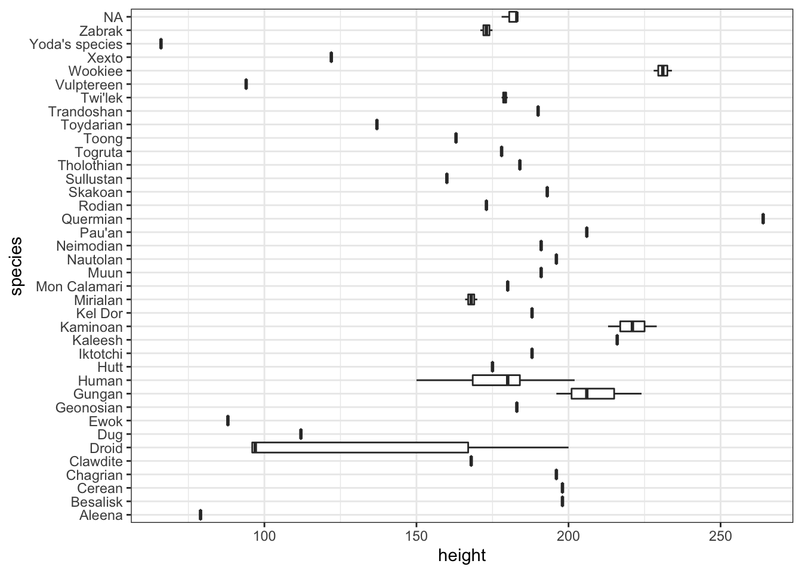


```r
starwars %>% 
  drop_na(height) %>% 
  ggplot(aes(x = height, y = fct_reorder(species, height))) +
  geom_boxplot()
```

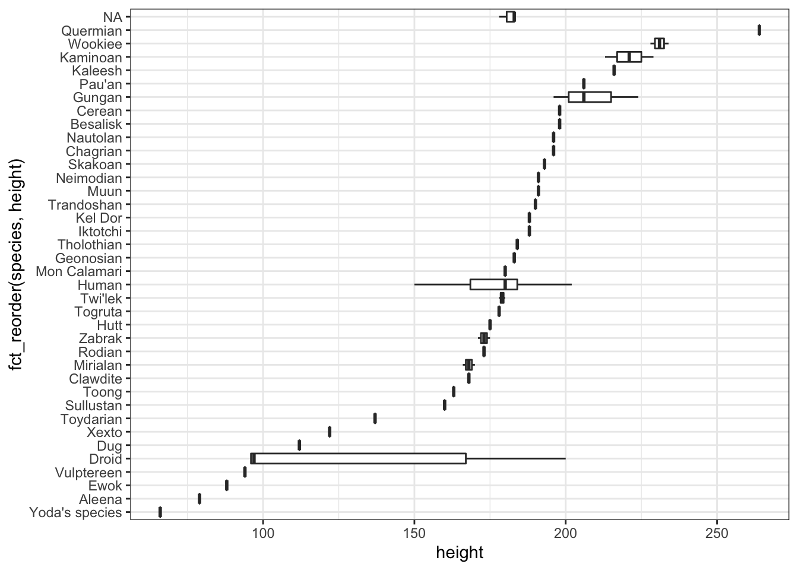


```r
starwars %>% 
  drop_na(height) %>% 
  ggplot(aes(x = height, y = fct_reorder(species, height, .fun = max))) +
  geom_boxplot()
```

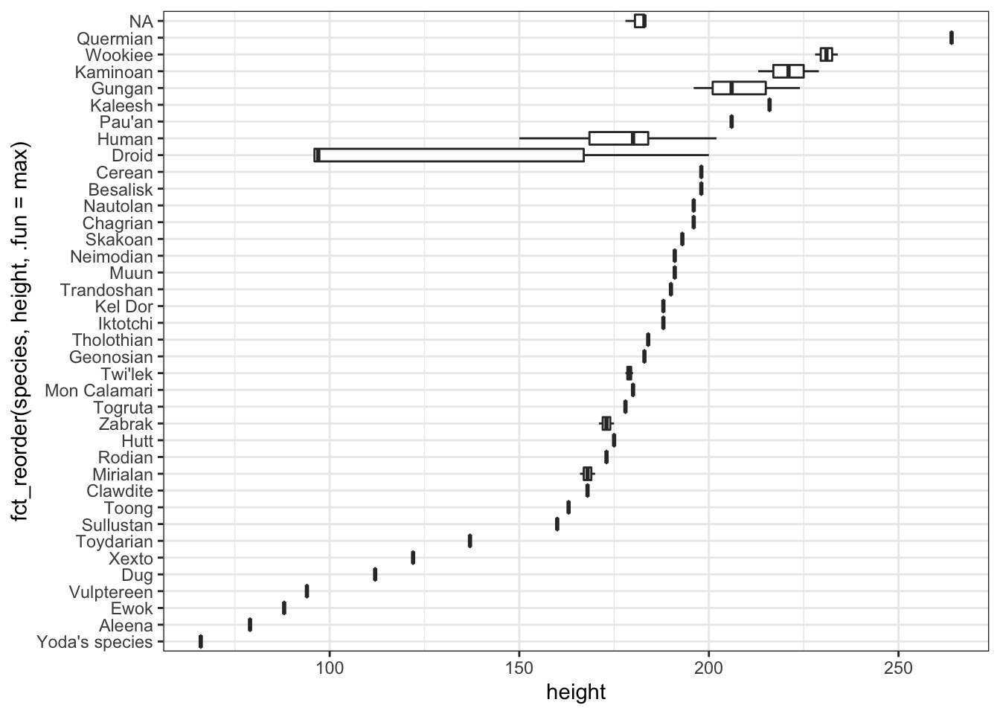

For more info, see the [forcats vignette](https://cran.r-project.org/web/packages/forcats/vignettes/forcats.html).

### Tweaking scales

A common request: scientific notation vs not. A few options:

1. Use different units. e.g., millions of people.


```r
gapminder::gapminder %>% 
  filter(country == "United States") %>% 
  ggplot(aes(x = year, y = pop / 1e6)) +
  geom_line() +
  labs(y = "Population (millions)")
```

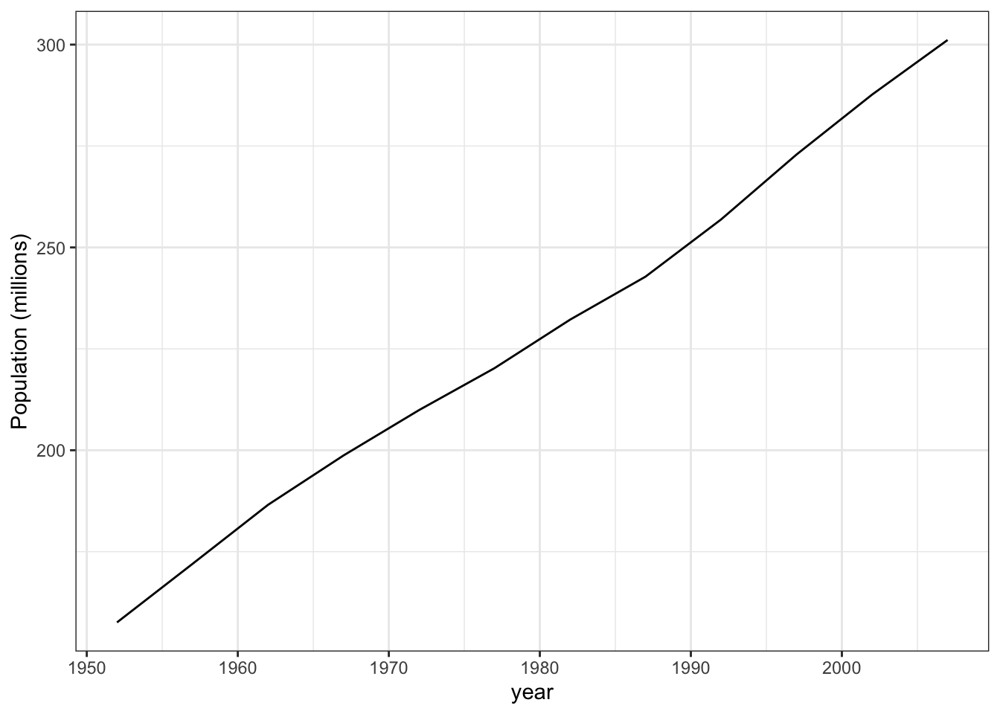

2. Use `scale_y_continuous` with `labels = scales::comma`.


```r
gapminder::gapminder %>% 
  filter(country == "United States") %>% 
  ggplot(aes(x = year, y = pop)) +
  geom_line() +
  scale_y_continuous(labels = scales::comma) + 
  labs(y = "Population")
```

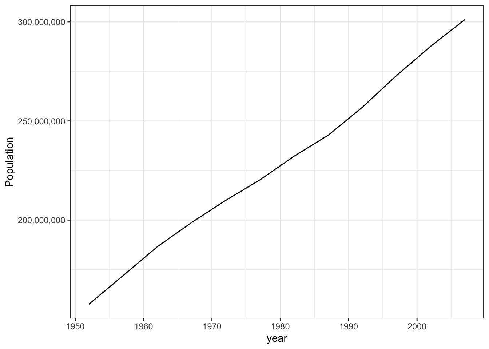

3. Use `scales::label_number` for even more control (see the help page).


```r
gapminder::gapminder %>% 
  filter(country == "United States") %>% 
  ggplot(aes(x = year, y = pop)) +
  geom_line() +
  scale_y_continuous(labels = scales::label_number(scale = 1e-6, suffix = "M")) + 
  labs(y = "Population")
```

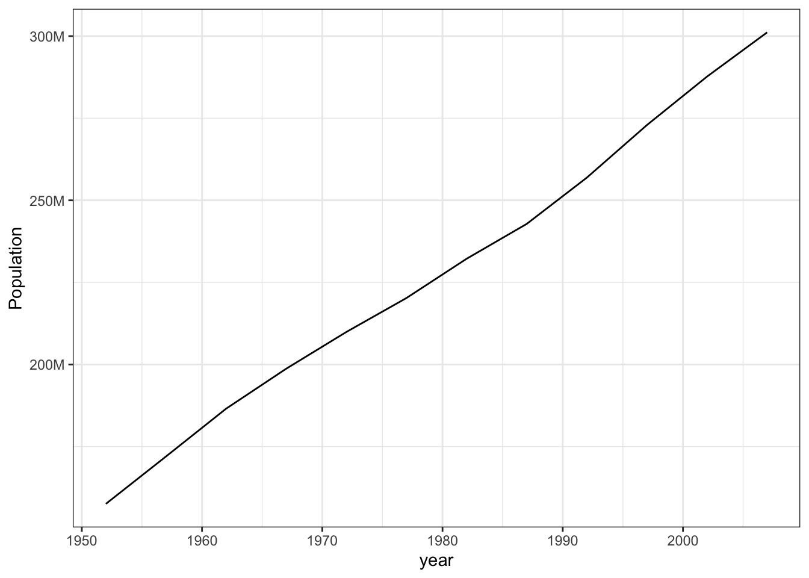

### Direct Labels

When you have many lines, colors don't work well for labels. Instead, use two
tricks:

1. Create a data frame with just the rightmost point of each line:


```r
gapminder_filtered <-
  gapminder::gapminder %>% 
  group_by(country) %>% 
  filter(max(pop) > 100000000)

last_pop <- gapminder_filtered %>% 
  group_by(country) %>% 
  slice_tail(n = 1)
```


2. Use text geoms to label those points:


```r
gapminder_filtered %>% 
  ggplot(aes(x = year, y = pop, color = country)) +
  geom_line() +
  geom_text(
    data = last_pop, aes(label = country), # use different data
    color = "black", hjust = "left" # text starts at "x" and faces right
  ) +
  scale_x_continuous(expand = expansion(mult = c(0, .2))) + # make some room
  scale_y_log10() +
  theme(legend.position = "none") # turn off legend since it's redundant
```

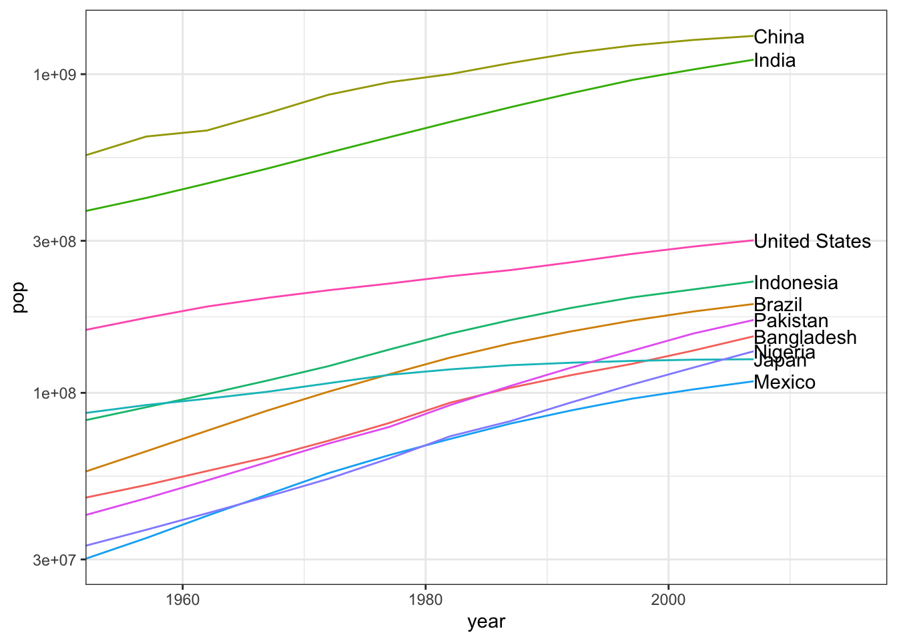

3. Use `ggrepel::geom_text_repel` to keep them from running into each other:


```r
gapminder_filtered %>% 
  ggplot(aes(x = year, y = pop, color = country)) +
  geom_line() +
  ggrepel::geom_text_repel(
    data = last_pop, aes(label = country),
    color = "black", hjust = "left",
    direction = "y", # only move up or down, never left/right
    segment.alpha = .1, # lighten the connecting lines
    nudge_x = 3,
    seed = 0 # make this plot reproducible.
  ) +
  scale_x_continuous(expand = expansion(mult = c(0, .3))) +
  scale_y_log10() +
  theme(legend.position = "none")
```

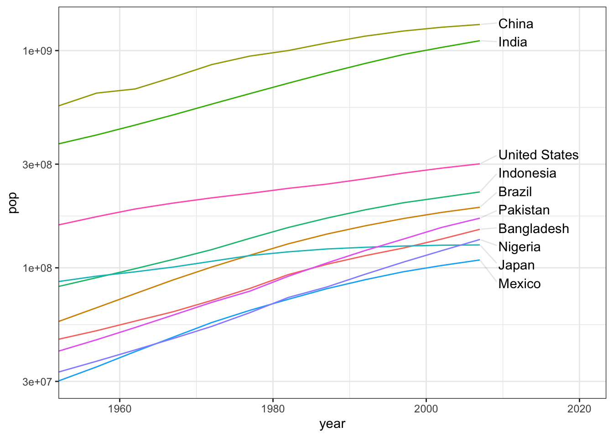


See below (and [spaghetti charts](https://www.data-to-viz.com/caveat/spaghetti.html)) for a cleaner alternative.


### Legends and Labels

If you need multiple rows for your legend, you probably have too many different
values. But you can grit your teeth and do it...


```r
starwars %>% skimr::skim()
```


Table: (\#tab:multi-row-legend-ick)Data summary

|                         |           |
|:------------------------|:----------|
|Name                     |Piped data |
|Number of rows           |87         |
|Number of columns        |14         |
|_______________________  |           |
|Column type frequency:   |           |
|character                |8          |
|list                     |3          |
|numeric                  |3          |
|________________________ |           |
|Group variables          |None       |


**Variable type: character**

|skim_variable | n_missing| complete_rate| min| max| empty| n_unique| whitespace|
|:-------------|---------:|-------------:|---:|---:|-----:|--------:|----------:|
|name          |         0|          1.00|   3|  21|     0|       87|          0|
|hair_color    |         5|          0.94|   4|  13|     0|       12|          0|
|skin_color    |         0|          1.00|   3|  19|     0|       31|          0|
|eye_color     |         0|          1.00|   3|  13|     0|       15|          0|
|sex           |         4|          0.95|   4|  14|     0|        4|          0|
|gender        |         4|          0.95|   8|   9|     0|        2|          0|
|homeworld     |        10|          0.89|   4|  14|     0|       48|          0|
|species       |         4|          0.95|   3|  14|     0|       37|          0|


**Variable type: list**

|skim_variable | n_missing| complete_rate| n_unique| min_length| max_length|
|:-------------|---------:|-------------:|--------:|----------:|----------:|
|films         |         0|             1|       24|          1|          7|
|vehicles      |         0|             1|       11|          0|          2|
|starships     |         0|             1|       17|          0|          5|


**Variable type: numeric**

|skim_variable | n_missing| complete_rate|   mean|     sd| p0|   p25| p50|   p75| p100|hist  |
|:-------------|---------:|-------------:|------:|------:|--:|-----:|---:|-----:|----:|:-----|
|height        |         6|          0.93| 174.36|  34.77| 66| 167.0| 180| 191.0|  264|▁▁▇▅▁ |
|mass          |        28|          0.68|  97.31| 169.46| 15|  55.6|  79|  84.5| 1358|▇▁▁▁▁ |
|birth_year    |        44|          0.49|  87.57| 154.69|  8|  35.0|  52|  72.0|  896|▇▁▁▁▁ |

```r
starwars %>% ggplot(aes(x = height, y = mass, color = species)) +
  geom_point() +
  theme(
    legend.position = "bottom", 
    legend.key.size = unit(0.3, "cm")
#    legend.box.margin = margin(t = 0, r = 0, b = 0, l = 0, unit = "pt")
    ) +
  guides(fill = guide_legend(nrow = 2, byrow = TRUE))
```

```
## Warning: Removed 28 rows containing missing values (geom_point).
```

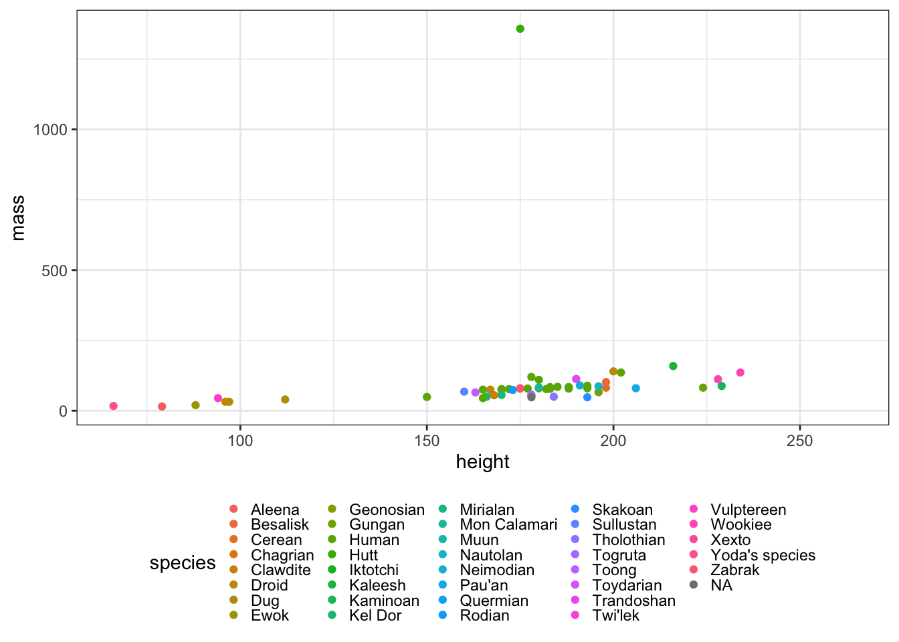

### Context and Small Multiples

Showing other data in the background can give context. The easiest way to do this is to filter the data and use multiple layers. (Note that we have to use the `group` aesthetic to draw multiple lines.)


```r
gapminder_just_usa <- gapminder::gapminder %>% filter(country == "United States")
gapminder::gapminder %>% 
  ggplot(aes(x = year, y = lifeExp, group = country)) +
    geom_line(alpha = 0.1) +
    geom_line(data = gapminder_just_usa, color = "red")
```

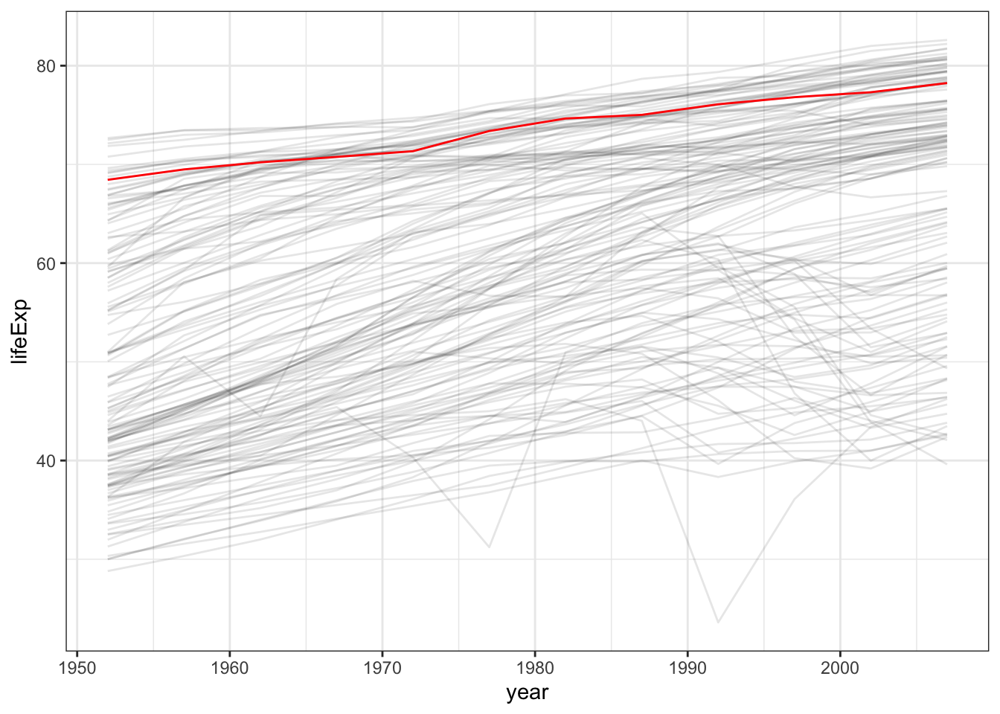

This pairs nicely with faceting; you just need to remove the faceting variable from the background plot. 
We can use this technique to make an easy-to-read version of the spaghetti chart above, using small multiples instead:


```r
gapminder_filtered %>% 
  ggplot(aes(x = year, y = lifeExp)) +
    geom_line(data = gapminder::gapminder %>% rename(country2 = country), mapping = aes(group = country2), alpha = 0.1) +
    geom_line(color = "red") +
    facet_wrap(vars(country), nrow = 2)
```

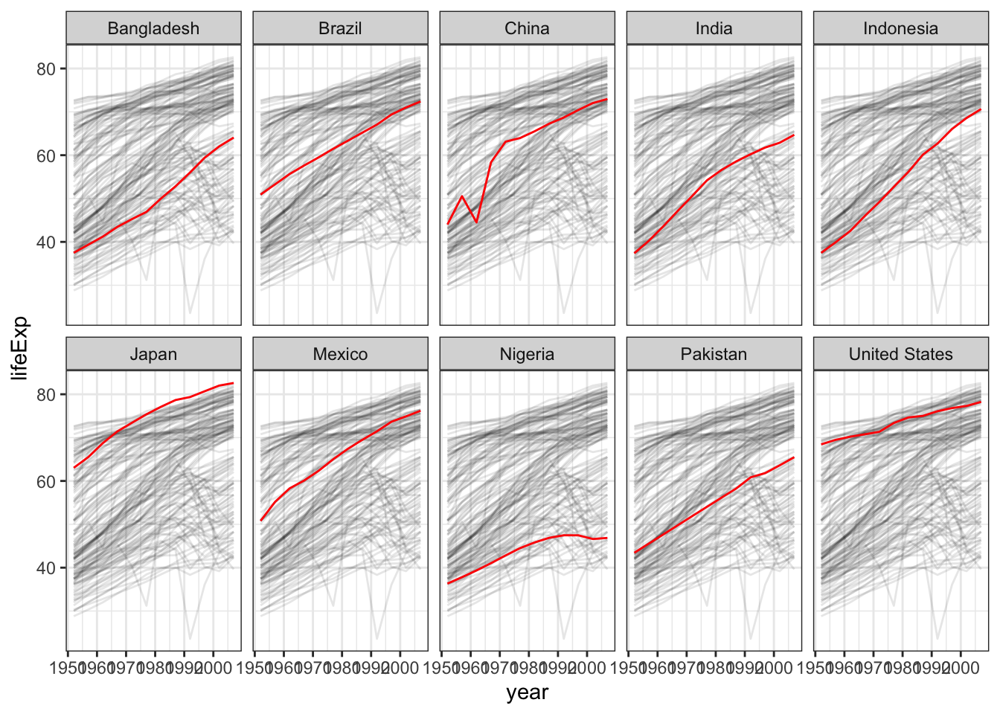

That example was a bit complex because we needed to maintain the group for the lines. Scatter plots are simpler to code:


```r
gapminder::gapminder %>%
  filter(year == 2007) %>% 
  ggplot(aes(x = gdpPercap, y = lifeExp)) +
    geom_point(data = gapminder::gapminder %>% select(-continent), alpha = 0.1, size = .5) +
    geom_point(color = "red", size = .5) +
    facet_wrap(vars(continent)) +
    scale_x_log10()
```

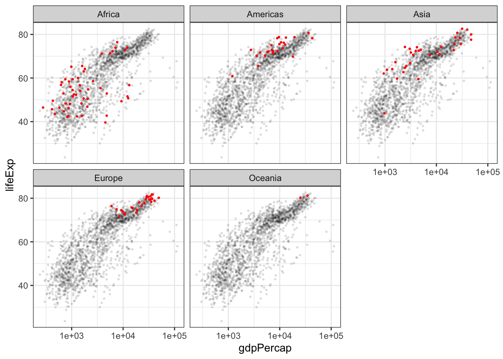


## Maps

### Plotly

This document shows examples of two simple mapping tasks using Plotly. More details are available in the [plotly-r book](https://plotly-r.com/maps.html).

We'll be using the `tidyverse` and the `plotly` package.


```r
library(tidyverse)
library(plotly)
```

#### Markers

When you just want to mark something on a map, you can give lat/long coordinates to `add_markers`.

For example, let's use a dataset of US cities:


```r
maps::us.cities %>% head()
```

```
##         name country.etc    pop   lat    long capital
## 1 Abilene TX          TX 113888 32.45  -99.74       0
## 2   Akron OH          OH 206634 41.08  -81.52       0
## 3 Alameda CA          CA  70069 37.77 -122.26       0
## 4  Albany GA          GA  75510 31.58  -84.18       0
## 5  Albany NY          NY  93576 42.67  -73.80       2
## 6  Albany OR          OR  45535 44.62 -123.09       0
```

Here's how to draw it on a map.


```r
maps::us.cities %>% 
  # Fix the column names.
  rename(state = country.etc) %>%
  # Keep only larger cities.
  filter(pop > 100000) %>% 
  # Construct the "geo" projection.
  plot_geo() %>%
  # Add state markers
  add_markers(
    # Set marker position.
    x = ~long, 
    y = ~lat, 
    # Set other aesthetics (here, redundantly encode population)
    size = ~pop, 
    color = ~pop,
    # Customize the label.
    text = ~ glue::glue("{name}, population {scales::comma(pop)}"),  
    hoverinfo = "text"
  ) %>% 
  layout(
    # Zoom into just USA.
    geo = list(
      scope = 'usa'
    )
  )
```

```
## Warning: `line.width` does not currently support multiple values.
```

```{=html}
<div id="htmlwidget-1b4ff99564eb6e8884a5" style="width:672px;height:480px;" class="plotly html-widget"></div>
<script type="application/json" data-for="htmlwidget-1b4ff99564eb6e8884a5">{"x":{"visdat":{"b8834c4191e0":["function () ","plotlyVisDat"]},"cur_data":"b8834c4191e0","attrs":{"b8834c4191e0":{"alpha_stroke":1,"sizes":[10,100],"spans":[1,20],"x":{},"y":{},"type":"scatter","mode":"markers","size":{},"color":{},"text":{},"hoverinfo":"text","inherit":true}},"layout":{"margin":{"b":40,"l":60,"t":25,"r":10},"mapType":"geo","geo":{"domain":{"x":[0,1],"y":[0,1]},"scope":"usa"},"hovermode":"closest","showlegend":false,"legend":{"yanchor":"top","y":0.5}},"source":"A","config":{"modeBarButtonsToAdd":["hoverclosest","hovercompare"],"showSendToCloud":false},"data":[{"type":"scattergeo","mode":"markers","text":["Abilene TX, population 113,888","Akron OH, population 206,634","Albuquerque NM, population 494,962","Alexandria VA, population 127,159","Allentown PA, population 105,224","Amarillo TX, population 183,295","Anaheim CA, population 334,909","Anchorage AK, population 279,428","Ann Arbor MI, population 113,716","Antioch CA, population 109,485","Arlington TX, population 374,729","Arlington VA, population 184,603","Arvada CO, population 101,633","Athens-Clarke GA, population 103,618","Atlanta GA, population 424,096","Augusta-Richmond GA, population 192,376","Aurora CO, population 304,641","Aurora IL, population 181,120","Austin TX, population 683,404","Bakersfield CA, population 301,775","Baltimore MD, population 602,658","Baton Rouge LA, population 222,217","Beaumont TX, population 110,949","Bellevue WA, population 111,896","Billings MT, population 101,249","Birmingham AL, population 229,300","Boise ID, population 193,628","Boston MA, population 567,759","Bridgeport CT, population 138,901","Brownsville TX, population 174,135","Buffalo NY, population 276,762","Burbank CA, population 105,515","Cambridge MA, population 101,342","Cape Coral FL, population 137,134","Carrollton TX, population 123,154","Cary NC, population 106,117","Cedar Rapids IA, population 123,243","Chandler AZ, population 247,915","Charleston SC, population 106,372","Charlotte NC, population 607,111","Chattanooga TN, population 153,617","Chesapeake VA, population 223,222","Chicago IL, population 2,830,144","Chula Vista CA, population 221,736","Cincinnati OH, population 301,561","Clarksville TN, population 113,379","Clearwater FL, population 107,866","Cleveland OH, population 443,949","Clinton MI, population 100,517","Colorado Springs CO, population 375,744","Columbia SC, population 118,020","Columbus GA, population 184,900","Columbus OH, population 741,677","Concord CA, population 126,360","Coral Springs FL, population 134,773","Corona CA, population 159,198","Corpus Christi TX, population 280,808","Costa Mesa CA, population 109,357","Dallas TX, population 1,216,543","Dayton OH, population 157,607","Denton TX, population 105,431","Denver CO, population 556,575","Des Moines IA, population 192,050","Detroit MI, population 871,789","Downey CA, population 112,762","Durham NC, population 208,426","East Los Angeles CA, population 125,121","Edison NJ, population 103,448","El Monte CA, population 127,195","El Paso TX, population 603,545","Elizabeth NJ, population 124,552","Escondido CA, population 137,823","Eugene OR, population 146,483","Evansville IN, population 114,237","Fairfield CA, population 107,749","Fayetteville NC, population 124,919","Flint MI, population 115,691","Fontana CA, population 178,257","Fort Collins CO, population 131,505","Fort Lauderdale FL, population 173,597","Fort Wayne IN, population 231,147","Fort Worth TX, population 633,849","Fremont CA, population 202,574","Fresno CA, population 472,517","Fullerton CA, population 137,126","Gainesville FL, population 127,933","Garden Grove CA, population 167,647","Garland TX, population 217,609","Gilbert AZ, population 186,332","Glendale AZ, population 244,734","Glendale CA, population 204,747","Grand Prairie TX, population 144,018","Grand Rapids MI, population 193,006","Green Bay WI, population 100,616","Greensboro NC, population 233,342","Gresham OR, population 100,674","Hampton VA, population 148,201","Hartford CT, population 123,836","Hayward CA, population 140,704","Henderson NV, population 255,646","Hialeah FL, population 224,644","Highlands Ranch CO, population 109,009","Hollywood FL, population 145,877","Honolulu HI, population 386,345","Houston TX, population 2,043,005","Huntington Beach CA, population 197,124","Huntsville AL, population 169,155","Independence MO, population 110,124","Indianapolis IN, population 771,725","Inglewood CA, population 116,797","Irvine CA, population 199,755","Irving TX, population 194,407","Jackson MS, population 175,085","Jacksonville FL, population 809,874","Jersey City NJ, population 237,125","Joliet IL, population 141,246","Kansas City KS, population 143,402","Kansas City MO, population 441,833","Killeen TX, population 106,441","Knoxville TN, population 172,000","Lafayette LA, population 112,317","Lakewood CO, population 140,154","Lancaster CA, population 131,779","Lansing MI, population 117,236","Laredo TX, population 218,041","Las Vegas NV, population 553,807","Lexington KY, population 274,245","Lincoln NE, population 245,301","Little Rock AR, population 184,323","Long Beach CA, population 486,571","Los Angeles CA, population 3,911,500","Louisville KY, population 241,072","Lowell MA, population 103,085","Lubbock TX, population 213,587","MacAllen TX, population 125,985","MacKinney TX, population 108,976","Madison WI, population 227,642","Manchester NH, population 110,384","Memphis TN, population 639,736","Mesa AZ, population 461,167","Mesquite TX, population 132,746","Metairie LA, population 141,606","Miami FL, population 386,740","Milwaukee WI, population 575,250","Minneapolis MN, population 364,726","Miramar FL, population 123,116","Mobile AL, population 188,467","Modesto CA, population 221,674","Montgomery AL, population 197,653","Moreno Valley CA, population 174,068","Naperville IL, population 147,178","Nashville TN, population 523,547","New Haven CT, population 125,030","New Orleans LA, population 454,207","New York NY, population 8,124,427","Newark NJ, population 281,378","Newport News VA, population 183,941","Norfolk VA, population 248,182","Norman OK, population 102,925","North Las Vegas NV, population 177,751","Norwalk CA, population 110,002","Oakland CA, population 393,632","Oceanside CA, population 172,251","Oklahoma City OK, population 538,141","Olathe KS, population 118,165","Omaha NE, population 417,809","Ontario CA, population 175,805","Orange CA, population 134,868","Orlando FL, population 211,226","Overland Park KS, population 169,520","Oxnard CA, population 190,658","Palmdale CA, population 139,337","Paradise NV, population 221,051","Pasadena CA, population 146,676","Pasadena TX, population 145,351","Paterson NJ, population 151,523","Pembroke Pines FL, population 160,157","Peoria AZ, population 146,634","Peoria IL, population 112,894","Philadelphia PA, population 1,439,814","Phoenix AZ, population 1,450,884","Pittsburgh PA, population 316,272","Plano TX, population 260,415","Plymouth MA, population 133,313","Pomona CA, population 157,501","Port Saint Lucie FL, population 126,377","Portland OR, population 542,751","Providence RI, population 178,295","Provo UT, population 105,832","Pueblo CO, population 104,659","Raleigh NC, population 350,822","Rancho Cucamonga CA, population 177,721","Reno NV, population 206,626","Rialto CA, population 103,423","Richardson TX, population 107,481","Richmond CA, population 103,818","Richmond VA, population 189,498","Riverside CA, population 306,351","Rochester NY, population 209,587","Rockford IL, population 153,148","Roseville CA, population 120,444","Sacramento CA, population 480,392","Saint Louis MO, population 315,546","Saint Paul MN, population 272,469","Saint Petersburg FL, population 245,804","Salem OR, population 148,942","Salinas CA, population 150,050","Salt Lake City UT, population 177,318","San Antonio TX, population 1,278,171","San Bernardino CA, population 205,743","San Buenaventura CA, population 106,518","San Diego CA, population 1,299,352","San Francisco CA, population 723,724","San Jose CA, population 897,883","Santa Ana CA, population 344,086","Santa Clara CA, population 102,178","Santa Clarita CA, population 172,730","Santa Rosa CA, population 156,669","Savannah GA, population 124,898","Scottsdale AZ, population 230,949","Seattle WA, population 570,430","Shreveport LA, population 196,228","Simi Valley CA, population 121,033","Sioux Falls SD, population 143,534","South Bend IN, population 102,927","South Gate CA, population 100,612","Spokane WA, population 197,513","Spring Hill FL, population 103,782","Spring Valley NV, population 176,522","Springfield IL, population 116,725","Springfield MA, population 152,095","Springfield MO, population 150,128","Stamford CT, population 122,011","Sterling Heights MI, population 127,027","Stockton CA, population 299,188","Sunnyvale CA, population 125,486","Sunrise Manor NV, population 195,581","Syracuse NY, population 140,793","Tacoma WA, population 197,621","Tallahassee FL, population 154,114","Tampa FL, population 328,578","Tempe AZ, population 158,313","Thornton CO, population 109,695","Thousand Oaks CA, population 130,136","Toledo OH, population 305,292","Toms River NJ, population 127,934","Topeka KS, population 121,229","Torrance CA, population 146,264","Tucson AZ, population 525,268","Tulsa OK, population 379,833","Vallejo CA, population 121,146","Vancouver WA, population 161,034","Virginia Beach VA, population 453,884","Visalia CA, population 110,620","WASHINGTON DC, population 548,359","Waco TX, population 119,911","Warren MI, population 132,537","Waterbury CT, population 108,645","West Covina CA, population 110,646","West Jordan UT, population 105,629","West Valley City UT, population 113,989","Westminster CO, population 104,708","Wichita Falls TX, population 100,616","Wichita KS, population 356,051","Winston-Salem NC, population 194,826","Worcester MA, population 177,973","Yonkers NY, population 198,045"],"hoverinfo":["text","text","text","text","text","text","text","text","text","text","text","text","text","text","text","text","text","text","text","text","text","text","text","text","text","text","text","text","text","text","text","text","text","text","text","text","text","text","text","text","text","text","text","text","text","text","text","text","text","text","text","text","text","text","text","text","text","text","text","text","text","text","text","text","text","text","text","text","text","text","text","text","text","text","text","text","text","text","text","text","text","text","text","text","text","text","text","text","text","text","text","text","text","text","text","text","text","text","text","text","text","text","text","text","text","text","text","text","text","text","text","text","text","text","text","text","text","text","text","text","text","text","text","text","text","text","text","text","text","text","text","text","text","text","text","text","text","text","text","text","text","text","text","text","text","text","text","text","text","text","text","text","text","text","text","text","text","text","text","text","text","text","text","text","text","text","text","text","text","text","text","text","text","text","text","text","text","text","text","text","text","text","text","text","text","text","text","text","text","text","text","text","text","text","text","text","text","text","text","text","text","text","text","text","text","text","text","text","text","text","text","text","text","text","text","text","text","text","text","text","text","text","text","text","text","text","text","text","text","text","text","text","text","text","text","text","text","text","text","text","text","text","text","text","text","text","text","text","text","text","text","text","text","text","text","text","text","text","text","text","text","text","text","text","text","text","text"],"marker":{"colorbar":{"title":"pop","ticklen":2},"cmin":100517,"cmax":8124427,"colorscale":[["0","rgba(68,1,84,1)"],["0.0416666666666667","rgba(70,19,97,1)"],["0.0833333333333333","rgba(72,32,111,1)"],["0.125","rgba(71,45,122,1)"],["0.166666666666667","rgba(68,58,128,1)"],["0.208333333333333","rgba(64,70,135,1)"],["0.25","rgba(60,82,138,1)"],["0.291666666666667","rgba(56,93,140,1)"],["0.333333333333333","rgba(49,104,142,1)"],["0.375","rgba(46,114,142,1)"],["0.416666666666667","rgba(42,123,142,1)"],["0.458333333333333","rgba(38,133,141,1)"],["0.5","rgba(37,144,140,1)"],["0.541666666666667","rgba(33,154,138,1)"],["0.583333333333333","rgba(39,164,133,1)"],["0.625","rgba(47,174,127,1)"],["0.666666666666667","rgba(53,183,121,1)"],["0.708333333333333","rgba(79,191,110,1)"],["0.75","rgba(98,199,98,1)"],["0.791666666666667","rgba(119,207,85,1)"],["0.833333333333333","rgba(147,214,70,1)"],["0.875","rgba(172,220,52,1)"],["0.916666666666667","rgba(199,225,42,1)"],["0.958333333333333","rgba(226,228,40,1)"],["1","rgba(253,231,37,1)"]],"showscale":false,"color":[113888,206634,494962,127159,105224,183295,334909,279428,113716,109485,374729,184603,101633,103618,424096,192376,304641,181120,683404,301775,602658,222217,110949,111896,101249,229300,193628,567759,138901,174135,276762,105515,101342,137134,123154,106117,123243,247915,106372,607111,153617,223222,2830144,221736,301561,113379,107866,443949,100517,375744,118020,184900,741677,126360,134773,159198,280808,109357,1216543,157607,105431,556575,192050,871789,112762,208426,125121,103448,127195,603545,124552,137823,146483,114237,107749,124919,115691,178257,131505,173597,231147,633849,202574,472517,137126,127933,167647,217609,186332,244734,204747,144018,193006,100616,233342,100674,148201,123836,140704,255646,224644,109009,145877,386345,2043005,197124,169155,110124,771725,116797,199755,194407,175085,809874,237125,141246,143402,441833,106441,172000,112317,140154,131779,117236,218041,553807,274245,245301,184323,486571,3911500,241072,103085,213587,125985,108976,227642,110384,639736,461167,132746,141606,386740,575250,364726,123116,188467,221674,197653,174068,147178,523547,125030,454207,8124427,281378,183941,248182,102925,177751,110002,393632,172251,538141,118165,417809,175805,134868,211226,169520,190658,139337,221051,146676,145351,151523,160157,146634,112894,1439814,1450884,316272,260415,133313,157501,126377,542751,178295,105832,104659,350822,177721,206626,103423,107481,103818,189498,306351,209587,153148,120444,480392,315546,272469,245804,148942,150050,177318,1278171,205743,106518,1299352,723724,897883,344086,102178,172730,156669,124898,230949,570430,196228,121033,143534,102927,100612,197513,103782,176522,116725,152095,150128,122011,127027,299188,125486,195581,140793,197621,154114,328578,158313,109695,130136,305292,127934,121229,146264,525268,379833,121146,161034,453884,110620,548359,119911,132537,108645,110646,105629,113989,104708,100616,356051,194826,177973,198045],"size":[10.1499755106924,11.1902588638208,14.4242831736647,10.2988293737093,10.0527959560862,10.9284775128335,12.629052419581,12.0067510727314,10.1480462766905,10.1005893635397,13.075692523969,10.9431486644292,10.0125175880587,10.0347822944176,13.6294163319379,11.0303343382466,12.2895521011577,10.9040816758912,16.5379384863489,12.2574056787776,15.6322528542818,11.3650452210955,10.1170102855092,10.1276322889963,10.0082104609847,11.4444915259518,11.0443773671439,15.2408090320056,10.4305332437677,10.8257345857568,11.9768479457023,10.056059950822,10.009253593323,10.4107137293414,10.2539073843052,10.0628122698285,10.2549056507364,11.653286240748,10.0656724714011,15.6821998252722,10.5955949156957,11.3763177802343,40.6167977955884,11.3596500957762,12.255005352752,10.1442663240241,10.0824298876732,13.8520970449569,10,13.0870772478754,10.1963219926445,10.9464799580255,17.1915562362988,10.289867408782,10.3842316277226,10.6581940724659,12.0222298106534,10.0991536545151,22.5178796870852,10.6403486579486,10.0551177667746,15.1153639559766,11.0266777668244,18.6509544598581,10.1373457578662,11.2103587901659,10.2759701940824,10.0328754933692,10.2992331668725,15.6422018691635,10.2695880188088,10.4184418818257,10.5155765705248,10.1538900610799,10.0811175598929,10.2737044657779,10.1701988182819,10.8719689029413,10.347576181687,10.8197001212626,11.4652083585185,15.98210598075,11.1447199681951,14.1725293528965,10.4106239975274,10.3075109267178,10.7529620845697,11.313359696208,10.9625419527388,11.61760662819,11.1690933721839,10.4879279553235,11.0374007186023,10.0011104311988,11.4898285249959,10.0017609868506,10.5348464775901,10.2615570214521,10.4507565513571,11.7400008225416,11.3922676101801,10.0952503206043,10.5087793856113,13.2059831179562,31.7878714990572,11.0835901698798,10.7698765315164,10.1077566921862,17.528588929836,10.182604241573,11.1131007202224,11.0531150025362,10.8363902386742,17.9564863015662,11.5322604565605,10.4568358817584,10.4810186056424,13.8283629801431,10.0664464082972,10.8017874078847,10.1323544257102,10.4445874891418,10.3506494963179,10.1875282748685,11.3182052141662,15.0843167483185,11.9486160737097,11.6239663705101,10.9400080509378,14.3301657172127,52.7458022335744,11.5765318903128,10.0288039123071,11.268247026699,10.2856612299988,10.0948801768714,11.4258946074919,10.1106729761426,16.0481373794073,14.0452223417262,10.3614958293401,10.4608738133902,13.2104136262745,15.324831659378,12.9634941069877,10.2534811581885,10.9864891306109,11.3589546742174,11.0895236860832,10.8249830818142,10.5233720218696,14.7449061617092,10.2749494946977,13.9671556635107,100,12.0286232024038,10.9357233568173,11.6562810400416,10.0270092760263,10.8662933657033,10.1063882820221,13.2877175840706,10.8046027435502,14.9085994234731,10.197948381774,13.5588983425786,10.8444661019378,10.3852971930144,11.2417649250802,10.773970545532,11.0110644311813,10.4354236276329,11.351966809199,10.5177413505386,10.5028795188381,10.5721076133705,10.6689506736741,10.5172702585149,10.1388263327978,25.0221936686728,25.1463600663517,12.4200109422962,11.7934922001867,10.3678555716602,10.6391597114125,10.2900580888868,14.9603073813141,10.872395129058,10.0596155739533,10.0464586467196,12.8075402141849,10.8659568714006,11.1901691320067,10.0325950814503,10.0781115441225,10.0370255897686,10.9980533181454,12.3087322764089,11.2233811196786,10.5903343880976,10.2235107322988,14.2608591073429,12.411867780172,11.9286956109926,11.629608258318,10.5431578868656,10.5555857431103,10.8614366312683,23.2091287165484,11.180264983032,10.0673100770073,23.4467049106982,16.9901868291145,18.9436372043056,12.7319860267625,10.0186305678902,10.8099754359159,10.6298276027523,10.273468919766,11.462987496121,15.2707682414185,11.0735402067072,10.2301172371076,10.4824991805741,10.0270317089798,10.0010655652917,11.0879533793375,10.0366217966054,10.8525083157712,10.1817966552466,10.5785234380745,10.5564606282972,10.2410869513741,10.2973487987777,12.2283886534121,10.280064208098,11.0662831462467,10.4517548177883,11.0891647588271,10.601169504643,12.5580409052445,10.6482674905377,10.1029448236583,10.3322208250093,12.2968540275252,10.3075221431945,10.2323156665516,10.5131201621155,14.7642097182047,13.132941421327,10.2313846989809,10.6787875237883,13.9635327415188,10.1133200646568,15.0232093829567,10.2175323501884,10.3591515856982,10.0911675230654,10.1136116930524,10.0573386291721,10.1511083748447,10.0470082540806,10.0011104311988,12.8661911711373,11.0578147062966,10.8687834235429,11.0939205449712],"sizemode":"area","line":{"colorbar":{"title":"","ticklen":2},"cmin":100517,"cmax":8124427,"colorscale":[["0","rgba(68,1,84,1)"],["0.0416666666666667","rgba(70,19,97,1)"],["0.0833333333333333","rgba(72,32,111,1)"],["0.125","rgba(71,45,122,1)"],["0.166666666666667","rgba(68,58,128,1)"],["0.208333333333333","rgba(64,70,135,1)"],["0.25","rgba(60,82,138,1)"],["0.291666666666667","rgba(56,93,140,1)"],["0.333333333333333","rgba(49,104,142,1)"],["0.375","rgba(46,114,142,1)"],["0.416666666666667","rgba(42,123,142,1)"],["0.458333333333333","rgba(38,133,141,1)"],["0.5","rgba(37,144,140,1)"],["0.541666666666667","rgba(33,154,138,1)"],["0.583333333333333","rgba(39,164,133,1)"],["0.625","rgba(47,174,127,1)"],["0.666666666666667","rgba(53,183,121,1)"],["0.708333333333333","rgba(79,191,110,1)"],["0.75","rgba(98,199,98,1)"],["0.791666666666667","rgba(119,207,85,1)"],["0.833333333333333","rgba(147,214,70,1)"],["0.875","rgba(172,220,52,1)"],["0.916666666666667","rgba(199,225,42,1)"],["0.958333333333333","rgba(226,228,40,1)"],["1","rgba(253,231,37,1)"]],"showscale":false,"color":[113888,206634,494962,127159,105224,183295,334909,279428,113716,109485,374729,184603,101633,103618,424096,192376,304641,181120,683404,301775,602658,222217,110949,111896,101249,229300,193628,567759,138901,174135,276762,105515,101342,137134,123154,106117,123243,247915,106372,607111,153617,223222,2830144,221736,301561,113379,107866,443949,100517,375744,118020,184900,741677,126360,134773,159198,280808,109357,1216543,157607,105431,556575,192050,871789,112762,208426,125121,103448,127195,603545,124552,137823,146483,114237,107749,124919,115691,178257,131505,173597,231147,633849,202574,472517,137126,127933,167647,217609,186332,244734,204747,144018,193006,100616,233342,100674,148201,123836,140704,255646,224644,109009,145877,386345,2043005,197124,169155,110124,771725,116797,199755,194407,175085,809874,237125,141246,143402,441833,106441,172000,112317,140154,131779,117236,218041,553807,274245,245301,184323,486571,3911500,241072,103085,213587,125985,108976,227642,110384,639736,461167,132746,141606,386740,575250,364726,123116,188467,221674,197653,174068,147178,523547,125030,454207,8124427,281378,183941,248182,102925,177751,110002,393632,172251,538141,118165,417809,175805,134868,211226,169520,190658,139337,221051,146676,145351,151523,160157,146634,112894,1439814,1450884,316272,260415,133313,157501,126377,542751,178295,105832,104659,350822,177721,206626,103423,107481,103818,189498,306351,209587,153148,120444,480392,315546,272469,245804,148942,150050,177318,1278171,205743,106518,1299352,723724,897883,344086,102178,172730,156669,124898,230949,570430,196228,121033,143534,102927,100612,197513,103782,176522,116725,152095,150128,122011,127027,299188,125486,195581,140793,197621,154114,328578,158313,109695,130136,305292,127934,121229,146264,525268,379833,121146,161034,453884,110620,548359,119911,132537,108645,110646,105629,113989,104708,100616,356051,194826,177973,198045]}},"textfont":{"size":[10.1499755106924,11.1902588638208,14.4242831736647,10.2988293737093,10.0527959560862,10.9284775128335,12.629052419581,12.0067510727314,10.1480462766905,10.1005893635397,13.075692523969,10.9431486644292,10.0125175880587,10.0347822944176,13.6294163319379,11.0303343382466,12.2895521011577,10.9040816758912,16.5379384863489,12.2574056787776,15.6322528542818,11.3650452210955,10.1170102855092,10.1276322889963,10.0082104609847,11.4444915259518,11.0443773671439,15.2408090320056,10.4305332437677,10.8257345857568,11.9768479457023,10.056059950822,10.009253593323,10.4107137293414,10.2539073843052,10.0628122698285,10.2549056507364,11.653286240748,10.0656724714011,15.6821998252722,10.5955949156957,11.3763177802343,40.6167977955884,11.3596500957762,12.255005352752,10.1442663240241,10.0824298876732,13.8520970449569,10,13.0870772478754,10.1963219926445,10.9464799580255,17.1915562362988,10.289867408782,10.3842316277226,10.6581940724659,12.0222298106534,10.0991536545151,22.5178796870852,10.6403486579486,10.0551177667746,15.1153639559766,11.0266777668244,18.6509544598581,10.1373457578662,11.2103587901659,10.2759701940824,10.0328754933692,10.2992331668725,15.6422018691635,10.2695880188088,10.4184418818257,10.5155765705248,10.1538900610799,10.0811175598929,10.2737044657779,10.1701988182819,10.8719689029413,10.347576181687,10.8197001212626,11.4652083585185,15.98210598075,11.1447199681951,14.1725293528965,10.4106239975274,10.3075109267178,10.7529620845697,11.313359696208,10.9625419527388,11.61760662819,11.1690933721839,10.4879279553235,11.0374007186023,10.0011104311988,11.4898285249959,10.0017609868506,10.5348464775901,10.2615570214521,10.4507565513571,11.7400008225416,11.3922676101801,10.0952503206043,10.5087793856113,13.2059831179562,31.7878714990572,11.0835901698798,10.7698765315164,10.1077566921862,17.528588929836,10.182604241573,11.1131007202224,11.0531150025362,10.8363902386742,17.9564863015662,11.5322604565605,10.4568358817584,10.4810186056424,13.8283629801431,10.0664464082972,10.8017874078847,10.1323544257102,10.4445874891418,10.3506494963179,10.1875282748685,11.3182052141662,15.0843167483185,11.9486160737097,11.6239663705101,10.9400080509378,14.3301657172127,52.7458022335744,11.5765318903128,10.0288039123071,11.268247026699,10.2856612299988,10.0948801768714,11.4258946074919,10.1106729761426,16.0481373794073,14.0452223417262,10.3614958293401,10.4608738133902,13.2104136262745,15.324831659378,12.9634941069877,10.2534811581885,10.9864891306109,11.3589546742174,11.0895236860832,10.8249830818142,10.5233720218696,14.7449061617092,10.2749494946977,13.9671556635107,100,12.0286232024038,10.9357233568173,11.6562810400416,10.0270092760263,10.8662933657033,10.1063882820221,13.2877175840706,10.8046027435502,14.9085994234731,10.197948381774,13.5588983425786,10.8444661019378,10.3852971930144,11.2417649250802,10.773970545532,11.0110644311813,10.4354236276329,11.351966809199,10.5177413505386,10.5028795188381,10.5721076133705,10.6689506736741,10.5172702585149,10.1388263327978,25.0221936686728,25.1463600663517,12.4200109422962,11.7934922001867,10.3678555716602,10.6391597114125,10.2900580888868,14.9603073813141,10.872395129058,10.0596155739533,10.0464586467196,12.8075402141849,10.8659568714006,11.1901691320067,10.0325950814503,10.0781115441225,10.0370255897686,10.9980533181454,12.3087322764089,11.2233811196786,10.5903343880976,10.2235107322988,14.2608591073429,12.411867780172,11.9286956109926,11.629608258318,10.5431578868656,10.5555857431103,10.8614366312683,23.2091287165484,11.180264983032,10.0673100770073,23.4467049106982,16.9901868291145,18.9436372043056,12.7319860267625,10.0186305678902,10.8099754359159,10.6298276027523,10.273468919766,11.462987496121,15.2707682414185,11.0735402067072,10.2301172371076,10.4824991805741,10.0270317089798,10.0010655652917,11.0879533793375,10.0366217966054,10.8525083157712,10.1817966552466,10.5785234380745,10.5564606282972,10.2410869513741,10.2973487987777,12.2283886534121,10.280064208098,11.0662831462467,10.4517548177883,11.0891647588271,10.601169504643,12.5580409052445,10.6482674905377,10.1029448236583,10.3322208250093,12.2968540275252,10.3075221431945,10.2323156665516,10.5131201621155,14.7642097182047,13.132941421327,10.2313846989809,10.6787875237883,13.9635327415188,10.1133200646568,15.0232093829567,10.2175323501884,10.3591515856982,10.0911675230654,10.1136116930524,10.0573386291721,10.1511083748447,10.0470082540806,10.0011104311988,12.8661911711373,11.0578147062966,10.8687834235429,11.0939205449712]},"geo":"geo","lat":[32.45,41.08,35.12,38.82,40.6,35.2,33.84,61.18,42.28,37.99,32.69,38.88,39.82,33.95,33.76,33.46,39.71,41.77,30.31,35.36,39.3,30.45,30.09,47.6,45.79,33.53,43.61,42.34,41.19,25.93,42.89,34.19,42.38,26.64,32.99,35.78,41.97,33.3,32.79,35.2,35.07,36.68,41.84,32.63,39.14,36.56,27.98,41.48,42.59,38.86,34.04,32.51,39.99,37.97,26.27,33.87,27.71,33.67,32.79,39.78,33.21,39.77,41.58,42.38,33.94,35.98,34.03,40.53,34.07,31.85,40.67,33.14,44.05,37.98,38.25,35.07,43.02,34.1,40.56,26.14,41.07,32.75,37.53,36.78,33.88,29.67,33.78,32.91,33.33,33.58,34.18,32.69,42.96,44.52,36.08,45.5,37.05,41.77,37.63,36.03,25.86,39.55,26.03,21.32,29.77,33.69,34.71,39.09,39.78,33.96,33.66,32.86,32.32,30.33,40.71,41.53,39.12,39.12,31.1,35.97,30.22,39.7,34.69,42.71,27.53,36.21,38.04,40.82,34.72,33.79,34.11,38.22,42.64,33.58,26.22,33.2,43.08,42.98,35.11,33.42,32.77,30,25.78,43.06,44.96,25.98,30.68,37.66,32.35,33.93,41.76,36.17,41.31,30.07,40.67,40.72,37.08,36.92,35.23,36.27,33.91,37.77,33.23,35.47,38.89,41.26,34.05,33.81,28.5,38.91,34.2,34.61,36.08,34.16,29.66,40.91,26.01,33.69,40.74,40.01,33.54,40.44,33.05,41.96,34.06,27.28,45.54,41.82,40.25,38.27,35.82,34.12,39.54,34.11,32.97,37.95,37.53,33.94,43.17,42.27,38.76,38.57,38.64,44.95,27.76,44.92,36.68,40.78,29.46,34.14,34.27,32.81,37.77,37.3,33.74,37.37,34.41,38.45,32.02,33.69,47.62,32.47,34.26,43.54,41.68,33.94,47.67,28.48,36.11,39.78,42.12,37.2,41.1,42.58,37.97,37.39,36.19,43.04,47.25,30.46,27.96,33.39,39.89,34.19,41.66,39.94,39.04,33.83,32.2,36.13,38.11,45.63,36.74,36.33,38.91,31.57,42.49,41.56,34.05,40.6,40.69,39.88,33.9,37.69,36.1,42.27,40.95],"lon":[-99.74,-81.52,-106.62,-77.09,-75.48,-101.82,-117.87,-149.19,-83.73,-121.8,-97.13,-77.1,-105.11,-83.39,-84.42,-81.99,-104.73,-88.29,-97.75,-119,-76.61,-91.13,-94.14,-122.16,-108.54,-86.8,-116.23,-71.02,-73.2,-97.48,-78.86,-118.33,-71.12,-82,-96.9,-78.8,-91.67,-111.87,-79.99,-80.83,-85.26,-76.31,-87.68,-117.04,-84.51,-87.35,-82.77,-81.68,-82.92,-104.76,-80.89,-84.87,-82.99,-122,-80.26,-117.57,-97.29,-117.91,-96.77,-84.2,-97.13,-104.87,-93.62,-83.1,-118.13,-78.91,-118.17,-74.37,-118.03,-106.44,-74.19,-117.07,-123.11,-87.54,-122.04,-78.9,-83.69,-117.46,-105.07,-80.14,-85.14,-97.34,-122,-119.79,-117.93,-82.34,-117.96,-96.63,-111.76,-112.2,-118.25,-97.02,-85.66,-87.99,-79.83,-122.44,-76.29,-72.68,-122.1,-115,-80.3,-104.97,-80.16,-157.8,-95.39,-118.01,-86.63,-94.35,-86.15,-118.34,-117.8,-96.97,-90.21,-81.66,-74.06,-88.12,-94.73,-94.55,-97.72,-83.95,-92.03,-105.11,-118.18,-84.55,-99.49,-115.22,-84.46,-96.69,-92.35,-118.16,-118.41,-85.74,-71.32,-101.88,-98.24,-96.65,-89.39,-71.44,-90.01,-111.74,-96.6,-90.18,-80.21,-87.97,-93.27,-80.33,-88.09,-120.99,-86.28,-117.21,-88.15,-86.78,-72.92,-89.93,-73.94,-74.17,-76.51,-76.24,-97.34,-115.14,-118.08,-122.22,-117.31,-97.51,-94.81,-96.01,-117.61,-117.82,-81.37,-94.68,-119.21,-118.09,-115.13,-118.14,-95.15,-74.16,-80.34,-112.24,-89.61,-75.13,-112.07,-79.98,-96.75,-70.67,-117.76,-80.35,-122.66,-71.42,-111.64,-104.62,-78.66,-117.57,-119.82,-117.39,-96.71,-122.36,-77.47,-117.4,-77.62,-89.06,-121.29,-121.47,-90.24,-93.1,-82.64,-123.02,-121.64,-111.93,-98.51,-117.29,-119.26,-117.14,-122.45,-121.85,-117.88,-121.97,-118.51,-122.7,-81.13,-111.87,-122.35,-93.8,-118.75,-96.73,-86.27,-118.19,-117.41,-82.56,-115.24,-89.64,-72.54,-93.29,-73.55,-83.03,-121.31,-122.03,-115.05,-76.14,-122.46,-84.28,-82.48,-111.93,-104.96,-118.87,-83.58,-74.17,-95.69,-118.34,-110.89,-95.92,-122.26,-122.64,-76.04,-119.32,-77.02,-97.18,-83.03,-73.04,-117.91,-111.99,-112.01,-105.05,-98.52,-97.34,-80.26,-71.81,-73.87],"frame":null},{"type":"scattergeo","mode":"markers","opacity":0,"hoverinfo":"none","showlegend":false,"marker":{"colorbar":{"title":"pop","ticklen":2,"len":0.5,"lenmode":"fraction","y":1,"yanchor":"top"},"cmin":100517,"cmax":8124427,"colorscale":[["0","rgba(68,1,84,1)"],["0.0416666666666667","rgba(70,19,97,1)"],["0.0833333333333333","rgba(72,32,111,1)"],["0.125","rgba(71,45,122,1)"],["0.166666666666667","rgba(68,58,128,1)"],["0.208333333333333","rgba(64,70,135,1)"],["0.25","rgba(60,82,138,1)"],["0.291666666666667","rgba(56,93,140,1)"],["0.333333333333333","rgba(49,104,142,1)"],["0.375","rgba(46,114,142,1)"],["0.416666666666667","rgba(42,123,142,1)"],["0.458333333333333","rgba(38,133,141,1)"],["0.5","rgba(37,144,140,1)"],["0.541666666666667","rgba(33,154,138,1)"],["0.583333333333333","rgba(39,164,133,1)"],["0.625","rgba(47,174,127,1)"],["0.666666666666667","rgba(53,183,121,1)"],["0.708333333333333","rgba(79,191,110,1)"],["0.75","rgba(98,199,98,1)"],["0.791666666666667","rgba(119,207,85,1)"],["0.833333333333333","rgba(147,214,70,1)"],["0.875","rgba(172,220,52,1)"],["0.916666666666667","rgba(199,225,42,1)"],["0.958333333333333","rgba(226,228,40,1)"],["1","rgba(253,231,37,1)"]],"showscale":true,"color":[100517,8124427],"line":{"color":"rgba(255,127,14,1)"}},"lat":[21.32,61.18],"lon":[-157.8,-70.67],"geo":"geo","frame":null}],"highlight":{"on":"plotly_click","persistent":false,"dynamic":false,"selectize":false,"opacityDim":0.2,"selected":{"opacity":1},"debounce":0},"shinyEvents":["plotly_hover","plotly_click","plotly_selected","plotly_relayout","plotly_brushed","plotly_brushing","plotly_clickannotation","plotly_doubleclick","plotly_deselect","plotly_afterplot","plotly_sunburstclick"],"base_url":"https://plot.ly"},"evals":[],"jsHooks":[]}</script>
```

#### Choropleths

Plotly has builtin support for countries and US states. Any other granularity requires manually working with GeoJSON files; see
the documentation.

Let's make a world population map. First, let's construct a dataset of the most recent data that Gapminder has for each country:


```r
library(gapminder)
latest_country_data <- gapminder::gapminder_unfiltered %>%
  arrange(year) %>% 
  group_by(country) %>%
  slice_tail(n = 1) %>% 
  left_join(gapminder::country_codes, by = "country")
```

Now we add a "choropleth" trace. Note that this has the typical problem of choropleth maps and densities; see
[Fundamentals of Data Visualization](https://clauswilke.com/dataviz/geospatial-data.html#choropleth-mapping)
for some discussion of this.


```r
latest_country_data %>% 
  plot_geo() %>% 
  add_trace(
    type = "choropleth",
    # Specify that the "country" column contains the country names.
    locations = ~country,
    locationmode = "country names",
    # Use fill to show population. (I don't know why it's called 'z' and not 'fill'.)
    z = ~pop
  )
```

```{=html}
<div id="htmlwidget-8f836166d559454ecd73" style="width:672px;height:480px;" class="plotly html-widget"></div>
<script type="application/json" data-for="htmlwidget-8f836166d559454ecd73">{"x":{"visdat":{"b8833255c100":["function () ","plotlyVisDat"]},"cur_data":"b8833255c100","attrs":{"b8833255c100":{"alpha_stroke":1,"sizes":[10,100],"spans":[1,20],"type":"choropleth","locations":{},"locationmode":"country names","z":{},"inherit":true}},"layout":{"margin":{"b":40,"l":60,"t":25,"r":10},"mapType":"geo","scene":{"zaxis":{"title":"pop"}},"geo":{"domain":{"x":[0,1],"y":[0,1]}},"hovermode":"closest","showlegend":false,"legend":{"yanchor":"top","y":0.5}},"source":"A","config":{"modeBarButtonsToAdd":["hoverclosest","hovercompare"],"showSendToCloud":false},"data":[{"colorbar":{"title":"pop","ticklen":2,"len":0.5,"lenmode":"fraction","y":1,"yanchor":"top"},"colorscale":[["0","rgba(68,1,84,1)"],["0.0416666666666667","rgba(70,19,97,1)"],["0.0833333333333333","rgba(72,32,111,1)"],["0.125","rgba(71,45,122,1)"],["0.166666666666667","rgba(68,58,128,1)"],["0.208333333333333","rgba(64,70,135,1)"],["0.25","rgba(60,82,138,1)"],["0.291666666666667","rgba(56,93,140,1)"],["0.333333333333333","rgba(49,104,142,1)"],["0.375","rgba(46,114,142,1)"],["0.416666666666667","rgba(42,123,142,1)"],["0.458333333333333","rgba(38,133,141,1)"],["0.5","rgba(37,144,140,1)"],["0.541666666666667","rgba(33,154,138,1)"],["0.583333333333333","rgba(39,164,133,1)"],["0.625","rgba(47,174,127,1)"],["0.666666666666667","rgba(53,183,121,1)"],["0.708333333333333","rgba(79,191,110,1)"],["0.75","rgba(98,199,98,1)"],["0.791666666666667","rgba(119,207,85,1)"],["0.833333333333333","rgba(147,214,70,1)"],["0.875","rgba(172,220,52,1)"],["0.916666666666667","rgba(199,225,42,1)"],["0.958333333333333","rgba(226,228,40,1)"],["1","rgba(253,231,37,1)"]],"showscale":true,"type":"choropleth","locations":["Afghanistan","Albania","Algeria","Angola","Argentina","Armenia","Aruba","Australia","Austria","Azerbaijan","Bahamas","Bahrain","Bangladesh","Barbados","Belarus","Belgium","Belize","Benin","Bhutan","Bolivia","Bosnia and Herzegovina","Botswana","Brazil","Brunei","Bulgaria","Burkina Faso","Burundi","Cambodia","Cameroon","Canada","Cape Verde","Central African Republic","Chad","Chile","China","Colombia","Comoros","Congo, Dem. Rep.","Congo, Rep.","Costa Rica","Cote d'Ivoire","Croatia","Cuba","Cyprus","Czech Republic","Denmark","Djibouti","Dominican Republic","Ecuador","Egypt","El Salvador","Equatorial Guinea","Eritrea","Estonia","Ethiopia","Fiji","Finland","France","French Guiana","French Polynesia","Gabon","Gambia","Georgia","Germany","Ghana","Greece","Grenada","Guadeloupe","Guatemala","Guinea","Guinea-Bissau","Guyana","Haiti","Honduras","Hong Kong, China","Hungary","Iceland","India","Indonesia","Iran","Iraq","Ireland","Israel","Italy","Jamaica","Japan","Jordan","Kazakhstan","Kenya","Korea, Dem. Rep.","Korea, Rep.","Kuwait","Latvia","Lebanon","Lesotho","Liberia","Libya","Lithuania","Luxembourg","Macao, China","Madagascar","Malawi","Malaysia","Maldives","Mali","Malta","Martinique","Mauritania","Mauritius","Mexico","Micronesia, Fed. Sts.","Moldova","Mongolia","Montenegro","Morocco","Mozambique","Myanmar","Namibia","Nepal","Netherlands","Netherlands Antilles","New Caledonia","New Zealand","Nicaragua","Niger","Nigeria","Norway","Oman","Pakistan","Panama","Papua New Guinea","Paraguay","Peru","Philippines","Poland","Portugal","Puerto Rico","Qatar","Reunion","Romania","Russia","Rwanda","Samoa","Sao Tome and Principe","Saudi Arabia","Senegal","Serbia","Sierra Leone","Singapore","Slovak Republic","Slovenia","Solomon Islands","Somalia","South Africa","Spain","Sri Lanka","Sudan","Suriname","Swaziland","Sweden","Switzerland","Syria","Taiwan","Tajikistan","Tanzania","Thailand","Timor-Leste","Togo","Tonga","Trinidad and Tobago","Tunisia","Turkey","Turkmenistan","Uganda","Ukraine","United Arab Emirates","United Kingdom","United States","Uruguay","Uzbekistan","Vanuatu","Venezuela","Vietnam","West Bank and Gaza","Yemen, Rep.","Zambia","Zimbabwe"],"locationmode":"country names","z":[31889923,3600523,33333216,12420476,40301927,2971650,72194,20434176,8199783,8017309,305655,708573,150448339,280946,10289007,10392226,294385,8078314,2327849,9119152,4552198,1639131,190010647,386511,7322858,14326203,8390505,14131858,17696293,33390141,423613,4369038,10238807,16284741,1318683096,44227550,710960,64606759,3800610,4133884,18013409,4493312,11416987,788457,10228744,5468120,496374,9319622,13755680,80264543,6939688,551201,4906585,1315912,76511887,918675,5238460,61083916,182333,278633,1454867,1688359,4646003,82400996,22873338,10706290,89971,435739,12572928,9947814,1472041,769095,8502814,7483763,6980412,9956108,301931,1110396331,223547000,69453570,27499638,4109086,6426679,58147733,2780132,127467972,6053193,15284929,35610177,23301725,49044790,2505559,2259810,3921278,2012649,3193942,6036914,3575439,468571,456989,19167654,13327079,24821286,369031,12031795,401880,422277,3270065,1250882,108700891,107862,4480560,2874127,684736,33757175,19951656,47761980,2055080,28901790,16570613,223472,221943,4115771,5675356,12894865,135031164,4627926,3204897,169270617,3242173,5795887,6667147,28674757,91077287,38518241,10642836,3942491,907229,798094,22276056,142369485,8860588,176615,199579,27601038,12267493,10150265,6144562,4553009,5447502,2009245,566842,9118773,43997828,40448191,20378239,42292929,439894,1133066,9031088,7554661,19314747,23174294,7484274,38139640,65068149,1084971,5701579,116921,1056608,10276158,71158647,5136262,29170398,46435909,2642566,60776238,301139947,3447496,27780059,211971,26084662,85262356,4018332,22211743,11746035,12311143],"marker":{"line":{"color":"rgba(31,119,180,1)"}},"geo":"geo","frame":null}],"highlight":{"on":"plotly_click","persistent":false,"dynamic":false,"selectize":false,"opacityDim":0.2,"selected":{"opacity":1},"debounce":0},"shinyEvents":["plotly_hover","plotly_click","plotly_selected","plotly_relayout","plotly_brushed","plotly_brushing","plotly_clickannotation","plotly_doubleclick","plotly_deselect","plotly_afterplot","plotly_sunburstclick"],"base_url":"https://plot.ly"},"evals":[],"jsHooks":[]}</script>
```


