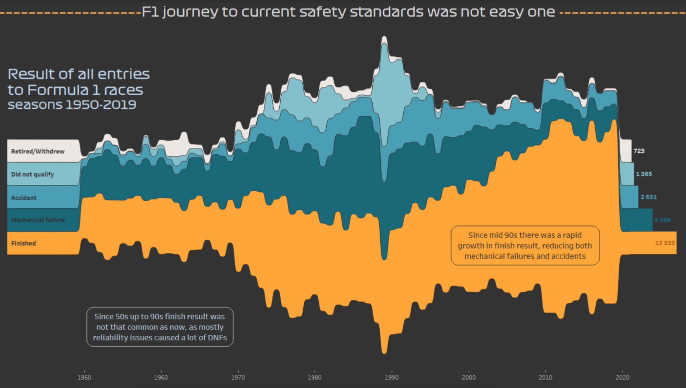
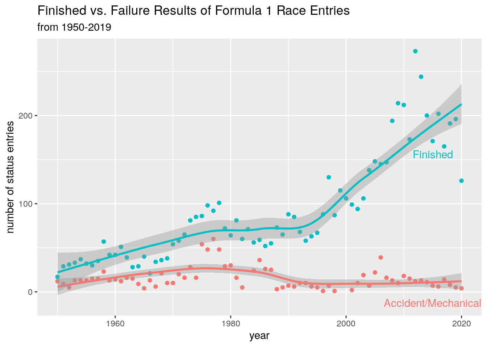
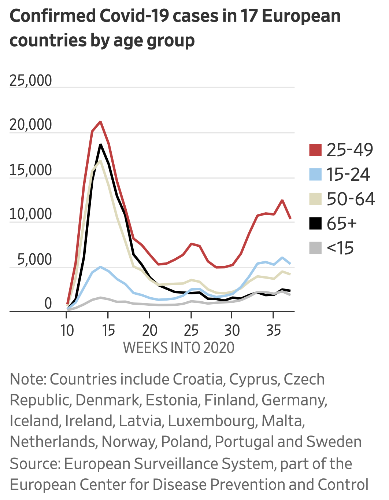
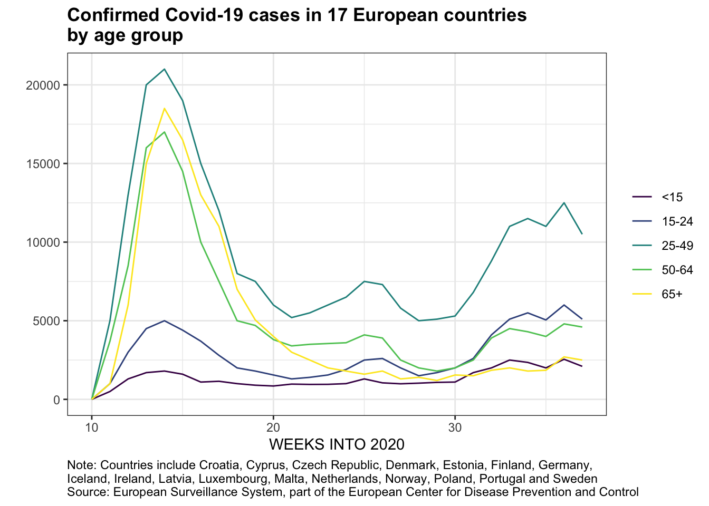

```{r setup, include=FALSE, message=FALSE}
source("../slides-common.R")
slideSetup()
library(tidyverse)
library(unvotes)
library(lubridate)
library(scales)
#if (!interactive()) knitr::opts_chunk$set(message = FALSE)
```

# Welcome to DATA 202!

### As you enter...

- Make a **name card** (name on front *and back*)
- Sit next to someone you **don't know well**
- Introduce yourself. *Share either*:
  - Something you're passionate about outside of this class: a cause, a subject, a hobby, etc.
  - Something you're excited about for this semester

---

## What might this mean for us working with data?

> Seek good and not evil, that you may live,<br>
> and so the Lord, the God of hosts, will be with you, just as you have said.
> Hate evil and love good, and establish justice in the gate;<br>
> it may be that the Lord, the God of hosts, will be gracious to the remnant of Joseph.
> <br> ... <br>
> I hate, I despise your festivals, and I take no delight in your solemn assemblies.
> Even though you offer me your burnt offerings and grain offerings, I will not accept them,
> and the offerings of well-being of your fatted animals I will not look upon. ...<br>
> But let justice roll down like water and righteousness like an ever-flowing stream.

[Amos 5:14-15, 21-24 NRSV](https://www.biblegateway.com/passage/?search=Amos+5&version=NRSVUE&interface=print)

---

class: middle

# Opening Prayer

From the apostle Paul's letter to the Philippians:

> This is my prayer: <br>that your love may abound more and more<br> in knowledge and depth of insight,<br>so that you may be able to discern what is best and may be pure and blameless for the day of Christ, filled with the fruit of righteousness that comes through Jesus Christ—to the glory and praise of God.

---

# What is this course?

- **visualization**: communicating data to humans
- **modeling** and validation: using data to perform tasks
- but first, **data wrangling**: How to transform data into the structure you need for visualization and modeling

...using **computing** in the R language (`#rstats`) and occasionally other tools

---

# Where are we going?

.col2[
- Introduction and Toolset (week 1)
- Data Visualization Design and Implementation (weeks 2 and 3)
- Data Wrangling (single-table and multiple-table) (weeks 4 and 5)
- Data Tidying (week 6)
- Midterm project: redesign and recreate a visualization (weeks 7 and 8)
- Making Estimates using Data (week 9)
- Making Predictions using Data (Supervised Learning) (weeks 10 and 11)
- Supervised Learning using Trees (weeks 12 and 13)
- Effective and Interpretable Models (week 14)
- Final Project (week 15)
]

Discussions on *ethics* and *perspectives* are woven in throughout the course.

---

## Optional material

- Clustering (Unsupervised Learning)
- Databases and APIs
- Text Data
- Geospatial Data
- Audio and Image Data

---

# Feedback from Last Year

"What aspects of this course most helped your learning?"

> **Lab**. **Homework**. "forced our brains to work."

"What additional or different things could you have done to enhance your learning?"

> "gone to more office hours", "gone over the exercises and homework more"


---

# Structure

Overall, *flipped*.

- Read and watch *at home* (at 2x speed if you want)
- Solve problems *together in lab*

---

# Weekly Rhythm

.pull-left[
### In Class

- **Monday** class: discuss a previous assignment
- **Wednesday** class: work on lab exercises
- **Friday** class: weekly quiz, finish lab, start on homework
]
.pull-right[
### At home

- **Monday**: Preparation and Lecture quizzes due
- **Tuesday**: Previous week's labs due
- **Wednesday**: Post or reply in a discussion forum
- **Thursday**: Previous week's homework due
]

At-home activities are due at end-of-day, scheduled so you don't have to work on weekends


---

# Ways to participate

- Hot-seat coding
- Hot-seat explaining
- Present an explanation
- Present a homework or lab
- Give feedback on project presentations

**Intentional imperfection**: presenters *should make mistakes* so we can all learn.

---

## Technology We'll Use

- **RStudio**: A powerful environment for working with data
  - Most students will use Calvin's installation `https://rstudio.calvin.edu/`
  - You can also install it on your own computer like I do
- Ed Discussion (**EdStem**)
  - Organized Q&A, tips, announcements
  - Anonymous questions (fear not!)
  - Ask questions in class without interrupting

---

class: center, middle

## Example Projects

---

```{r echo=FALSE, out.width="100%"}

```

???
The original plot looked fancy, but was hard to read and made erroneous conclusions.

---

```{r echo=FALSE, out.width="75%"}

```

???
The student found the original data, noticed some nuances in the data that the
original vis author had overlooked.

Thoughtfully merged some race outcomes, plotted propertions, changed plot type...

much clearer, isn't it?

---

.pull-left[
```{r echo=FALSE, out.width="75%"}

```
]

.pull-right[
```{r echo=FALSE, out.width="100%"}

```
]

???

Original article used this visual to blame parties for COVID spread.

Student had trouble getting identical original data, but worked around it.

Reflected on original's design choice of red for young adults (pre-attentive processing); binning of ages (poor, but it was that way in the original data); whether data actually supports the claim (could be jobs etc.)

(kew24)

---

# Example final projects

* Predict how much a used car will sell for
* Forecast how much electricity will be used
* Predict how much a plane flight will cost


---

## Our Goals

* *Skill*: how to do these things
* *Knowledge*: understanding the underlying concepts
* *Dispositions*: wisdom in practicing these skills

---

class: middle, center

## Data Dispositions

---

## Humility

Challenge: data feels powerful, people listen to what you use it to say.

So we will practice:

* Citing all sources (for both data and process)
* Acknowledging limitations
* Noticing and reporting our analysis decisions and possible alternatives
* Validation of results

---

## Integrity

It’s tempting to say something that isn’t entirely true, or to manipulate the collection/analysis/reporting process to yield the answer you want.

<br>

So we will practice:

* Evaluating claims that others use data to make
* Clearly articulating our analysis decisions and rationale
* Reproducibility
* Using exploratory analytics to validate data against assumptions

---

## Hospitality

We can choose to use our tools to elucidate and clarify, rather than obscure.

So we will practice:

* Clear visual communication
* Clarity of code and process
* Writing explanations that are accessible and appropriate to audience.

---

## Compassion and Justice

Data Science can both cause harm and reveal it.

So we will:

* Study examples of how data might cause harm
* Study examples of how harm might be mitigated or revealed

---

## A worked example

```{r echo=FALSE}
un_uk_us_tr <- un_votes %>%
  mutate(
    country = case_when(
      country == "United Kingdom" ~ "UK",
      country == "United States" ~ "US",
      TRUE ~ country
    )
  ) %>%
  inner_join(un_roll_calls, by = "rcid") %>%
  inner_join(un_roll_call_issues, by = "rcid") %>%
  mutate(
    issue = fct_recode(issue,  "Nuclear weapons and material" = "Nuclear weapons and nuclear material")
  ) %>%
  filter(country %in% c("UK", "US", "Turkey")) %>%
  mutate(year = year(date)) %>%
  group_by(country, year, issue) %>%
  summarize(percent_yes = mean(vote == "yes"))
```

.floating-source[Erik Voeten "Data and Analyses of Voting in the UN General Assembly" Routledge Handbook of International Organization, edited by Bob Reinalda (published May 27, 2013)]

```{r}
un_uk_us_tr
```

---

.small[
```{r out.width = "80%", fig.asp = 0.45, fig.width = 10}
ggplot(un_uk_us_tr) #<<
```
]

---

.small[
```{r out.width = "80%", fig.asp = 0.45, fig.width = 10}
ggplot(un_uk_us_tr,
       aes(x = year, y = percent_yes)) #<<
```
]

---

.small[
```{r out.width = "80%", fig.asp = 0.45, fig.width = 10}
ggplot(un_uk_us_tr,
       aes(x = year, y = percent_yes)) +
  geom_point() #<<
```
]

---

.small[
```{r out.width = "80%", fig.asp = 0.45, fig.width = 10}
ggplot(un_uk_us_tr,
       aes(x = year, y = percent_yes)) +
  geom_point() +
  facet_wrap(~issue) #<<
```
]

---

.small[
```{r out.width = "80%", fig.asp = 0.45, fig.width = 10}
ggplot(un_uk_us_tr,
       aes(x = year, y = percent_yes, color = country)) + #<<
  geom_point() +
  facet_wrap(~issue)
```
]

---

.small[
```{r out.width = "80%", fig.asp = 0.45, fig.width = 10}
ggplot(un_uk_us_tr,
       aes(x = year, y = percent_yes, color = country)) +
  geom_point(size = .25) + #<<
  facet_wrap(~issue)
```
]

---

.small[
```{r out.width = "80%", fig.asp = 0.45, fig.width = 10}
ggplot(un_uk_us_tr,
       aes(x = year, y = percent_yes, color = country)) +
  geom_point(size = .25) +
  geom_smooth(method = "loess", se = FALSE) + #<<
  facet_wrap(~issue) 
```
]

---

.small[
```{r out.width = "80%", fig.asp = 0.45, fig.width = 10}
ggplot(un_uk_us_tr,
       aes(x = year, y = percent_yes, color = country)) +
  geom_point(size = .25) +
  geom_smooth(method = "loess", se = FALSE) +
  facet_wrap(~issue) +
  labs( #<<
    title = "Percentage of 'Yes' votes in the UN General Assembly", #<<
    subtitle = "1946 to 2015", #<<
    y = "% Yes", x = "Year", color = "Country" #<<
  ) #<<
```
]

---

.small[
```{r out.width = "80%", fig.asp = 0.45, fig.width = 10}
ggplot(un_uk_us_tr, 
       aes(x = year, y = percent_yes, color = country)) +
  geom_point(size = .25) +
  geom_smooth(method = "loess", se = FALSE) +
  facet_wrap(~issue) +
  labs(
    title = "Percentage of 'Yes' votes in the UN General Assembly",
    subtitle = "1946 to 2015",
    y = "% Yes", x = "Year", color = "Country"
  ) +
  scale_y_continuous(labels = label_percent()) #<<
```
]
