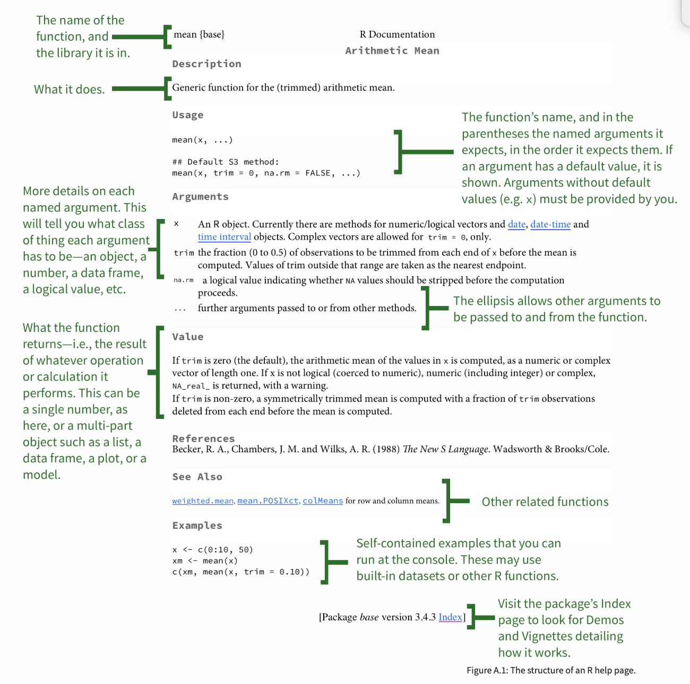

```{r setup, include=FALSE, message=FALSE}
source("../slides-common.R")
slideSetup()
library(tidyverse)
#if (!interactive()) knitr::opts_chunk$set(message = FALSE)
```


## Q&A 

**Will we use databases / SQL?** Yes, in the later part of the class.

**Will everything be on Moodle?** Moodle Calendar will have all dates, and direct links to anything outside of Moodle that you'll need.

---

## Do you remember your take-away point from Monday?

---

## Logistics

* "Check off" all Moodle activities under "Introduction"
  * Prep 1
  * Lec 1.1
  * Discussion 1
  * Quiz 1
  * Lab 1.2
  * Lec 1.3
* Start Prep 2 for Wednesday (no class Monday)
* Homework 1 posted soon
* Piazza: keep it up!

---


## So far...

- Monday: Overall objectives: projects, topics, dispositions
- Wednesday:
  - Hands on practice with R, RStudio, Git, GitHub
  - First look at summarizing data in R
- Today:
  - Review Wednesday's activity
  - Overview of the toolkit we're using

.question[
.large[
Questions so far?
]
]

---

class: center, middle

# Reproducible data analysis

---

## Reproducibility checklist

.question[
What does it mean for a data analysis to be "reproducible"?
]

--

Near-term goals:

- Can you re-make all tables and figures easily?
- Does the code actually do what you think it does?
- In addition to what was done, is it clear *why* it was done? 

Long-term goals:

- Can the code be used for other data?
- Can you extend the code to do other things?

---

## Toolkit

- Scriptability $\rightarrow$ R
- Literate programming (code, narrative, output in one place) $\rightarrow$ R Markdown
- Version control $\rightarrow$ Git / GitHub

---

## Tour: R and RStudio

```{r echo=FALSE, out.width="80%"}
knitr::include_graphics("img/tour-r-rstudio.png")
```

---

## A short list (for now) of R essentials

- Functions are (most often) verbs, followed by what they will be applied to in parentheses:

```{r eval=FALSE}
do_this(to_this)
do_that(to_this, to_that, with_those)
```

--

- Packages are loaded with the `library` function:

```{r eval=FALSE}
library(package_name)
```

---

## R essentials (continued)

- Columns (variables) in data frames are accessed with `$`:

.small[
```{r eval=FALSE}
dataframe$var_name
```
]

--

- Object documentation can be accessed with `?`

```{r eval=FALSE}
?mean
```

---

## tidyverse

.pull-left[
```{r echo=FALSE, out.width="99%"}
knitr::include_graphics("img/tidyverse.png")
```
]

.pull-right[
.center[.large[
[tidyverse.org](https://www.tidyverse.org/)
]]

- The **tidyverse** is an opinionated collection of R packages designed for data science
- All packages share an underlying philosophy and a common grammar
]

---

## rmarkdown

.pull-left[
.center[.large[
[rmarkdown.rstudio.com](https://rmarkdown.rstudio.com/)
]]

- write code and prose in reproducible computational documents
]

.pull-right[
```{r echo=FALSE, out.width="60%"}
knitr::include_graphics("img/rmarkdown.png")
```
]

---

class: middle

# R Markdown

---


## R Markdown

- Fully reproducible reports -- each time you knit the analysis is ran from the beginning
- Simple markdown syntax for text
- Code goes in chunks, defined by three backticks, narrative goes outside of chunks

---

## Tour: R Markdown

```{r echo=FALSE, out.width="90%"}
knitr::include_graphics("img/tour-rmarkdown.png")
```

---

## Environments

.tip[
The environment of your R Markdown document is separate from the Console!
]

Remember this, and expect it to bite you a few times as you're learning to work 
with R Markdown!

---

## Environments

.pull-left[
First, run the following in the console

.small[
```{r eval = FALSE}
x <- 2
x * 3
```
]

.question[
All looks good, eh?
]
]

--

.pull-right[
Then, add the following in an R chunk in your R Markdown document

.small[
```{r eval = FALSE}
x * 3
```
]

.question[
What happens? Why the error?
]
]

---

## R Markdown help

.pull-left[
.center[
.midi[R Markdown Cheat Sheet  
`Help -> Cheatsheets`]
]
```{r echo=FALSE, out.width="80%"}
knitr::include_graphics("img/rmd-cheatsheet.png")
```
]
.pull-right[
.center[
.midi[Markdown Quick Reference  
`Help -> Markdown Quick Reference`]
]
```{r echo=FALSE, out.width="80%"}
knitr::include_graphics("img/md-cheatsheet.png")
```
]

---

## How will we use R Markdown?

- Every assignment / report / project / etc. is an R Markdown document
- You'll always have a template R Markdown document to start with
- The amount of scaffolding in the template will decrease over the semester


---

class: center, middle

# Getting help in R

---

class: center

```{r echo=FALSE, out.width="50%"}

```

.tiny[
Source: http://socviz.co/appendix.html#a-little-more-about-r
]

---

# Version Control

---

## Git and GitHub

.pull-left[
```{r echo=FALSE, out.width="25%"}
knitr::include_graphics("img/git-logo.png")
```
- Git is a version control system -- like “Track Changes” features from Microsoft Word, on steroids
- It's not the only version control system, but it's a very popular one
]
.pull-right[
```{r echo=FALSE, out.width="25%"}
knitr::include_graphics("img/github-logo.png")
```
- GitHub is the home for your Git-based projects on the internet

- We will use GitHub as a platform for web hosting and collaboration
]

---

## Versioning

```{r echo=FALSE, fig.align = "center", out.width = "70%"}
knitr::include_graphics("img/lego-steps.png")
```

---

## Versioning 

### with human readable messages

```{r echo=FALSE, fig.align = "center", out.width = "60%"}
knitr::include_graphics("img/lego-steps-commit-messages.png")
```

---

## Why do we need version control?

```{r echo=FALSE, fig.align = "center", out.width="35%"}
knitr::include_graphics("img/phd_comics_vc.gif")
```

---

## How will we use Git and GitHub?

```{r echo=FALSE, out.width="100%"}
knitr::include_graphics("img/whole-game-01.png")
```

---

## How will we use Git and GitHub?

```{r echo=FALSE, out.width="100%"}
knitr::include_graphics("img/whole-game-02.png")
```

---

## How will we use Git and GitHub?

```{r echo=FALSE, out.width="100%"}
knitr::include_graphics("img/whole-game-03.png")
```

---

## How will we use Git and GitHub?

```{r echo=FALSE, out.width="100%"}
knitr::include_graphics("img/whole-game-04.png")
```
