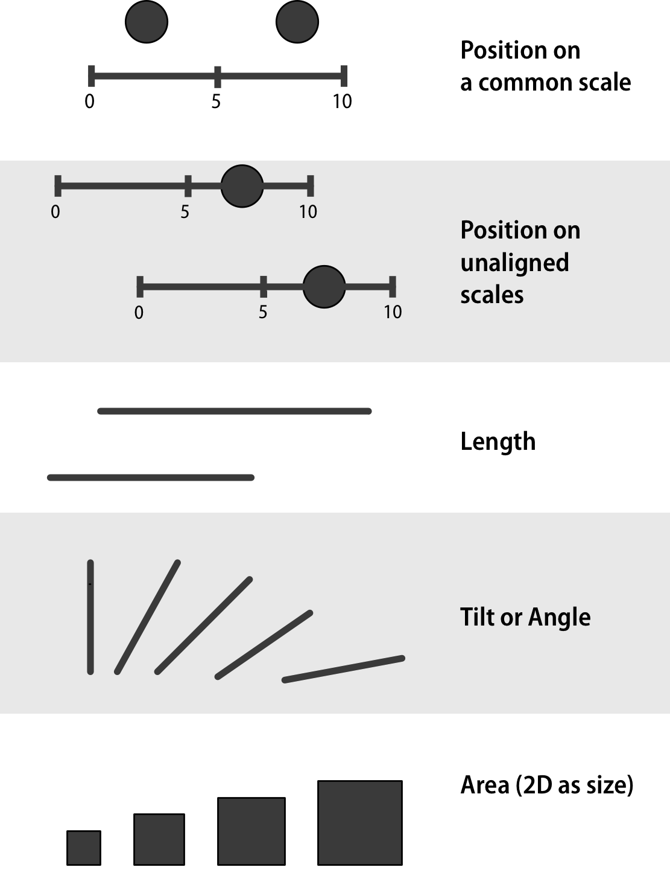
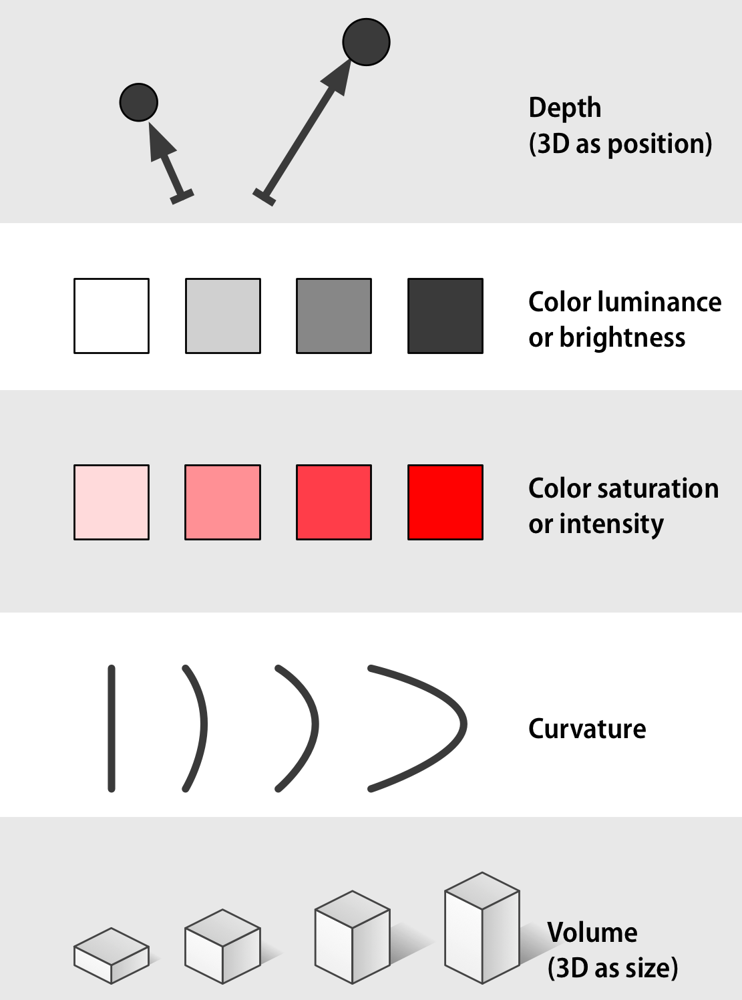

```{r include=FALSE, message=FALSE}
source("../slides-common.R")
slideSetup()
library(tidyverse)
# remotes::install_github("EvaMaeRey/flipbookr")
library(flipbookr)
```

## Review

What do each of the following operations do in RStudio?

* Run Chunk
* Knit
* Commit
* Push

Think-Pair-Share.

---

```{r include=FALSE}
quiz_responses <-
  read_csv(
    here::here("student_data/21FA DATA-202-A-Quiz 1-responses.csv"),
    col_types = cols(.default = col_character())
  ) %>%
  janitor::clean_names() %>%
  select(
    preferred_name = response_1,
    covid = response_4,
    courses = response_7
  )
```


## From the survey (Quiz 1)

```{r echo=FALSE}
tibble::tribble(
                                                     ~covid,  ~n,
                  "I'd be in favor of using such examples.", 10L,
                                             "I'm neutral.", 17L,
    "I'd prefer something different but I'd be ok with it.",  2L,
    "I feel strongly that we should not use such examples.",  2L
  ) %>% knitr::kable()
```

---

```{r num-courses}
quiz_responses %>% 
  mutate(num_courses = str_count(courses, "[0-9][0-9][0-9]")) %>% 
  ggplot(aes(x = num_courses)) +
    geom_bar() +
    scale_x_continuous(breaks = 1:10) +
    labs(x = "Number of previous courses")
```

-> My office hours **Wed 2:30-3:30 in Gold Lab** or by request.

---

## Q & A

> Can we edit directly on GitHub?

Technically yes, but GitHub won't show plots, documentation, etc., so don't.

> What programming languages?

* We're using R (`#rstats`) because it has a big community, it's popular in industry, and is good pedagogically.
* Other  players: Python (good at many things), Stata / SPSS / JMP (popular in some disciplines), Tableau / Microsoft PowerBI (popular in business)

> Are post-class quizzes part of grade?

They count towards "Prep and Participation" (10%).

---


class: center, middle

`r emo::ji("yarn")` **knit**

`r emo::ji("white_check_mark")` **commit**

`r emo::ji("arrow_up")` **push**


---

class: center, middle

<iframe width="560" height="315" src="https://www.youtube.com/embed/Z8t4k0Q8e8Y" frameborder="0" allow="accelerometer; autoplay; encrypted-media; gyroscope; picture-in-picture" allowfullscreen></iframe>


```{r include=FALSE}
library(tidyverse)
library(scales)
library(gapminder)
```

```{r include=FALSE}
gapminder %>% head(5) %>% knitr::kable()
```

---

### We'll make this chart

```{r health-and-wealth, echo=FALSE, out.width="80%", fig.align='center'}
gapminder %>% 
  filter(year == 2007) %>% 
  ggplot() +
    aes(x = gdpPercap, y = lifeExp) +
    geom_point(alpha = .8) + 
    coord_cartesian(ylim = c(20, 90)) + 
    aes(color = continent) +
    aes(size = pop) + 
    scale_x_continuous(
      breaks = c(400, 4000, 40000),
      trans = "log10") +
    labs(x = "GDP per Capita") +
    labs(y = "Life Expectancy (years)") +
    labs(color = "Continent") +
    labs(size = "Population") +
    scale_size_area(
      labels = label_comma()) +
    theme_bw() + 
    annotation_logticks(sides = "b")
```

---

## Composing a plot

<div style="position: absolute;top: 0;right: 0;width: 25%;">
  
</div>

--

* What's the data? "Each row is a ___"

--

* What is the coordinate system? (What's `x` and `y`?)

--

* What graphical symbols are used? (dot? bar? line?)

--

* What data variables are mapped to what visual cues (aesthetics)?
  * What *scales* are used? (Any transformations?)
  * What *guides* are shown? (What labels for values?)
* What labels and annotations are added?


---

`r flipbookr::chunk_reveal("health-and-wealth", chunk_options="out.width=\"100%\"")`

---

## ggplot2 $\in$ tidyverse

.pull-left[
```{r echo=FALSE, out.width="80%"}
knitr::include_graphics("img/ggplot2-part-of-tidyverse.png")
```
]
.pull-right[
- **ggplot2** is tidyverse's data visualization package
- The `gg` in "ggplot2" stands for Grammar of Graphics
- It is inspired by the book **Grammar of Graphics** by Leland Wilkinson
]
---

## Grammar of Graphics

Concisely describe the components of a graphic

```{r echo=FALSE, out.width="70%", fig.align='center'}
knitr::include_graphics("img/grammar-of-graphics.png")
```

.tiny[ 
Source: [BloggoType](http://bloggotype.blogspot.com/2016/08/holiday-notes2-grammar-of-graphics.html)
]

---

.pull-left[
```{r echo=FALSE, out.width="90%"}

```
]

.pull-right[
```{r echo=FALSE, out.width="90%"}

```
]

.tiny[
Source: https://socviz.co/lookatdata.html#channels-for-representing-data
]

---
