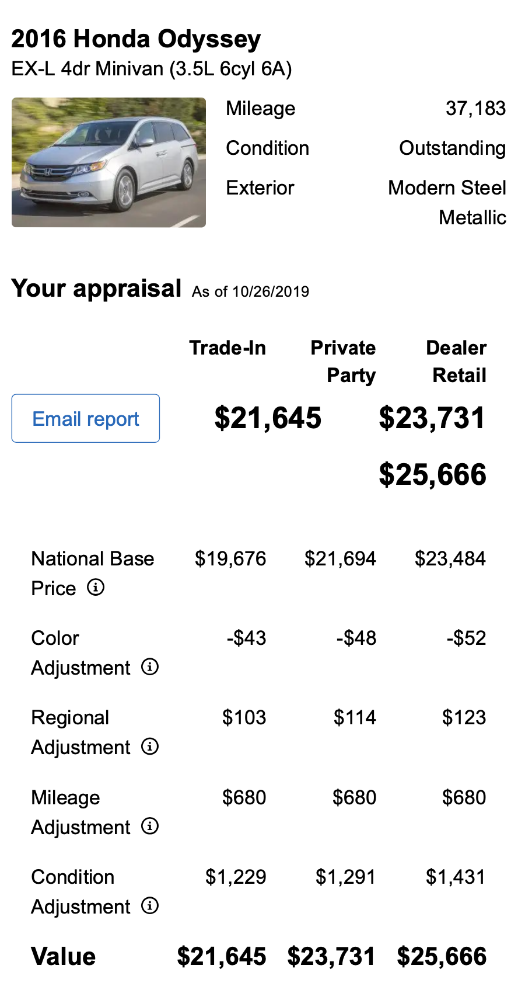

```{r child = "../slide-setup.Rmd"}
```

## Logistics

- Midterm 1 Online Portion is on Moodle
  - Don't forgot to copy-paste responses and completion code to Moodle
  - Closes Wed evening
- Project Milestone 2 due Friday
- No quiz or Discussion this week

---

## Q&A!

> What kinds of things can functions return?

Anything you can assign to a variable. (numbers, strings, data frames, plots, ...)

> Are `as.numeric` and `as.integer` the same?

<style>.compact-output pre { margin-top: 0; }</style>

.pull-left[
```{r}
as.numeric("1.7")
as.integer("1.7")
```
]
.pull-right[
```{r}
as.integer("One Point Seven")
```
]

---

```{r packages, echo=FALSE, message=FALSE, warning=FALSE}
library(tidyverse)
invisible(file.link("../slides.css", "slides.css"))
invisible(file.link("../xaringan-themer.css", "xaringan-themer.css"))
```

```{r fig.align='center', echo=FALSE, alt="Edmunds car price estimate", out.width="35%"}

```

What data frame does Edmunds have? Sketch an example. (What are the columns? What does each row represent?)

.floating-source[Edmunds.com]

---

# Missing Data

- Tools so far very good when we have all the data we want.
- Usually we *don't* -- or even we *can't*. 

Different kinds of missingness:

1. How much will this car / house sell for?
2. What will Bitcoin trade for at end-of-day today?
3. What will this addition do to the price of my house?
4. I feel rotten. Is it Covid?
5. What word will the user type next on their keyboard?
6. Will this home-buyer default on their loan?

Discussion:

1. For each of these, discuss **what data is missing** (*why*?).
2. Which of these situations are similar to each other?

---

## Some terminology

- **Supervised learning**: for each item independently, fill in an unobserved variable
  - **Regression**: fill in a *number*
  - **Classification**: fill in a *choice*
- **Unsupervised learning**: identify *relationships* between items
- **Forecasting**: predict how a sequence will continue (future observations)
- **Statistical inference**: fill in summary statistics (we wanted a population but only got a sample)
- **Causal inference**: fill in counterfactuals (what if?)

---

## Predictive Analytics

Mostly *supervised learning* (*regression* and *classification*), some *forecasting*.

* A powerful tool to turn data into action.
* It works because God made the universe predictable (and successful prediction rewarding)
* **Need for wisdom**: It can be used for great good and great harm

---

## Power of Predictive Modeling

* **Medicine**: wearable monitor for seizures or falls, detect malaria from blood smears, find effective drug regimens from medical records
* **Drug Discovery**: predict the efficacy of a synthesis plan for a drug
* **Precision Agriculture**: predict effect of micro-climate on plant growth
* **Urban Planning**: forecast resource needs, extreme weather risks, ...
* **Government**: classify feedback from constituents
* **Retail**: predict items in a grocery order
* **Recommendation systems**: Amazon, Netflix, YouTube, ...
* **User interfaces**: gesture typing, autocomplete / autocorrect

and so much more...

---

## The universe is surprisingly predictable

* God created the world with actionable structure
  * We gradually learn how to perceive that structure and act within it.
  * The better our perceptions align with how the universe is structured, the better our actions
  * We can discover that structure by learning to be less surprised by what we see ( = predicting our perceptions)
* Perceptions are thus both accurate and fallable.

---

## Predictive modeling technology: Need for wisdom

* Potential for great good
* But also great harm:
  * Lack of **fairness** in facial recognition, sentencing, lending, job applicant scoring, ...
  * Lack of **transparency** in how "Big Data" systems make conclusions
  * Lack of **privacy** as data is increasingly collected and aggregated
  * Amplification of extreme positions in social media, YouTube, etc.
  * Oversimplification of human experience
  * Hidden human labor
  * Illusion of objectivity
  * ...!

---

class: center, middle

# Wednesday

---

## Q&A

> How will we code predictive models?

- We'll use `tidymodels`, a toolkit like `tidyverse`. Preview today, practice Friday.
- We'll need all our `tidyverse` skills to understand our data before modeling it and to visualize our models.

> What are the limits? Can we predict everything?

- Silicon Valley: "Yes!"
- Wisdom: "No!"
  - [What failure to predict life outcomes can teach us](https://www.pnas.org/content/117/15/8234)
  - Predictions can be inaccurate and biased, with disparate impacts on vulnerable people.


---

## Different kinds of missing data

- Missing *items*: entire rows not in your data.
  - Some people didn't fill out your survey.
  - You only know about people who *did* visit your website, not those that didn't. etc.
- Missing *observations*: row present, but some observations missing
  - someone added a product to their cart but didn't buy it, so you don't know their address.
  - only some people got an expensive diagnostic test. etc.

---

## Why not just ignore what's missing?

- Ignoring missing data leads to [selection bias](https://catalogofbias.org/biases/selection-bias/) and related biases (see catalogofbias.org).
- Missing *observations* can be exactly the info you need for making a decision, e.g., what price to list your product for.
- Implications:
  - **Never** `drop_na()` without explanation.
  - "The map is not the territory" -- data ≠ objective reality

---

class: center, middle

# Examples of Supervised Learning

---

## Regression Example: Home Sales

```{r include=FALSE}
ames_home_sales <- AmesHousing::make_ames() %>% 
  mutate(Sale_Price = Sale_Price / 1000) %>% 
  filter(Gr_Liv_Area < 4000, Sale_Condition == "Normal")
```

From Ames, Iowa home sales, 2006-2010. (De Cock, 2011)

.small[
```{r echo=FALSE}
set.seed(0)
ames_home_sales %>%
  select(Lot_Area, Bldg_Type, Gr_Liv_Area, Garage_Cars, Sale_Price) %>% 
  slice_sample(n = 5) %>% 
  kableExtra::kbl() %>% 
    kableExtra::column_spec(5, background = "#8C2131", color = "white")
```
]
(`r nrow(ames_home_sales)` total rows)

* *y*: *response* variable (aka *outcome*, *dependent variable*): `Sale_Price`
* *X*: *features* (aka *predictors*, *covariates*, etc.): everything else

Note: `X` is much easier to measure than `y`

---

```{r split-ames, include=FALSE}
library(tidymodels)
set.seed(10) # Make consistent train-test splits.
ames_split <- initial_split(ames_home_sales, prop = 2/3) # Split our data randomly
ames_train <- training(ames_split)
ames_test <- testing(ames_split)
```

```{r fit-dt-ames, echo=FALSE}
decision_tree_fit <- decision_tree(mode = "regression", tree_depth = 3) %>% #<<
  set_engine("rpart") %>% 
  fit(
    Sale_Price ~ Gr_Liv_Area + Bldg_Type,
    data = ames_train)
```

.panelset[
.panel[.panel-name[Model]
```{r gr_liv_stub, echo=FALSE, out.width="100%"}
decision_tree_fit %>% 
  extract_fit_engine() %>% 
  rpart.plot::rpart.plot(roundint = FALSE)
```
]

.panel[.panel-name[Predictions]
```{r decision-tree-example-fit, echo=FALSE, out.width="100%"}
sweep_model <- function(model, var_to_sweep, sweep_min, sweep_max, ...) {
  X <- expand_grid(!!enquo(var_to_sweep) := seq(sweep_min, sweep_max, length.out = 500), ...)
  model %>% 
    predict(X) %>% 
    bind_cols(X)
}
ggplot(ames_train, aes(x = Gr_Liv_Area, y = Sale_Price)) +
  geom_point(alpha = .5, size = .5) +
  geom_line(data = sweep_model(
    decision_tree_fit, Gr_Liv_Area, 0, 4000, Bldg_Type = levels(ames_train$Bldg_Type)),
    mapping = aes(y = .pred),
    color = "red") +
  facet_wrap(vars(Bldg_Type)) +
  labs(x = "Living Area", y = "Sale Price ($1k)")
```

]
.panel[.panel-name[Model code]

```{r ref.label="split-ames", eval=FALSE}

```

```{r ref.label="fit-dt-ames", eval=FALSE}

```


Plotting the tree:

```{r ref.label="gr_liv_stub", eval=FALSE}

```

]
]

---

## Were those predictions good?

```{r}
metrics <- yardstick::metric_set(mae, mape, rsq_trad, rmse)
decision_tree_fit %>% 
  predict(ames_test) %>% 
  bind_cols(ames_test) %>% 
  metrics(truth = Sale_Price, estimate = .pred) %>% 
  select(-.estimator) %>% knitr::kable()
```

- Traditional R^2 (fraction of variance explained)
- MAE: Mean Absolute Error ("predictions are usually off by $xxx")
- MAPE: Mean Absolute Percent Error ("predictions are usually off by yy%")
- RMSE: Root Mean Squared Error: mathy, but sorta like the standard deviation

---

## Classification example: Can a blood test diagnose autism?

We'll use an example from a [2017 PLOS Computational Biology paper](https://journals.plos.org/ploscompbiol/article?id=10.1371/journal.pcbi.1005385)


```{r download-data, include=FALSE}
data_filename <- "data/autism.csv"
if (!file.exists(data_filename)) {
  dir.create("data")
  download.file("https://doi.org/10.1371/journal.pcbi.1005385.s001", data_filename)
}
```

```{r read-data, include=FALSE}
col_names <- names(read_csv(data_filename, n_max = 1, col_types = cols(.default = col_character())))
autism <- read_csv(data_filename, skip = 2, col_names = col_names, col_types = cols(
  .default = col_double(),
  Group = col_character()
))
```

```{r}
autism
```


---

We have 3 kinds of data about `r nrow(autism)` children:

1. The outcome (`Group`): ASD (diagnosed with ASD), SIB (sibling not diagnosed with ASD), and NEU (age-matched neurotypical children, for control)

```{r group-counts}
autism %>% group_by(Group) %>% summarize(n = n()) %>% knitr::kable()
```

---

1. The outcome (`Group`): ASD, SIB, NEU
2. Concentrations of various metabolites in a blood sample:

```{r show-metabolites}
autism %>% select(-1, -last_col())
```

---

1. The outcome (`Group`): ASD, SIB, NEU
2. Concentrations of various metabolites in a blood sample
3. For the ASD children only, a measure of life skills ("Vineland ABC")

```{r show-behavior-score, fig.asp=.25}
autism %>% 
  ggplot(aes(x = `Vineland ABC`, y = Group)) + geom_boxplot()
```

---

## Exploratory Data Analysis (EDA)

What do these metabolites look like?

```{r bad-metabolite-plot, echo=FALSE, out.width="80%"}
library(ggridges)
autism %>%
  select(-`Vineland ABC`) %>% 
  pivot_longer(-Group, names_to = "Measure") %>% 
  ggplot(aes(x = value, y = Measure)) +
  geom_density_ridges() + 
  facet_wrap(vars(Group), scales = "free_x")
```

---

code for the previous plot:
```{r ref.label="bad-metabolite-plot", eval=FALSE}
```

---

## EDA

Better question: **Can these metabolites help us distinguish autism?**

---

```{r ridgeplot, fig.width=10, fig.asp=1, echo=FALSE, out.width="80%"}
autism %>%
  select(-`Vineland ABC`) %>% 
  pivot_longer(-Group, names_to = "Measure") %>% 
  ggplot(aes(x = value, y = Group)) +
  geom_density_ridges() +
  facet_wrap(vars(Measure), scales = "free_x") + 
  theme_ridges()
```

---

code for previous plot:

```{r ref.label="ridgeplot", eval=FALSE}
```

---

## Can we predict ASD vs non-ASD from metabolites?

* Let's start by (1) ignoring the behavior scores (that's an *outcome*) and comparing
just ASD and NEU.
* We need to drop SIB and encode `Group` as a factor.

```{r}
data <- autism %>% 
  select(-`Vineland ABC`) %>% 
  filter(Group != "SIB") %>% 
  mutate(Group = as_factor(Group))
```

---

## Decision Tree *Classification*

```{r fit-tree}
spec <- workflow() %>% add_recipe(
  recipe(Group ~ ., data = data)) %>% #<<
  add_model(decision_tree(mode = "classification") %>% set_engine("rpart")) #<<
model <- spec %>% fit(data)
```


```{r show-tree, echo=FALSE, fig.asp= .4}
extract_fit_engine(model) %>% 
  rpart.plot::rpart.plot(roundint = FALSE)
```

---

### What do the *predictions* look like?

```{r predicted-probs-tree}
model %>% predict(data, type = "prob")
```

---

### Were those predictions *good*?

.small-code[
```{r plot-predicted-probs-tree, fig.asp=.4, out.width="90%"}
model %>%
  predict(data, type = "prob") %>%
  bind_cols(data) %>% 
  mutate(idx = row_number()) %>% 
  ggplot(aes(x = idx, y = .pred_ASD, color = Group, shape = Group)) +
  geom_hline(yintercept = .5) +
  geom_point() 
```
]

---

### Quantifying that:

```{r}
metrics <- yardstick::metric_set(accuracy, sensitivity, specificity)
model %>% 
  predict(data, type = "class") %>% 
  bind_cols(data) %>% 
  metrics(truth = Group, estimate = .pred_class)
```

---

## Classification Metrics

|                      | Event happened              | No event happened           |
|----------------------|-------------------------------|-------------------------------|
| Event predicted    | True positive                 | False positive (Type 1 error) |
| No event predicted | False negative (Type 2 error) | True negative                 |

--

- **Accuracy** (% correct) = (TP + TN) / (# episodes)
- **False negative** ("miss") **rate** = FN / (# actual events)
- **False positive** ("false alarm") **rate** = FP / (# true non-events)

--

- **Sensitivity** ("true positive rate") = TP / (# actual events)
  - Sensitivity = 1 − False negative rate
- **Specificity** ("true negative rate") = TN / (# actual events)
  - Specificity = 1 − False positive rate
- [Wikipedia article](https://en.wikipedia.org/wiki/Sensitivity_and_specificity)

