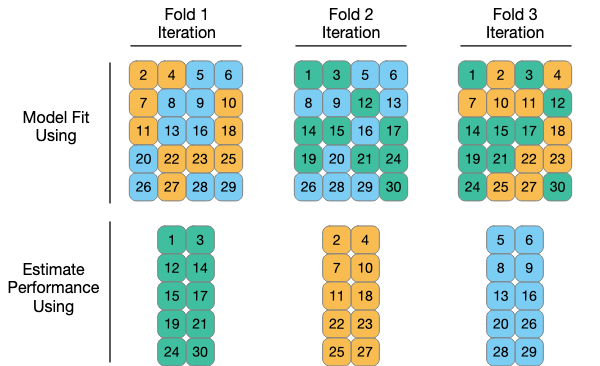

```{r setup, include=FALSE, code=xfun::read_utf8('../slide-setup.R')}
```

```{r setup2, include=FALSE}
if (interactive()) source('../slide-setup.R')
library(tidyverse)
library(tidymodels)
library(rpart.plot)

sweep_model <- function(model, var_to_sweep, sweep_min, sweep_max, ...) {
  X <- expand_grid(!!enquo(var_to_sweep) := seq(sweep_min, sweep_max, length.out = 500), ...)
  model %>% 
    predict(X) %>% 
    bind_cols(X)
}

add_predictions <- function(data, model, variable_name = ".pred", model_name = deparse(substitute(model))) {
  model %>%
    predict(data) %>%
    rename(!!enquo(variable_name) := .pred) %>%
    mutate(model = model_name) %>%
    bind_cols(data)
}
```

.small-code[
```{r load-and-subset-data}
data(ames, package = "modeldata")
ames_all <- ames %>%
  filter(Gr_Liv_Area < 4000, Sale_Condition == "Normal") %>%
  mutate(across(where(is.integer), as.double)) %>%
  mutate(Sale_Price = Sale_Price / 1000)
rm(ames)
```

```{r train-test-split}
metrics <- yardstick::metric_set(mae, mape, rsq_trad)

set.seed(10) # Seed the random number generator
ames_split <- initial_split(ames_all, prop = 2 / 3)
ames_train <- training(ames_split)
ames_test <- testing(ames_split)
```

```{r echo=FALSE}
lat_long_grid <- expand_grid(
  Latitude  = modelr::seq_range(ames_train$Latitude,  n = 200, expand = .05),
  Longitude = modelr::seq_range(ames_train$Longitude, n = 200, expand = .05),
)
```


```{r plot-util, echo=FALSE}
show_latlong_model <- function(dataset, model, model_name = deparse(substitute(model))) {
  ggplot(dataset, aes(x = Longitude, y = Latitude)) +
    geom_raster(
      data = lat_long_grid %>% add_predictions(model),
      mapping = aes(fill = .pred)
    ) +
    geom_point(color = "black", size = .75) +
    geom_point(aes(color = Sale_Price), size = .5) +
    scale_color_viridis_c(aesthetics = c("color", "fill")) +
    coord_equal() +
    labs(title = model_name)
}
```

```{r train-model1}
model1 <-
  decision_tree(mode = "regression", tree_depth = 2) %>%
  fit(Sale_Price ~ Latitude + Longitude, data = ames_train)
```

```{r train-model2}
model2 <-
  decision_tree(mode = "regression", tree_depth = 30) %>%
  fit(Sale_Price ~ Latitude + Longitude, data = ames_train)
```

```{r train-model3}
model3 <-
  decision_tree(mode = "regression", cost_complexity = 1e-6, min_n = 2) %>%
  fit(Sale_Price ~ Latitude + Longitude, data = ames_train)
```
]

---

## Q&A

> Where to look for final project ideas? How modeling is used?

Pick a topic, search for "*topic* Kaggle", "*topic* data science blog" etc.; more ideas on the Projects page.

<!-- > How might we use modeling and classifier evaluation in our projects? -->

<!-- - Classification: label things as good/bad, customers as sale/bounce, land as crop/forest, ... -->

> What other areas does sensitivity/specificity matter for?

Medical tests. Fraud detection. Content moderation. Lots!

> Can we do final project in teams?

Yes, even across sections. See milestone instructions.

---


## Location, Location, Location!

- Recall: Ames housing dataset has sale prices for homes. **Task**: Predict how much a home will sell for.
- Previously we used attributes of the house and lot.
- Today (just to illustrate), we'll look at location *only*.

---

## Which model is better?

.pull-left[
```{r show-model1-alg, echo=FALSE}
model1 %>%
  extract_fit_engine() %>% 
  rpart.plot(roundint = FALSE, digits = 5, type = 4)
```

```{r show-model1-data, echo=FALSE, out.width="100%", fig.width=10, fig.asp=NULL}
show_latlong_model(ames_train, model1) + guides(fill = "none", color = "none")
```

]

.pull-right[
```{r show-model2-alg, echo=FALSE}
model2 %>%
  pluck("fit") %>%
  rpart.plot(roundint = FALSE, digits = 5, type = 4)
```

```{r show-model2-data, echo=FALSE, out.width="100%", fig.width=10, fig.asp=NULL}
show_latlong_model(ames_train, model2) + guides(fill = "none", color = "none")
```

]

---

## How about this model?

```{r show-model3-data, echo=FALSE, out.width="100%", fig.width=10, fig.asp=NULL}
show_latlong_model(ames_train, model3) + guides(fill = "none", color = "none")
```

---

## What made these models different? *Hyperparameters*

* Tree depth: how many levels of decisions
* Leaf size: minimum number of observations for each leaf node
* Complexity penalty: how much improvement for a split to be "worth it"

```{r ref.label=c("train-model1", "train-model2", "train-model3"), eval=FALSE}
```


---

## How do we *train* a decision tree?

Greedy algorithm: make the best single split of the current data, repeat.

* The model: "choose your own adventure": at each step, check one simple condition
about one variable (e.g., `Latitude < 42.05`)
* Goal: find the best tree (for regression: minimize MSE)
* Approach: greedy algorithm: try all possible splits, keep the best one, repeat.

---

## Which one works best?

```{r}
bind_rows(
  ames_train %>% add_predictions(model1),
  ames_train %>% add_predictions(model2),
  ames_train %>% add_predictions(model3),
) %>% 
  group_by(model) %>% 
  metrics(truth = Sale_Price, estimate = .pred) %>% 
  ggplot(aes(y = .estimate, x = model)) + geom_col() +
  facet_wrap(vars(.metric), scales = "free_y")
```

---

## How about on testing data?

```{r}
bind_rows(
  ames_test %>% add_predictions(model1), #<<
  ames_test %>% add_predictions(model2), #<<
  ames_test %>% add_predictions(model3), #<<
) %>% 
  group_by(model) %>% 
  metrics(truth = Sale_Price, estimate = .pred) %>% 
  ggplot(aes(y = .estimate, x = model)) + geom_col() +
  facet_wrap(vars(.metric), scales = "free_y")
```

---

## Why train-test split? Memorizing the eye chart

.floating-source[
[Snellen chart on Wikimedia](https://commons.wikimedia.org/wiki/File:Snellen_chart.svg), CC-BY-SA  
Analogy by [Clem Wang](https://www.linkedin.com/pulse/metaphor-over-fitting-machine-learning-clem-wang)
]

```{r echo=FALSE, out.width="50%"}
include_graphics("https://upload.wikimedia.org/wikipedia/commons/thumb/9/9f/Snellen_chart.svg/1000px-Snellen_chart.svg.png")
```

---

## Cross-Validation

#### Puzzle

* We want to pick the model that works best on *unseen* data
* ... but as soon as we try one model, **we've peeked at the data!**

#### Solution

* Divide training data into *V* piles (e.g., 10)
* Hide one pile from yourself.
  * train on ("analyze") the rest,
  * evaluate ("assess") on the one you held out.
* Repeat for each of the *V* piles.

---

```{r declare-cv, echo=FALSE}
ames_resamples <- ames_train %>% vfold_cv(v = 10)
```

```{r declare-all-models, echo=FALSE, cache=TRUE}
all_models <- tribble(
  ~model_name, ~spec,
  "model1",    decision_tree(mode = "regression", tree_depth = 2),
  "model2",    decision_tree(mode = "regression", tree_depth = 30),
  "model3",    decision_tree(mode = "regression", cost_complexity = 1e-6, min_n = 2)
)
```

```{r sample-all-models, echo=FALSE, cache=TRUE}
models_with_samples <- all_models %>% 
  rowwise() %>% 
  mutate(samples = list(
    spec %>% fit_resamples(
      Sale_Price ~ Latitude + Longitude,
      resamples = ames_resamples,
      metrics = metric_set(mae))))
```

```{r model-specs, echo=FALSE}
model3_spec <- all_models$spec[[3]]
```


```{r last-fit, echo=FALSE, message=FALSE}
test_predictions <- 
  all_models %>% 
  rowwise(model_name) %>% 
  # Fit on all training data
  mutate(fit_on_all_training_data = list(spec %>% fit(Sale_Price ~ Latitude + Longitude, data = ames_train))) %>% 
  # Test on test set
  summarize(ames_test %>% add_predictions(fit_on_all_training_data) %>% mae(truth = Sale_Price, estimate = .pred))
```

```{r compare-models-traintest, echo=FALSE, message=FALSE, out.width="100%"}
models_with_samples %>% 
  rowwise(model_name) %>% 
  summarize(collect_metrics(samples, summarize = FALSE)) %>% 
  bind_rows(
    train = .,
    test = test_predictions,
    .id = "assessment_data"
  ) %>% 
  mutate(assessment_data = as_factor(assessment_data)) %>% 
  ggplot(aes(x = model_name, y = .estimate, color = assessment_data)) +
  geom_boxplot() +
  labs(x = "Model name", y = "Mean absolute error ($1000)", fill = "Assessment dataset") +
  coord_cartesian(ylim = c(0, NA))
```


---

## What is Cross-Validation?

```{r resampling-flowchart, echo=FALSE, out.width="90%"}
knitr::include_graphics("https://www.tmwr.org/premade/resampling.svg")
```

---

```{r three-cv-iter, echo=FALSE, out.width="100%"}

```

.floating-source[Source: [Tidy Modeling with R](https://www.tmwr.org/premade/three-CV-iter.svg)]

---


```{r ames-cv-anim, echo=FALSE, cache=TRUE, fig.show="animate", animation.hook="gifski", out.width="100%"}
ames_train %>%
  vfold_cv(v = 10) %>%
  pull(splits) %>% 
  iwalk(function(split, split_idx) {
    print(
      bind_rows(analysis = analysis(split), assessment = assessment(split), .id = "role") %>% 
      ggplot(aes(y = Latitude, x = Longitude, color = role, shape = role)) +
      geom_point(size = 1) +
      scale_color_manual(values = c("analysis" = "grey", "assessment" = "red")) +
      labs(title = glue("Fold {split_idx}")) +
      theme_bw() +
      theme(panel.grid = element_blank())
    )
  })
```

---

## How to do CV?

1. Declare the splitting strategy:

```{r ref.label="declare-cv", eval=FALSE}
```

```{r show-resamples-df}
ames_resamples
```

---

## How to do CV?

1. Declare the splitting strategy
2. Fit on each resample, evaluate using a set of metrics.

```{r ames-cv-model3-anim, echo=FALSE, cache=TRUE, fig.show="animate", animation.hook="gifski", out.width="100%"}
withr::with_seed(0, {
  ames_train %>%
    vfold_cv(v = 10) %>%
    pull(splits) %>% 
    iwalk(function(split, split_idx) {
      model <- model3_spec %>% fit(Sale_Price ~ Latitude + Longitude, data = analysis(split))
      assess_mae <- assessment(split) %>% 
        add_predictions(model) %>% 
        mae(truth = Sale_Price, estimate = .pred) %>%
        pull(.estimate)
      print(
        bind_rows(analysis = analysis(split), assessment = assessment(split), .id = "role") %>% 
        ggplot(aes(y = Latitude, x = Longitude, color = role)) +
        geom_raster(
          data = lat_long_grid %>% add_predictions(model),
          mapping = aes(fill = .pred, color = NULL)
        ) +
        geom_point(size = .1) +
        scale_color_manual(values = c("analysis" = "grey", "assessment" = "red")) +
        labs(title = glue("Fold {split_idx} (MAE on assessment = {format(assess_mae, format='f', digits = 4)})")) +
        theme_bw() +
        theme(panel.grid = element_blank())
      )
    })
})
```

---

## How to do CV?

1. Declare the splitting strategy
2. Fit on each resample, evaluate using a set of metrics.

```{r sample-model3, cache=TRUE}
model3_samples <- model3_spec %>%
  fit_resamples( #<<
    Sale_Price ~ Latitude + Longitude,
    resamples = ames_resamples, #<<
    metrics = metric_set(mae))
model3_samples %>% collect_metrics(summarize = FALSE)
```

---

## How to do CV?

1. Declare the splitting strategy
2. Fit on each resample, evaluate using a set of metrics.
3. Plot and/or summarize the metrics.

.pull-left[
```{r crude-plot-folds, fig.height=1, fig.width=3, fig.asp=NULL}
model3_samples %>%
  collect_metrics(summarize = FALSE) %>% 
  ggplot(aes(x = .estimate, y = "model3")) +
  geom_point()
```
]

.pull-right[
```{r summarize-performance}
model3_samples %>%
  collect_metrics(summarize = TRUE)
```

]


---

```{r cv-anim, echo=FALSE, animation.hook='gifski', cache=TRUE, fig.width=6, fig.asp=.6}
# From https://yihui.org/animation/example/cv-ani/
library(animation)
set.seed(0)
ani.options(interval = 1, nmax = 15)
cv.ani(main = "Demonstration of 10-fold Cross Validation", k = 10,
  bty = "l")
```

---

## In code...

```{r eval=FALSE}
cross_val_scores <- function(complete_model_spec, training_data, v, metrics = metric_set(mae)) {
  # Split the data into V folds.
  set.seed(0)
  resamples <- vfold_cv(training_data, v = v) #<<
  
  ...
}
```

---

## In code...

```{r eval=FALSE}
cross_val_scores <- function(complete_model_spec, training_data, v, metrics = metric_set(mae)) {
  # Split the data into V folds.
  set.seed(0)
  resamples <- vfold_cv(training_data, v = v)
  
  # For each of the V folds, assess the result of analyzing on the rest.
  raw_cv_results <- complete_model_spec %>% 
    fit_resamples(resamples = resamples, metrics = metrics)
  
  # Return the collected metrics.
  collect_metrics(raw_cv_results, summarize = FALSE)
}
```

---

## What's a complete model spec?

Workflow = recipe + model\_spec.

```{r eval=FALSE}
spec <- workflow() %>% 
  add_recipe(recipe) %>% 
  add_model(model)
```

e.g.,

```{r eval=FALSE}
spec <- workflow() %>% 
  add_recipe(
    recipe(Sale_Price ~ Latitude + Longitude, data = ames_train) #<<
  ) %>% 
  add_model(
    linear_reg() #<<
  )
```

