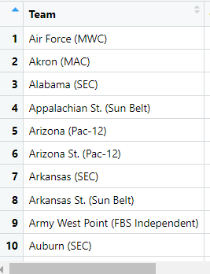

```{r setup, include=FALSE, code=xfun::read_utf8('../slide-setup.R')}
```

```{r setup2, include=FALSE}
if (interactive()) source('../slide-setup.R')
library(tidyverse)
```


## Q&A

> Are regex's useful in any real life dataset?

--

.pull-left[
```{r echo=FALSE}

```
]

.pull-right[
> "We also tried using a space as the separate factor, but ran into problems with a team like Air Force (MWC) as it would separate the "Air" and "Force" and omit the conference."
]

---

.pull-left[
```{r echo=FALSE}

```
]

.pull-right[
- Team name is anything except open paren, at least once. `"([^(]+)"`
- Then space and open paren. `" \("`
- Then conference is anything except close paren, at least once. `"([^)]+)"`
- Then close paren. `"\)"`
]

---

## Q&A

> What's the valid SSN regex?

```
^     # beginning of string
\d{3} # 3 digits
-     # hyphen
\d{2} # 2 digits
-     # hyphen
\d{4} # 4 digits
$     # end of string
```

> Are regexes used in every programming language?

Pretty much. JavaScript even has regex *literals* (`string.match(/regex/)`)

---

## Objectives

- Describe components of an effective data science report
- Contrast a report with a dashboard
- Choose a reporting and presentation strategy appropriate for a given audience

---

class: center, middle

## Final Project Expectations

<https://cs.calvin.edu/courses/data/202/21fa/projects.html#Project_2_Detailed_Expectations>

---

class: center, middle

## Making a Data-Driven Argument

---

## Key points

- Consider the *audience* to get the level of detail right.
  - Never assume your audience can rapidly process complex visuals. ([Claus Wilke](https://clauswilke.com/dataviz/telling-a-story.html#make-a-figure-for-the-generals))
- Consider the *purpose* to choose report vs dashboard vs presentation
- Anchor *claims* in *data*.
- Tell stories (e.g., "but-therefore")

---

### Make a point

.pull-left[
**Report A**

MAIN POINT

* Supporting chart 1
* Supporting table 2
* Supporting model 3

Discussion about how each supports main point
]

.pull-right[
**Report B**

* Chart 1
* Table 2
* Model 3
* Chart 4
* Table 5
* Chart 6
* Model 7
* Chart 12
* Table 25
]

---

### Tell a Story

* Chart 1
* Therefore, chart 2
* BUT, chart 3

[but-therefore](https://www.youtube.com/watch?v=vGUNqq3jVLg)

See also: "[Telling a story and making a point](https://clauswilke.com/dataviz/telling-a-story.html)"

---

### Anchor conclusions in data

.pull-left[
* The units are probably seconds<br><br>
* The fit looks good<br><br>
* This was surprising
]

--

.pull-right[
* because the median, 600, would be 10 minutes
* because the mean error of $15 is less than 0.1% of the price
* because I expected that people would leave higher ratings on products they enjoyed more
]

---

### Use appropriate language

.pull-left[
**Plain language** for the overview, conclusion, and visuals.

* Labels in visuals: use real names, not `code_names`. (For all aesthetics, not just x and y.)
* Don't assume the reader knows the structure of the data.
]

.pull-right[
**Technical language** when describing methods (data acquisition, wrangling, modeling, etc.).

* What data representation choices did you make? *why*?
* What modeling choices? Why? etc.
]

---

### Some color tips

<https://blog.datawrapper.de/beautifulcolors/>

---

class: center, middle

## Start Simple!

---

## Tools for Communication

- Markdown: **know** your *formatting*, including `- lists` and `[links](URL)`.
- Data graphics: `ggplot`, `plotly`, [`rbokeh`](https://hafen.github.io/rbokeh/articles/rbokeh.html)
- Slides:
  - These slides are `xaringan` + [`xaringanthemer`](https://pkg.garrickadenbuie.com/xaringanthemer/index.html) + [`xaringanExtra`](https://github.com/gadenbuie/xaringanExtra/)
  - [Other options](https://bookdown.org/yihui/rmarkdown/presentations.html) include `ioslides`, `slidy`, ...
- Getting on the web
  - GitHub Pages
  - `flexdashboard`
  - Shiny apps
  - RStudio Connect

---

## Dashboard vs Report

```{r echo=FALSE}
knitr::include_graphics("https://upload.wikimedia.org/wikipedia/commons/thumb/a/ab/Toyota_Corolla_2016_speedometer.jpg/1280px-Toyota_Corolla_2016_speedometer.jpg")
```

.floating-source[.small[Source: <https://commons.wikimedia.org/wiki/File:Toyota_Corolla_2016_speedometer.jpg>]]


---

## Dashboard vs Report

| aspect | Dashboard | Report |
|---|----------|-----|
| shows data? | | |
| uses visuals? | | |
| explanation? | | |
| single page? | | |

.floating-source[Inspired by <https://chartio.com/blog/dashboards-vs-reports-how-theyre-the-same-how-theyre-different/>]

---

## `flexdashboard`

<https://pkgs.rstudio.com/flexdashboard/articles/examples.html>

---


### Example: [Shiny](https://shiny.rstudio.com/) Apps

<https://shiny.rstudio.com/gallery/>

* [Engineering Production-Grade Shiny Apps](https://engineering-shiny.org/)

---

## Analyzing a dashboard

Questions:

1. What are the first things that draw your eye?
1. What information seems to be the most important?
1. For what purpose was this dashboard probably designed?

Examples: 

- weather app
- Kent County COVID
