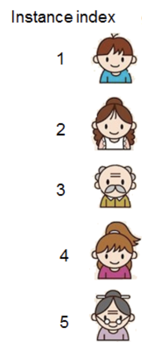

```{r include=FALSE}
library(tidyverse)
```

# Predictive Modeling


## Lingo

You'll see people calling the approaches we'll discuss here by a lot of different names:

* "*Predictive Modeling*": my current preferred term, since our goal is to *predict* and our approach is *modeling*.
* "*Predictive Analytics*": I'm unclear exactly what this means, apparently it's used a bit more broadly than "predictive modeling".
* "*Data Mining*": emphasizes the observational (rather than experimental) focus. Similar to "predictive analytics" in scope I think.
* "*Statistical Learning*": probably the most broadly used technical term
* "*Machine Learning*": focuses on the math and engineering of predictive modeling. I see this as a good name for the internals of statistical learning; but when you also are considering the context of the data (where it came from and the story you'll tell with it), I think "predictive modeling" and "data science" are more holistic terms.

Here are some names I don't like:

* "*AI*": it does have a specific meaning, but it's become both overused (to mean anything with data in it) and underused (discounting a lot of good work in intelligent systems that doesn't happen to need tons of data)
* "*Big Data*": a popular but (in my opinion) not very helpful umbrella term
* "*Data Science*": some people think (wrongly) that predictive modeling is all of what data science is about.
Data Science includes, but goes far beyond, predictive modeling.


## Reading Guide

### Prediction as a Goal

Below you'll find links to an interactive visual introduction to some of the basic concepts of
predictive modeling. As you read, don't worry about the details of
the classification model they're using, but read to answer questions like these:

* In what sense is this a "prediction" task?
* Why might having multiple features help make a better prediction?
* What is a "model"? What does it mean to "train" a model?
* What makes a predictive model a good model? How can we measure that?
* What does it mean to "test" a model? Should a model be tested on the same data that it was trained on? Why or why not?

Now the readings:

* [Part 1](http://www.r2d3.us/visual-intro-to-machine-learning-part-1/)
* [Part 2](http://www.r2d3.us/visual-intro-to-machine-learning-part-2/) (we won't get here for another week, so it's optional for now)

Here's a fun application to try out: Google's [Teachable Machine](https://teachablemachine.withgoogle.com/v1/).
(They made a [v2](https://teachablemachine.withgoogle.com/) that's less fun but more practical.)

### Linear models for regression

Many models that are used in statistical inference are also used in predictive modeling,
so learning about how those models work will be helpful even though we'll use them differently.
If you're already well familiar with these kinds of models from your stats background,
you can just skim these for a refresher:

* **Read**: Introduction to Modern Statistics (OpenIntro)
  * [3.1 Fitting a Line](https://openintro-ims.netlify.app/intro-linear-models.html#fit-line-res-cor)
  * [3.2 Least Squares Regression](https://openintro-ims.netlify.app/intro-linear-models.html#least-squares-regression)
  
* **Try**: Introduction to Linear Models [tutorials](https://openintrostat.github.io/ims-tutorials/03-introduction-to-linear-models/), specifically:
  * Review: [Visualizing two variables](https://openintro.shinyapps.io/ims-03-introduction-to-linear-models-01/)
  * Focus on: [Simple linear regression](https://openintro.shinyapps.io/ims-03-introduction-to-linear-models-03/)
  * continue to others if you have time or curiosity

### `tidymodels`

* [Supervised Machine Learning: Case Studies in R](https://supervised-ml-course.netlify.app/)
* [Case Study](https://www.tidymodels.org/start/case-study/)

## Modeling Goals

(Note: a better discussion of this is found in [Brieman 2001](https://projecteuclid.org/download/pdf_1/euclid.ss/1009213726))

Most of what is studied in statistics classes is modeling for the sake of *inference*:
you want to make conclusions about a *population* in general based on what you
observe in a *sample*. For example, if 1 person who received a vaccine later gets Covid
compared with 2 people who didn't, how effective is the vaccine in general?
What about if it were 100 people vs 200? Is it more effective for certain demographic
groups, or were they just more likely to have gotten the vaccine in the first place?
Inferential stats helps you think through what information you need to know to be able to start to answer a question
like that and how to design a controlled experiment so that you can actually give
a robust answer, and gives you mathematical tools to compute those answers from
observed data.

In general, a controlled experimental setting with randomization is needed to
make robust inferences about a population from a sample. And in many cases we
can do this: for example, most large websites are constantly running hundreds
of controlled experiments on their visitors. But in many other cases, we can't
make the experimental intervention we might want but we still observe a lot of
data; is that data useless?

Predictive modeling is one of several angles with which to make useful conclusions
from data that was collected without randomized interventions. (Other approaches
include instrumental variables analysis, propensity matching, and small
confirmatory controlled experiments to evaluate hypothesis generated from
observational studies.) The key idea is to change the goal: instead of trying
to make an inference about a proposed relationship in isolation (like "does being male
make you more likely to get a severe case of Covid, all else being equal?", which
is complicated by difference in underlying health conditions, lifestyle, etc.),
a predictive model only tries to make a prediction about the outcome ("here is a 70-year-old man; how
severe is his disease likely to be?").

## Defining Overfitting

The [Wikipedia article](https://en.wikipedia.org/wiki/Overfitting)
is actually pretty good; it\'s a bit sloppy, but data scientists tend to
be sloppy about that definition. There\'s a more precise definition for
the underlying phenomena, which have statistically rigorous but
confusing names:

-   **bias**: even with infinite training data, a linear regression
    could never fit a parabola (without feature engineering). One
    definition of bias is the test-set error when you have infinite
    training data.
-   **variance**: the amount that test-set predictions change when the
    model is trained with different subsets of all possible data. This measures,
    among other things, how robust the model is to having outliers or other 
    unusual things in the training set.

The old conventional wisdom was that there\'s necessarily a
[trade-off](https://en.wikipedia.org/wiki/Bias%E2%80%93variance_tradeoff)
between bias and variance. But that\'s not actually true: for example,
even if one model has high variance, the average of many of them can
have low variance while staying low-bias. (This is called *bagging*.) 
Some have theorized that this
is key to how deep learning works so well: it arrives at the same
conclusions through many different paths.


## Setting up a predictive modeling task

Predictive modeling works best when the units (rows) you analyze are *interchangeable*.
That is, ideally for predictive modeling you’d have each row be drawn from a big pool of basically interchangeable units.
For example, suppose you're trying to label the genre of a song given its audio features.
These units are interchangeable: each song could just come or go without affecting anything about the other songs (unless, say, one is a cover of another or something).
If your data has interrelationships between rows, like repeated measurements of the same cities / teams / countries / ...,
this makes your units much less interchangeable.
So you either need to be creative in how to set up a prediction problem where each row is interchangeable,
or think about how the lack of interchangeability might affect your results.

## A simple example

```{r echo=FALSE, message=FALSE}
FivePeople <- read.csv('data/five-people.csv') |>
  mutate(liked = stars >= 3) |>
  mutate(instance = row_number(), .before = everything())
#pander::emphasize.cols(4)
FivePeople |> pander::pander()
```

Our goal is to predict the star rating (how much the person would like a given product, on a scale
from 1 to 5) from some predictors (features) such as age, region, and whether they use a 
computer most days. Here our five people, affectionately named 1, 2, 3, 4, and 5:

```{r, echo = FALSE}

```

### A Classification Task

Construct a tree that predicts whether the person would like the product (stars >= 3) or not (stars < 3).

**Note**: This doesn't have to be the *best possible* tree; just try to come up with some tree.

### A Regression Task

Construct a tree that predicts the star rating value.

